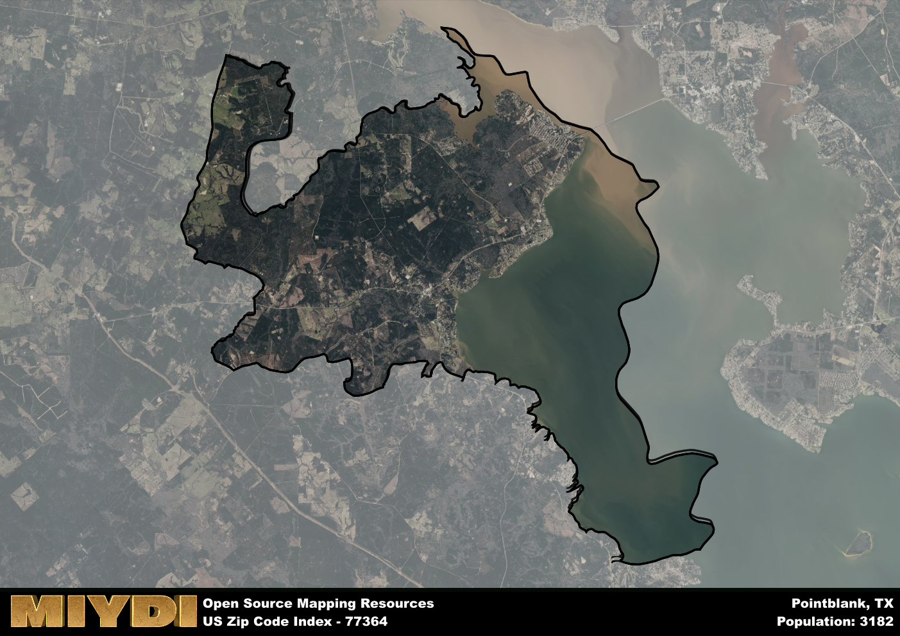

**Area Name:** Pointblank

**Zip Code:** 77364

**State:** TX

# Pointblank: A Hidden Gem in East Texas  
Located in San Jacinto County, the zip code area 77364 encompasses the charming neighborhood of Pointblank. Situated on the shores of Lake Livingston, Pointblank is surrounded by lush forests and rolling hills, creating a picturesque backdrop for its residents. The area is conveniently located near major highways, providing easy access to nearby cities like Houston and Huntsville, making it a popular destination for both primary residences and weekend getaways.

Pointblank has a rich historical narrative dating back to the early 19th century when it was first settled by pioneers drawn to the fertile land and abundant natural resources. The area saw significant development during the logging boom of the late 1800s, attracting more settlers and establishing Pointblank as a thriving community. The unique name of the neighborhood is said to have originated from a local legend about a sharp bend in the nearby river that resembled a "point blank" shot.

Today, Pointblank is a vibrant community known for its recreational opportunities, including fishing, boating, and hiking around Lake Livingston. The area boasts a mix of locally-owned shops, restaurants, and services that cater to residents and visitors alike. Pointblank is also home to several historic sites, such as the Old Town Cemetery and the Pointblank Community Center, which showcase the area's cultural heritage and sense of community pride.

# Pointblank Demographics

The population of Pointblank is 3182.  
Pointblank has a population density of 49.83 per square mile.  
The area of Pointblank is 63.86 square miles.  

## Pointblank Income and Economic Data

These demographic numbers are sourced from IRS return data, providing comprehensive insights into the population dynamics and economic trends within Pointblank.

**Breakdown of return types for Pointblank**

The table offers insight into the composition of tax returns filed with the IRS, categorizing them into three main types. Single returns represent filings by individuals, joint returns by married couples, and head of household returns by individuals who qualify as heads of households, typically having dependents. This breakdown provides an understanding of the different filing statuses adopted by taxpayers when submitting their tax documentation.

| Return Types filed for Pointblank                              | Percentage          |
|----------------------------------------------------------|---------------------|
| Single Returns                                            | 0.44 |
| Joint Returns                                             | 0.41 |
| Head Household Returns                                    | 0.12 |

The income and economic data presented here is sourced from the IRS income brackets, utilized for categorizing tax returns by income levels. This table displays income ranges for both single filers and married couples, along with the corresponding number of returns and the percentage within each bracket, providing valuable insight into the distribution of taxes across various income groups.

| Bracket Name       | Single Filer Income Range | Married Couple Range | Number of Returns | Percentage of Returns |
|--------------------|----------------------------|----------------------|-------------------|-----------------------|
| 10% Bracket        | Up to $10,275              | Up to $20,550        | 440 | 0.38% |
| 12% Bracket        | $10,276 - $41,775          | $20,551 - $83,550    | 280 | 0.24% |
| 22% Bracket        | $41,776 - $89,075          | $83,551 - $178,150   | 140 | 0.12% |
| 24% Bracket        | $89,076 - $170,050         | $178,151 - $340,100  | 110 | 0.09% |
| 32% Bracket        | $170,051 - $215,950        | $340,101 - $431,900  | 150 | 0.13% |
| 35% Bracket        | $215,951 - $539,900        | $431,901 - $647,850  | 40 | 0.03% |

### Exploring Taxpayer Diversity: A Breakdown of Different Types of Tax Returns in Pointblank

The table offers insights into various types of tax returns filed, reflecting different aspects of taxpayer activities and demographics. Categories include charitable returns for donations, dependent returns for claimed dependents, educator population, elderly population, real estate returns, self-employment returns, student loan returns, and unemployment returns, providing valuable insights into taxpayer behavior and demographics.

| Pointblank Filing Types                    | Count | Percentage |
|--------------------------------------|-------|------------|
| Charitable Donations                 | 40 | 0.034% |
| Dependents Claimed                   | 0 | 0% |
| Educator Residents                   | 0 | 0% |
| Elderly Population                   | 510 | 0.44% |
| Farming Population                   | 50 | 0.043% |
| Real Estate Transactions             | 50 | 0.043% |
| Self-Employed Individuals            | 130 | 0.112% |
| Student Loan Cases                   | 30 | 0.026% |
| Unemployment Benefit Filings         | 170 | 0.15% |

## Pointblank AI and Census Variables

The values presented in this dataset for Pointblank are AI-optimized, streamlined, and categorized into relevant buckets for enhanced utility in AI and mapping programs. These simplified values have been optimized to facilitate efficient analysis and integration into various technological applications, offering users accessible and actionable insights into demographics within the Pointblank area.

| AI Variables for Pointblank | Value |
|-------------|-------|
| Shape Area | 224673438.78125 |
| Shape Length | 121503.522235234 |

## How to use this free AI optimized Geo-Spatial Data for Pointblank, TX

This data is made freely available under the Creative Commons license, allowing for unrestricted use for any purpose. Users can access static resources directly from GitHub or leverage more advanced functionalities by utilizing the GeoJSON files. All datasets originate from official government or private sector sources and are meticulously compiled into relevant datasets within QGIS. However, the versatility of the data ensures compatibility with any mapping application.

## Data Accuracy Disclaimer
It's important to note that the data provided here may contain errors or discrepancies and should be considered as 'close enough' for business applications and AI rather than a definitive source of truth. This data is aggregated from multiple sources, some of which publish information on wildly different intervals, leading to potential inconsistencies. Additionally, certain data points may not be corrected for Covid-related changes, further impacting accuracy. Moreover, the assumption that demographic trends are consistent throughout a region may lead to discrepancies, as trends often concentrate in areas of highest population density. As a result, dense areas may be slightly underrepresented, while rural areas may be slightly overrepresented, resulting in a more conservative dataset. Furthermore, the focus primarily on areas within US Major and Minor Statistical areas means that approximately 40 million Americans living outside of these areas may not be fully represented. Lastly, the historical background and area descriptions generated using AI are susceptible to potential mistakes, so users should exercise caution when interpreting the information provided.
