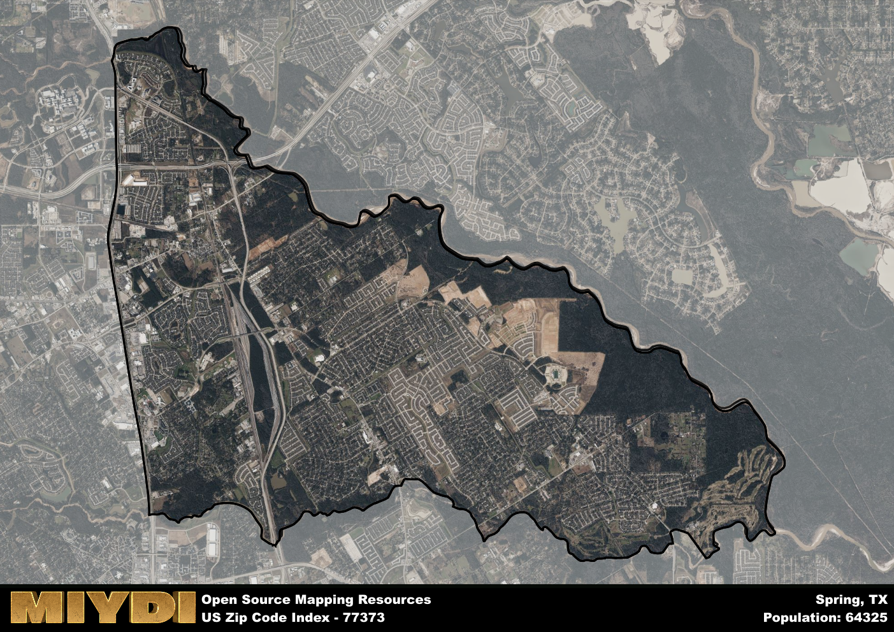

**Area Name:** Spring

**Zip Code:** 77373

**State:** TX

Spring is a part of the Houston-The Woodlands-Sugar Land - TX Metro Area, and makes up 0.91% of the Metro's population.  

# Exploring the Vibrant Neighborhood of Spring, TX (Zip Code: 77373)

Located in the northern part of Houston, the zip code area 77373 corresponds to the bustling neighborhood of Spring, Texas. Bordered by the Hardy Toll Road to the west and the Grand Parkway to the east, Spring seamlessly integrates with surrounding areas such as The Woodlands and Cypress. As part of the Greater Houston metropolitan area, Spring benefits from its proximity to the city's major population centers and economic hubs.

Originally settled by German immigrants in the mid-1800s, Spring has a rich historical narrative that includes its development as a railroad town and later as a commercial center for local farmers. The area's name is believed to have originated from the natural springs that once flowed in the region, providing a vital water source for early settlers. Over time, Spring evolved into a diverse community with a blend of residential neighborhoods, commercial districts, and recreational spaces.

Today, Spring is a vibrant and dynamic neighborhood known for its strong sense of community and family-friendly atmosphere. The area boasts a variety of shopping centers, restaurants, and entertainment options, making it a popular destination for residents and visitors alike. With access to top-rated schools, parks, and cultural attractions like the Mercer Arboretum and Botanic Gardens, Spring offers a high quality of life for its residents. Whether enjoying a leisurely day at the Spring Creek Greenway or exploring the historic Old Town Spring district, there is no shortage of activities to experience in this thriving neighborhood.

# Spring Demographics

The population of Spring is 64325.  
Spring has a population density of 2692.55 per square mile.  
The area of Spring is 23.89 square miles.  

## Spring Income and Economic Data

These demographic numbers are sourced from IRS return data, providing comprehensive insights into the population dynamics and economic trends within Spring.

**Breakdown of return types for Spring**

The table offers insight into the composition of tax returns filed with the IRS, categorizing them into three main types. Single returns represent filings by individuals, joint returns by married couples, and head of household returns by individuals who qualify as heads of households, typically having dependents. This breakdown provides an understanding of the different filing statuses adopted by taxpayers when submitting their tax documentation.

| Return Types filed for Spring                              | Percentage          |
|----------------------------------------------------------|---------------------|
| Single Returns                                            | 0.49 |
| Joint Returns                                             | 0.29 |
| Head Household Returns                                    | 0.2 |

The income and economic data presented here is sourced from the IRS income brackets, utilized for categorizing tax returns by income levels. This table displays income ranges for both single filers and married couples, along with the corresponding number of returns and the percentage within each bracket, providing valuable insight into the distribution of taxes across various income groups.

| Bracket Name       | Single Filer Income Range | Married Couple Range | Number of Returns | Percentage of Returns |
|--------------------|----------------------------|----------------------|-------------------|-----------------------|
| 10% Bracket        | Up to $10,275              | Up to $20,550        | 10540 | 0.34% |
| 12% Bracket        | $10,276 - $41,775          | $20,551 - $83,550    | 8740 | 0.28% |
| 22% Bracket        | $41,776 - $89,075          | $83,551 - $178,150   | 5170 | 0.17% |
| 24% Bracket        | $89,076 - $170,050         | $178,151 - $340,100  | 2770 | 0.09% |
| 32% Bracket        | $170,051 - $215,950        | $340,101 - $431,900  | 3020 | 0.1% |
| 35% Bracket        | $215,951 - $539,900        | $431,901 - $647,850  | 440 | 0.01% |

### Exploring Taxpayer Diversity: A Breakdown of Different Types of Tax Returns in Spring

The table offers insights into various types of tax returns filed, reflecting different aspects of taxpayer activities and demographics. Categories include charitable returns for donations, dependent returns for claimed dependents, educator population, elderly population, real estate returns, self-employment returns, student loan returns, and unemployment returns, providing valuable insights into taxpayer behavior and demographics.

| Spring Filing Types                    | Count | Percentage |
|--------------------------------------|-------|------------|
| Charitable Donations                 | 1670 | 0.054% |
| Dependents Claimed                   | 1250 | 0.041% |
| Educator Residents                   | 810 | 0.026% |
| Elderly Population                   | 5010 | 0.16% |
| Farming Population                   | 80 | 0.003% |
| Real Estate Transactions             | 1560 | 0.051% |
| Self-Employed Individuals            | 4090 | 0.133% |
| Student Loan Cases                   | 1800 | 0.059% |
| Unemployment Benefit Filings         | 6430 | 0.21% |

### Exploring Real Estate Trends: A Comprehensive Analysis of the Spring Area and its Neighbors

This table contains an in-depth examination of the real estate market in the Spring area. Sourced from trusted real estate market firms, this dataset provides a wealth of raw data detailing the local real estate landscape, along with comparative analyses juxtaposing the market dynamics with those of neighboring areas. Explore the intricacies of the Spring real estate market and gain valuable insights into its relationship with adjacent regions.

| Real Estate Data for Spring                       | Value    |
|------------------------------------------------|----------|
| Average Listing Price for Spring               | 297087 |
| Median Listing Price for Spring                | 268495 |
| Median Days on Market for Spring               | 35 |
| Median Listing Price per Square Foot for Spring| 45 |
| Median Square Feet for Spring                  | 1822 |
| Real Estate Prices to Income Ratio           | 37.64% |
| Price per Square Foot Ratio                  | 79.38% |
| Price Median Ratio                           | 70.40% |
| Market Sales Speed Ratio                     | 83.5% |

This table offers essential real estate data for the Spring area, including average and median listing prices, median days on market, and property size. It also presents ratio metrics as percentages, providing insights into how the local market compares to the surrounding region. A ratio of 100% signifies performance in line with the regional average, while values above or below indicate overperformance or underperformance, respectively, relative to expectations.

## Spring Sports and Recreation Data

#### Annual Youth Sports Spending for Spring

This table provides fundamental insights into the Sports and Recreation data for the Spring area, detailing the estimated annual expenditure on Youth Athletics. This includes estimated spending by the major consumer brackets. 
| Sports Spending for Spring| Value |
|-------------------------|-------|
| Athlete Spending Compared to the region | 183.67% |
| Total Youth Athlete Spending | 3,301,597 |
| Athletic Spending - Essential Focused Consumer | ,513,301 |
| Athletic Spending - Typical Consumer | ,813,260 |
| Athletic Spending - Affluent Consumers | ,972,930 |

#### Youth Coaching Estimates for Spring

This table presents the estimated number of coaches for the Spring area, derived from comprehensive national coaching surveys and athletic participation rates by state. It offers valuable insights into the vital role of coaching personnel in fostering athletic development and facilitating sports participation within the local community.

| Coaching Data for Spring | Value |
|-------------|-------|
| Total Coaches | 1053 |
| Paid Coaches | 274 |
| Volunteer Coaches | 780 |

#### Youth Athlete Participation for Spring

This table shows the estimated total number of youth athletes in the Spring area, sourced from comprehensive national coaching surveys and athletic participation rates by state.

| Total YA Athletes in Spring | Value |
|-------------|-------|
| Total High School Athletes | 1607 |
| Total Youth Athletes | 4822 |
| Total Young Adult Athletes | 3215 |
| Total Athletes to Age 25 | 9645 |

#### High School Age Athletes - Breakdown by Sport for Spring

This table shows insights regarding high school age estimated players by sport in the Spring area, derived from national and state-level athletic participation trends. 

| HS Players by Sport in Spring | Value |
|-------------|-------|
| Football Players | 370 |
| Basketball Players | 225 |
| Soccer Players | 177 |
| Volleyball Players | 113 |
| Baseball Players | 193 |
| Tennis Players | 96 |
| Track Athletes | 273 |
| Golf Players | 48 |
| Swimming Athletes | 48 |
| Wrestling Competitors | 48 |
| Lacrosse Players | 0 |

Estimating the number of younger athletes presents unique challenges due to their varied starting ages, typically beginning around six years old, and a gradual decline in participation rates as they age. Unlike high school-aged athletes, younger athletes are less likely to switch sports as they grow older, contributing to the stability of participation numbers within specific sports at younger ages.  

As a general trend, the total number of younger athletes is approximately three times the number of high school-aged athletes, underscoring the significant presence of youth athletes in sports programs and highlighting the importance of early engagement in athletic activities.

## Spring AI and Census Variables

The values presented in this dataset for Spring are AI-optimized, streamlined, and categorized into relevant buckets for enhanced utility in AI and mapping programs. These simplified values have been optimized to facilitate efficient analysis and integration into various technological applications, offering users accessible and actionable insights into demographics within the Spring area.

| AI Variables for Spring | Value |
|-------------|-------|
| Shape Area | 82896804.8320313 |
| Shape Length | 51956.8858752469 |
| CBSA Federal Processing Standard Code | 26420 |
| RE Price per Square Foot Ratio | 79.38% |
| RE Price Average Ratio | 62.81% |
| RE Speed Ratio | 83.5% |
| RE Income Ratio | 37.64% |
| Single Opportunity Flag | 4 |
| Single Parent Risk Flag | 6 |
| Elderly Opportunity Flag | 3 |
| Farm Opportunity Flag | 2 |
| Unemployment Risk | 6 |
| Educator Opportunity Flag | 5 |
| RE Affordability Index Flag | 2 |
| Income Bracket Flag | 6 |
| RE Income Flag | 1 |
| RE Median Square Footage Price Flag | 3 |
| RE Median Square Footage Size Flag | 4 |
| RE Activity Flag | 4 |
| Poverty Line Risk Flag | 2 |

## How to use this free AI optimized Geo-Spatial Data for Spring, TX

This data is made freely available under the Creative Commons license, allowing for unrestricted use for any purpose. Users can access static resources directly from GitHub or leverage more advanced functionalities by utilizing the GeoJSON files. All datasets originate from official government or private sector sources and are meticulously compiled into relevant datasets within QGIS. However, the versatility of the data ensures compatibility with any mapping application.

## Data Accuracy Disclaimer
It's important to note that the data provided here may contain errors or discrepancies and should be considered as 'close enough' for business applications and AI rather than a definitive source of truth. This data is aggregated from multiple sources, some of which publish information on wildly different intervals, leading to potential inconsistencies. Additionally, certain data points may not be corrected for Covid-related changes, further impacting accuracy. Moreover, the assumption that demographic trends are consistent throughout a region may lead to discrepancies, as trends often concentrate in areas of highest population density. As a result, dense areas may be slightly underrepresented, while rural areas may be slightly overrepresented, resulting in a more conservative dataset. Furthermore, the focus primarily on areas within US Major and Minor Statistical areas means that approximately 40 million Americans living outside of these areas may not be fully represented. Lastly, the historical background and area descriptions generated using AI are susceptible to potential mistakes, so users should exercise caution when interpreting the information provided.
