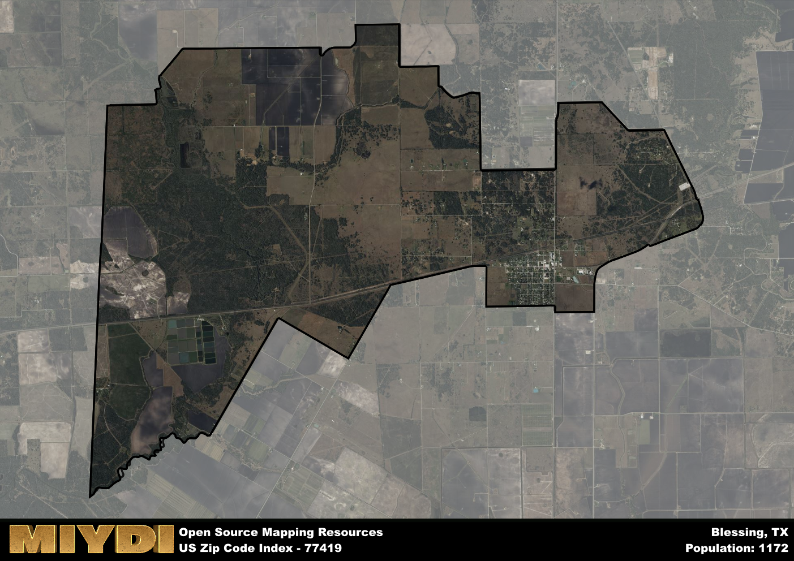

**Area Name:** Blessing

**Zip Code:** 77419

**State:** TX

Blessing is a part of the Bay City - TX Micro Area, and makes up 1.15% of the Metro's population.  

# Blessing: A Quaint Community in South Texas  

Located in Matagorda County, Blessing is a small unincorporated community that falls within the zip code 77419. Situated in the southern part of Texas, Blessing is bordered by the towns of Francitas to the north and Palacios to the south. Blessing is an integral part of the Greater Houston metropolitan area, providing a rural escape for residents while still maintaining close proximity to the bustling city life of Houston.

Blessing has a rich historical background, originally settled in the late 1800s by Czech and German immigrants. The town got its name from the Blessing family, who were early settlers in the area. Throughout the years, Blessing has grown into a close-knit community known for its agricultural roots and friendly atmosphere. The town has preserved its heritage through historic buildings and annual events that celebrate its cultural diversity.

Today, Blessing is a charming community that offers a peaceful way of life for its residents. The town's economy is primarily driven by agriculture, with farming and ranching being prominent industries. Blessing also provides essential services such as schools, churches, and small businesses to serve the local population. The area is known for its recreational opportunities, with nearby rivers and parks offering residents a chance to enjoy the natural beauty of South Texas. Blessing also boasts historic sites that showcase its unique heritage, making it a special gem within the Greater Houston area.

# Blessing Demographics

The population of Blessing is 1172.  
Blessing has a population density of 50.3 per square mile.  
The area of Blessing is 23.3 square miles.  

### Exploring Real Estate Trends: A Comprehensive Analysis of the Blessing Area and its Neighbors

This table contains an in-depth examination of the real estate market in the Blessing area. Sourced from trusted real estate market firms, this dataset provides a wealth of raw data detailing the local real estate landscape, along with comparative analyses juxtaposing the market dynamics with those of neighboring areas. Explore the intricacies of the Blessing real estate market and gain valuable insights into its relationship with adjacent regions.

| Real Estate Data for Blessing                       | Value    |
|------------------------------------------------|----------|
| Average Listing Price for Blessing               | 474000 |
| Median Listing Price for Blessing                | 474000 |
| Median Days on Market for Blessing               | 184 |
| Median Listing Price per Square Foot for Blessing| 25 |
| Median Square Feet for Blessing                  | 2113 |
| Real Estate Prices to Income Ratio           | 217.60% |
| Price per Square Foot Ratio                  | 131.30% |
| Price Median Ratio                           | 146.63% |
| Market Sales Speed Ratio                     | 249.0% |

This table offers essential real estate data for the Blessing area, including average and median listing prices, median days on market, and property size. It also presents ratio metrics as percentages, providing insights into how the local market compares to the surrounding region. A ratio of 100% signifies performance in line with the regional average, while values above or below indicate overperformance or underperformance, respectively, relative to expectations.

## Blessing Sports and Recreation Data

#### Annual Youth Sports Spending for Blessing

This table provides fundamental insights into the Sports and Recreation data for the Blessing area, detailing the estimated annual expenditure on Youth Athletics. This includes estimated spending by the major consumer brackets. 
| Sports Spending for Blessing| Value |
|-------------------------|-------|
| Athlete Spending Compared to the region | 10.60% |
| Total Youth Athlete Spending | 83,085 |
| Athletic Spending - Essential Focused Consumer | 7,642 |
| Athletic Spending - Typical Consumer | 2,720 |
| Athletic Spending - Affluent Consumers | 2,684 |

#### Youth Coaching Estimates for Blessing

This table presents the estimated number of coaches for the Blessing area, derived from comprehensive national coaching surveys and athletic participation rates by state. It offers valuable insights into the vital role of coaching personnel in fostering athletic development and facilitating sports participation within the local community.

| Coaching Data for Blessing | Value |
|-------------|-------|
| Total Coaches | 19 |
| Paid Coaches | 5 |
| Volunteer Coaches | 14 |

#### Youth Athlete Participation for Blessing

This table shows the estimated total number of youth athletes in the Blessing area, sourced from comprehensive national coaching surveys and athletic participation rates by state.

| Total YA Athletes in Blessing | Value |
|-------------|-------|
| Total High School Athletes | 29 |
| Total Youth Athletes | 88 |
| Total Young Adult Athletes | 59 |
| Total Athletes to Age 25 | 176 |

#### High School Age Athletes - Breakdown by Sport for Blessing

This table shows insights regarding high school age estimated players by sport in the Blessing area, derived from national and state-level athletic participation trends. 

| HS Players by Sport in Blessing | Value |
|-------------|-------|
| Football Players | 7 |
| Basketball Players | 4 |
| Soccer Players | 3 |
| Volleyball Players | 2 |
| Baseball Players | 4 |
| Tennis Players | 2 |
| Track Athletes | 5 |
| Golf Players | 1 |
| Swimming Athletes | 1 |
| Wrestling Competitors | 1 |
| Lacrosse Players | 0 |

Estimating the number of younger athletes presents unique challenges due to their varied starting ages, typically beginning around six years old, and a gradual decline in participation rates as they age. Unlike high school-aged athletes, younger athletes are less likely to switch sports as they grow older, contributing to the stability of participation numbers within specific sports at younger ages.  

As a general trend, the total number of younger athletes is approximately three times the number of high school-aged athletes, underscoring the significant presence of youth athletes in sports programs and highlighting the importance of early engagement in athletic activities.

## Blessing AI and Census Variables

The values presented in this dataset for Blessing are AI-optimized, streamlined, and categorized into relevant buckets for enhanced utility in AI and mapping programs. These simplified values have been optimized to facilitate efficient analysis and integration into various technological applications, offering users accessible and actionable insights into demographics within the Blessing area.

| AI Variables for Blessing | Value |
|-------------|-------|
| Shape Area | 79002106.578125 |
| Shape Length | 52348.6146387763 |
| CBSA Federal Processing Standard Code | 13060 |
| RE Price per Square Foot Ratio | 131.30% |
| RE Speed Ratio | 249.0% |
| RE Income Ratio | 217.60% |
| Income Bracket Flag | 5 |
| RE Income Flag | 6 |
| RE Median Square Footage Price Flag | 5 |
| RE Median Square Footage Size Flag | 5 |
| RE Activity Flag | 7 |
| Poverty Line Risk Flag | 4 |

## How to use this free AI optimized Geo-Spatial Data for Blessing, TX

This data is made freely available under the Creative Commons license, allowing for unrestricted use for any purpose. Users can access static resources directly from GitHub or leverage more advanced functionalities by utilizing the GeoJSON files. All datasets originate from official government or private sector sources and are meticulously compiled into relevant datasets within QGIS. However, the versatility of the data ensures compatibility with any mapping application.

## Data Accuracy Disclaimer
It's important to note that the data provided here may contain errors or discrepancies and should be considered as 'close enough' for business applications and AI rather than a definitive source of truth. This data is aggregated from multiple sources, some of which publish information on wildly different intervals, leading to potential inconsistencies. Additionally, certain data points may not be corrected for Covid-related changes, further impacting accuracy. Moreover, the assumption that demographic trends are consistent throughout a region may lead to discrepancies, as trends often concentrate in areas of highest population density. As a result, dense areas may be slightly underrepresented, while rural areas may be slightly overrepresented, resulting in a more conservative dataset. Furthermore, the focus primarily on areas within US Major and Minor Statistical areas means that approximately 40 million Americans living outside of these areas may not be fully represented. Lastly, the historical background and area descriptions generated using AI are susceptible to potential mistakes, so users should exercise caution when interpreting the information provided.
