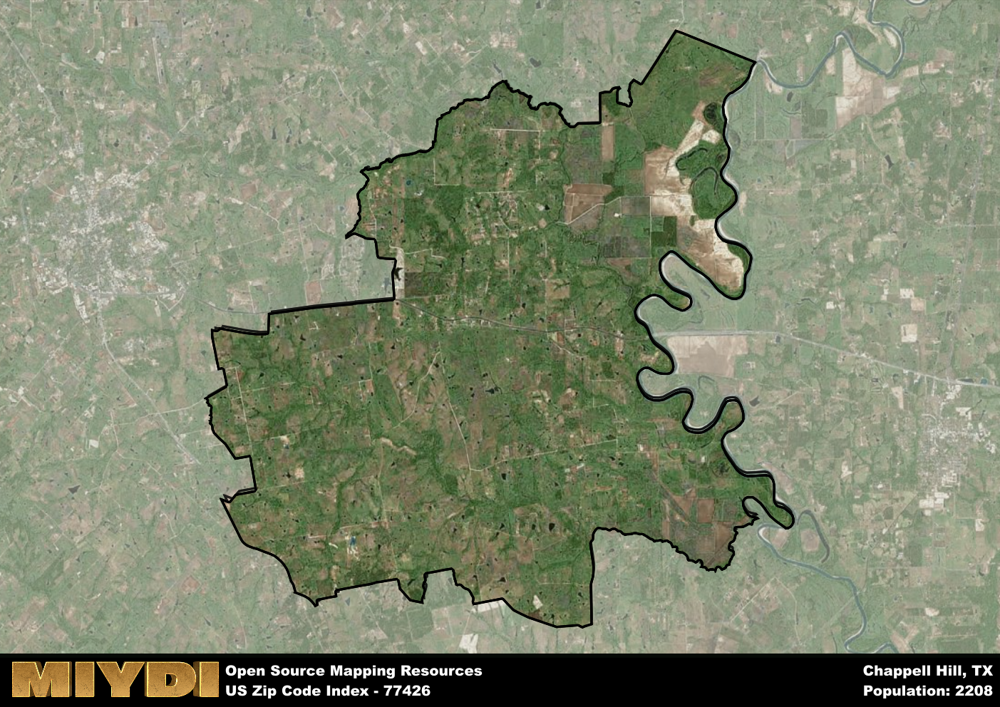

**Area Name:** Chappell Hill

**Zip Code:** 77426

**State:** TX

Chappell Hill is a part of the Brenham - TX Micro Area, and makes up  of the Metro's population.  

# Chappell Hill: A Historic Gem in Southeast Texas  

Chappell Hill, located in zip code 77426, is a charming neighborhood nestled in the heart of southeast Texas. The area is bordered by Brenham to the west and Houston to the east, making it a convenient location for residents looking to enjoy small-town living while still having access to major urban centers. Chappell Hill is known for its picturesque countryside, rolling hills, and historic homes that date back to the 19th century.

Originally settled in the 1840s by Mary Hargrove Haller, Chappell Hill quickly grew into a thriving community thanks to its fertile land and proximity to major trade routes. The neighborhood was named after Jacob Haller's wife, Susan Chappell Haller, and played a significant role in the cotton industry during the antebellum period. Today, Chappell Hill retains much of its historic charm, with many of its original buildings still standing as a testament to its rich past.

While Chappell Hill may be steeped in history, it also offers modern amenities and a tight-knit community for residents and visitors alike. The area is home to a variety of local shops, restaurants, and bed and breakfasts that cater to tourists looking to experience a taste of Texas hospitality. Additionally, Chappell Hill hosts annual events such as the Bluebonnet Festival and Christmas in the Country, drawing in visitors from across the state. With its blend of history, natural beauty, and community spirit, Chappell Hill is truly a hidden gem in southeast Texas.

# Chappell Hill Demographics

The population of Chappell Hill is 2208.  
Chappell Hill has a population density of 21.45 per square mile.  
The area of Chappell Hill is 102.93 square miles.  

## Chappell Hill Income and Economic Data

These demographic numbers are sourced from IRS return data, providing comprehensive insights into the population dynamics and economic trends within Chappell Hill.

**Breakdown of return types for Chappell Hill**

The table offers insight into the composition of tax returns filed with the IRS, categorizing them into three main types. Single returns represent filings by individuals, joint returns by married couples, and head of household returns by individuals who qualify as heads of households, typically having dependents. This breakdown provides an understanding of the different filing statuses adopted by taxpayers when submitting their tax documentation.

| Return Types filed for Chappell Hill                              | Percentage          |
|----------------------------------------------------------|---------------------|
| Single Returns                                            | 0.47 |
| Joint Returns                                             | 0.4 |
| Head Household Returns                                    | 0.11 |

The income and economic data presented here is sourced from the IRS income brackets, utilized for categorizing tax returns by income levels. This table displays income ranges for both single filers and married couples, along with the corresponding number of returns and the percentage within each bracket, providing valuable insight into the distribution of taxes across various income groups.

| Bracket Name       | Single Filer Income Range | Married Couple Range | Number of Returns | Percentage of Returns |
|--------------------|----------------------------|----------------------|-------------------|-----------------------|
| 10% Bracket        | Up to $10,275              | Up to $20,550        | 390 | 0.34% |
| 12% Bracket        | $10,276 - $41,775          | $20,551 - $83,550    | 270 | 0.23% |
| 22% Bracket        | $41,776 - $89,075          | $83,551 - $178,150   | 110 | 0.1% |
| 24% Bracket        | $89,076 - $170,050         | $178,151 - $340,100  | 80 | 0.07% |
| 32% Bracket        | $170,051 - $215,950        | $340,101 - $431,900  | 190 | 0.17% |
| 35% Bracket        | $215,951 - $539,900        | $431,901 - $647,850  | 110 | 0.1% |

### Exploring Taxpayer Diversity: A Breakdown of Different Types of Tax Returns in Chappell Hill

The table offers insights into various types of tax returns filed, reflecting different aspects of taxpayer activities and demographics. Categories include charitable returns for donations, dependent returns for claimed dependents, educator population, elderly population, real estate returns, self-employment returns, student loan returns, and unemployment returns, providing valuable insights into taxpayer behavior and demographics.

| Chappell Hill Filing Types                    | Count | Percentage |
|--------------------------------------|-------|------------|
| Charitable Donations                 | 130 | 0.113% |
| Dependents Claimed                   | 0 | 0% |
| Educator Residents                   | 0 | 0% |
| Elderly Population                   | 420 | 0.37% |
| Farming Population                   | 170 | 0.148% |
| Real Estate Transactions             | 130 | 0.113% |
| Self-Employed Individuals            | 160 | 0.139% |
| Student Loan Cases                   | 40 | 0.035% |
| Unemployment Benefit Filings         | 100 | 0.09% |

## Chappell Hill AI and Census Variables

The values presented in this dataset for Chappell Hill are AI-optimized, streamlined, and categorized into relevant buckets for enhanced utility in AI and mapping programs. These simplified values have been optimized to facilitate efficient analysis and integration into various technological applications, offering users accessible and actionable insights into demographics within the Chappell Hill area.

| AI Variables for Chappell Hill | Value |
|-------------|-------|
| Shape Area | 357513083.4375 |
| Shape Length | 134649.615196087 |
| CBSA Federal Processing Standard Code | 14780 |

## How to use this free AI optimized Geo-Spatial Data for Chappell Hill, TX

This data is made freely available under the Creative Commons license, allowing for unrestricted use for any purpose. Users can access static resources directly from GitHub or leverage more advanced functionalities by utilizing the GeoJSON files. All datasets originate from official government or private sector sources and are meticulously compiled into relevant datasets within QGIS. However, the versatility of the data ensures compatibility with any mapping application.

## Data Accuracy Disclaimer
It's important to note that the data provided here may contain errors or discrepancies and should be considered as 'close enough' for business applications and AI rather than a definitive source of truth. This data is aggregated from multiple sources, some of which publish information on wildly different intervals, leading to potential inconsistencies. Additionally, certain data points may not be corrected for Covid-related changes, further impacting accuracy. Moreover, the assumption that demographic trends are consistent throughout a region may lead to discrepancies, as trends often concentrate in areas of highest population density. As a result, dense areas may be slightly underrepresented, while rural areas may be slightly overrepresented, resulting in a more conservative dataset. Furthermore, the focus primarily on areas within US Major and Minor Statistical areas means that approximately 40 million Americans living outside of these areas may not be fully represented. Lastly, the historical background and area descriptions generated using AI are susceptible to potential mistakes, so users should exercise caution when interpreting the information provided.
