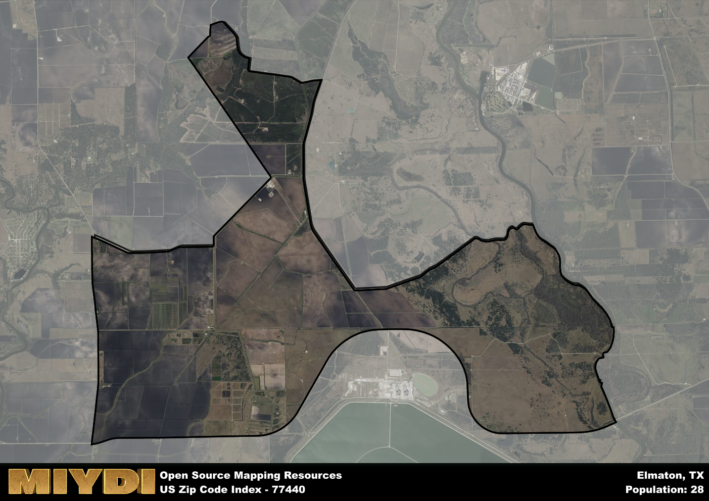

**Area Name:** Elmaton

**Zip Code:** 77440

**State:** TX

Elmaton is a part of the Bay City - TX Micro Area, and makes up  of the Metro's population.  

# Elmaton: A Historic Gem in South Texas

Located in Matagorda County, Elmaton is a charming community nestled within the zip code 77440. This area is bordered by the Colorado River to the north and the small town of Collegeport to the south. Elmaton seamlessly integrates with nearby cities such as Bay City and Palacios, serving as a peaceful residential enclave amidst the bustling urban landscape of South Texas.

Elmaton has a rich history dating back to the early 1900s when it was founded as a railroad stop along the Gulf, Colorado, and Santa Fe Railway. Over the years, Elmaton has evolved into a tight-knit community known for its agricultural heritage and friendly atmosphere. The name "Elmaton" is believed to be a combination of "El" (the Spanish word for "the") and "Maton," a term used by cattle drovers in the area.

Today, Elmaton remains a picturesque neighborhood with a mix of residential homes and small businesses. The area thrives on agriculture, particularly rice farming, and is home to several local shops and restaurants that cater to both residents and visitors. Visitors can explore the historic sites in Elmaton, such as the old train depot, or enjoy outdoor activities along the Colorado River. With its unique blend of history and modern amenities, Elmaton continues to be a hidden gem in South Texas.

# Elmaton Demographics

The population of Elmaton is 28.  
Elmaton has a population density of 1.42 per square mile.  
The area of Elmaton is 19.76 square miles.  

## Elmaton AI and Census Variables

The values presented in this dataset for Elmaton are AI-optimized, streamlined, and categorized into relevant buckets for enhanced utility in AI and mapping programs. These simplified values have been optimized to facilitate efficient analysis and integration into various technological applications, offering users accessible and actionable insights into demographics within the Elmaton area.

| AI Variables for Elmaton | Value |
|-------------|-------|
| Shape Area | 66911864.4257813 |
| Shape Length | 56600.7988147777 |
| CBSA Federal Processing Standard Code | 13060 |

## How to use this free AI optimized Geo-Spatial Data for Elmaton, TX

This data is made freely available under the Creative Commons license, allowing for unrestricted use for any purpose. Users can access static resources directly from GitHub or leverage more advanced functionalities by utilizing the GeoJSON files. All datasets originate from official government or private sector sources and are meticulously compiled into relevant datasets within QGIS. However, the versatility of the data ensures compatibility with any mapping application.

## Data Accuracy Disclaimer
It's important to note that the data provided here may contain errors or discrepancies and should be considered as 'close enough' for business applications and AI rather than a definitive source of truth. This data is aggregated from multiple sources, some of which publish information on wildly different intervals, leading to potential inconsistencies. Additionally, certain data points may not be corrected for Covid-related changes, further impacting accuracy. Moreover, the assumption that demographic trends are consistent throughout a region may lead to discrepancies, as trends often concentrate in areas of highest population density. As a result, dense areas may be slightly underrepresented, while rural areas may be slightly overrepresented, resulting in a more conservative dataset. Furthermore, the focus primarily on areas within US Major and Minor Statistical areas means that approximately 40 million Americans living outside of these areas may not be fully represented. Lastly, the historical background and area descriptions generated using AI are susceptible to potential mistakes, so users should exercise caution when interpreting the information provided.
