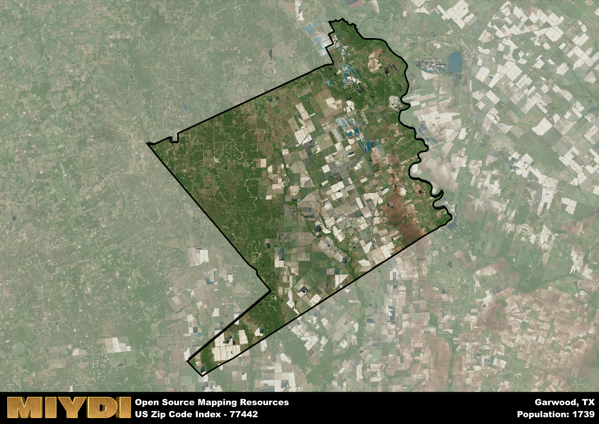

**Area Name:** Garwood

**Zip Code:** 77442

**State:** TX

Garwood is a part of the El Campo - TX Micro Area, and makes up  of the Metro's population.  

# Garwood: A Quaint Community in Southeast Texas

Located in southeastern Texas, zip code 77442 encompasses the small town of Garwood. Situated in Colorado County, Garwood is bordered by the cities of Eagle Lake to the north and Wharton to the south. The town is an integral part of the larger Houston metropolitan area, providing a rural escape for residents while still being within a commutable distance to the urban amenities of Houston.

Garwood has a rich historical background, dating back to its establishment in the late 1800s. The town was named after a prominent local family, the Garwoods, who were early settlers in the area. Over the years, Garwood has developed into a close-knit community with a focus on agriculture and ranching. The town has preserved its small-town charm while adapting to modern times, creating a unique blend of old-world charm and contemporary living.

In the present day, Garwood offers its residents a peaceful and serene lifestyle. The town is known for its agricultural activities, including cattle ranching and farming. Residents can enjoy the local parks and recreational facilities, as well as access to essential services such as schools, grocery stores, and healthcare facilities. Garwood also boasts several historic sites, including the Garwood Cemetery, which provides a glimpse into the town's past.

# Garwood Demographics

The population of Garwood is 1739.  
Garwood has a population density of 7.04 per square mile.  
The area of Garwood is 246.93 square miles.  

## Garwood Income and Economic Data

These demographic numbers are sourced from IRS return data, providing comprehensive insights into the population dynamics and economic trends within Garwood.

**Breakdown of return types for Garwood**

The table offers insight into the composition of tax returns filed with the IRS, categorizing them into three main types. Single returns represent filings by individuals, joint returns by married couples, and head of household returns by individuals who qualify as heads of households, typically having dependents. This breakdown provides an understanding of the different filing statuses adopted by taxpayers when submitting their tax documentation.

| Return Types filed for Garwood                              | Percentage          |
|----------------------------------------------------------|---------------------|
| Single Returns                                            | 0.46 |
| Joint Returns                                             | 0.41 |
| Head Household Returns                                    | 0.12 |

The income and economic data presented here is sourced from the IRS income brackets, utilized for categorizing tax returns by income levels. This table displays income ranges for both single filers and married couples, along with the corresponding number of returns and the percentage within each bracket, providing valuable insight into the distribution of taxes across various income groups.

| Bracket Name       | Single Filer Income Range | Married Couple Range | Number of Returns | Percentage of Returns |
|--------------------|----------------------------|----------------------|-------------------|-----------------------|
| 10% Bracket        | Up to $10,275              | Up to $20,550        | 160 | 0.39% |
| 12% Bracket        | $10,276 - $41,775          | $20,551 - $83,550    | 90 | 0.22% |
| 22% Bracket        | $41,776 - $89,075          | $83,551 - $178,150   | 60 | 0.15% |
| 24% Bracket        | $89,076 - $170,050         | $178,151 - $340,100  | 40 | 0.1% |
| 32% Bracket        | $170,051 - $215,950        | $340,101 - $431,900  | 60 | 0.15% |
| 35% Bracket        | $215,951 - $539,900        | $431,901 - $647,850  | 0 | 0% |

### Exploring Taxpayer Diversity: A Breakdown of Different Types of Tax Returns in Garwood

The table offers insights into various types of tax returns filed, reflecting different aspects of taxpayer activities and demographics. Categories include charitable returns for donations, dependent returns for claimed dependents, educator population, elderly population, real estate returns, self-employment returns, student loan returns, and unemployment returns, providing valuable insights into taxpayer behavior and demographics.

| Garwood Filing Types                    | Count | Percentage |
|--------------------------------------|-------|------------|
| Charitable Donations                 | 0 | 0% |
| Dependents Claimed                   | 0 | 0% |
| Educator Residents                   | 0 | 0% |
| Elderly Population                   | 130 | 0.32% |
| Farming Population                   | 70 | 0.171% |
| Real Estate Transactions             | 0 | 0% |
| Self-Employed Individuals            | 80 | 0.195% |
| Student Loan Cases                   | 0 | 0% |
| Unemployment Benefit Filings         | 20 | 0.05% |

## Garwood AI and Census Variables

The values presented in this dataset for Garwood are AI-optimized, streamlined, and categorized into relevant buckets for enhanced utility in AI and mapping programs. These simplified values have been optimized to facilitate efficient analysis and integration into various technological applications, offering users accessible and actionable insights into demographics within the Garwood area.

| AI Variables for Garwood | Value |
|-------------|-------|
| Shape Area | 846264633.226563 |
| Shape Length | 165381.068679974 |
| CBSA Federal Processing Standard Code | 20900 |

## How to use this free AI optimized Geo-Spatial Data for Garwood, TX

This data is made freely available under the Creative Commons license, allowing for unrestricted use for any purpose. Users can access static resources directly from GitHub or leverage more advanced functionalities by utilizing the GeoJSON files. All datasets originate from official government or private sector sources and are meticulously compiled into relevant datasets within QGIS. However, the versatility of the data ensures compatibility with any mapping application.

## Data Accuracy Disclaimer
It's important to note that the data provided here may contain errors or discrepancies and should be considered as 'close enough' for business applications and AI rather than a definitive source of truth. This data is aggregated from multiple sources, some of which publish information on wildly different intervals, leading to potential inconsistencies. Additionally, certain data points may not be corrected for Covid-related changes, further impacting accuracy. Moreover, the assumption that demographic trends are consistent throughout a region may lead to discrepancies, as trends often concentrate in areas of highest population density. As a result, dense areas may be slightly underrepresented, while rural areas may be slightly overrepresented, resulting in a more conservative dataset. Furthermore, the focus primarily on areas within US Major and Minor Statistical areas means that approximately 40 million Americans living outside of these areas may not be fully represented. Lastly, the historical background and area descriptions generated using AI are susceptible to potential mistakes, so users should exercise caution when interpreting the information provided.
