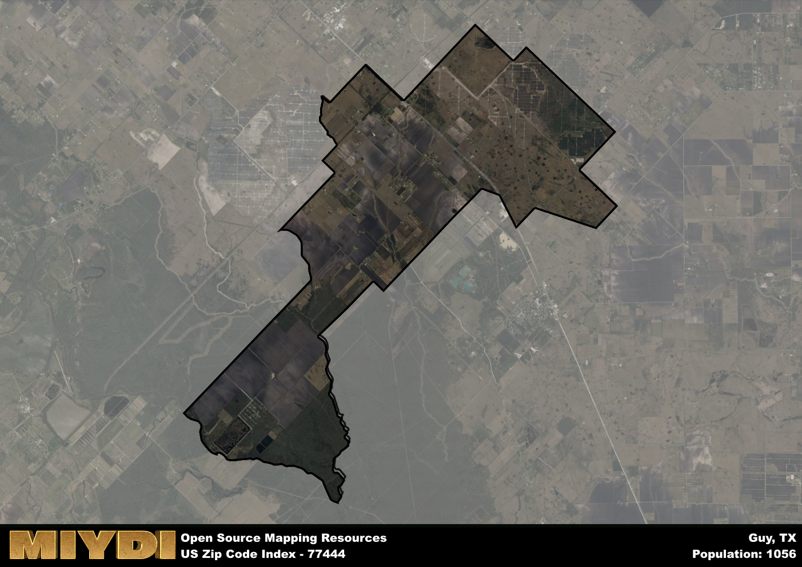

**Area Name:** Guy

**Zip Code:** 77444

**State:** TX

Guy is a part of the Houston-The Woodlands-Sugar Land - TX Metro Area, and makes up  of the Metro's population.  

# Headline  
**Discover the Charming Neighborhood of Guy in Zip Code 77444**  

Nestled in the heart of Texas, the zip code 77444 encompasses the charming neighborhood of Guy. Situated within the larger metropolitan area of Houston, Guy is located in Fort Bend County and is surrounded by the cities of Richmond, Rosenberg, and Sugar Land. The area is easily accessible via major highways and is a short drive away from the bustling urban center of Houston, making it a convenient yet tranquil residential enclave.

The history of Guy dates back to the early 19th century when it was founded as a small farming community. Over the years, the area experienced steady growth and development, attracting residents seeking a peaceful suburban lifestyle. Named after local pioneer Leonard Guy, the neighborhood has preserved its rich heritage through historic landmarks and a close-knit community spirit that continues to thrive to this day.

Today, Guy is a thriving community with a mix of residential and commercial spaces. The area boasts a variety of local businesses, restaurants, and shops that cater to the needs of its residents. Guy also offers a range of recreational amenities, including parks, playgrounds, and community centers, making it a family-friendly neighborhood. Additionally, the neighborhood is home to cultural sites and events that celebrate its unique identity within the vibrant tapestry of the greater Houston area.

# Guy Demographics

The population of Guy is 1056.  
Guy has a population density of 42.24 per square mile.  
The area of Guy is 25 square miles.  

## Guy Income and Economic Data

These demographic numbers are sourced from IRS return data, providing comprehensive insights into the population dynamics and economic trends within Guy.

**Breakdown of return types for Guy**

The table offers insight into the composition of tax returns filed with the IRS, categorizing them into three main types. Single returns represent filings by individuals, joint returns by married couples, and head of household returns by individuals who qualify as heads of households, typically having dependents. This breakdown provides an understanding of the different filing statuses adopted by taxpayers when submitting their tax documentation.

| Return Types filed for Guy                              | Percentage          |
|----------------------------------------------------------|---------------------|
| Single Returns                                            | 0.43 |
| Joint Returns                                             | 0.4 |
| Head Household Returns                                    | 0.18 |

The income and economic data presented here is sourced from the IRS income brackets, utilized for categorizing tax returns by income levels. This table displays income ranges for both single filers and married couples, along with the corresponding number of returns and the percentage within each bracket, providing valuable insight into the distribution of taxes across various income groups.

| Bracket Name       | Single Filer Income Range | Married Couple Range | Number of Returns | Percentage of Returns |
|--------------------|----------------------------|----------------------|-------------------|-----------------------|
| 10% Bracket        | Up to $10,275              | Up to $20,550        | 150 | 0.38% |
| 12% Bracket        | $10,276 - $41,775          | $20,551 - $83,550    | 80 | 0.2% |
| 22% Bracket        | $41,776 - $89,075          | $83,551 - $178,150   | 70 | 0.18% |
| 24% Bracket        | $89,076 - $170,050         | $178,151 - $340,100  | 30 | 0.08% |
| 32% Bracket        | $170,051 - $215,950        | $340,101 - $431,900  | 70 | 0.18% |
| 35% Bracket        | $215,951 - $539,900        | $431,901 - $647,850  | 0 | 0% |

### Exploring Taxpayer Diversity: A Breakdown of Different Types of Tax Returns in Guy

The table offers insights into various types of tax returns filed, reflecting different aspects of taxpayer activities and demographics. Categories include charitable returns for donations, dependent returns for claimed dependents, educator population, elderly population, real estate returns, self-employment returns, student loan returns, and unemployment returns, providing valuable insights into taxpayer behavior and demographics.

| Guy Filing Types                    | Count | Percentage |
|--------------------------------------|-------|------------|
| Charitable Donations                 | 0 | 0% |
| Dependents Claimed                   | 0 | 0% |
| Educator Residents                   | 0 | 0% |
| Elderly Population                   | 80 | 0.2% |
| Farming Population                   | 40 | 0.1% |
| Real Estate Transactions             | 0 | 0% |
| Self-Employed Individuals            | 60 | 0.15% |
| Student Loan Cases                   | 0 | 0% |
| Unemployment Benefit Filings         | 50 | 0.13% |

## Guy AI and Census Variables

The values presented in this dataset for Guy are AI-optimized, streamlined, and categorized into relevant buckets for enhanced utility in AI and mapping programs. These simplified values have been optimized to facilitate efficient analysis and integration into various technological applications, offering users accessible and actionable insights into demographics within the Guy area.

| AI Variables for Guy | Value |
|-------------|-------|
| Shape Area | 85450358.1875 |
| Shape Length | 62630.4584853933 |
| CBSA Federal Processing Standard Code | 26420 |

## How to use this free AI optimized Geo-Spatial Data for Guy, TX

This data is made freely available under the Creative Commons license, allowing for unrestricted use for any purpose. Users can access static resources directly from GitHub or leverage more advanced functionalities by utilizing the GeoJSON files. All datasets originate from official government or private sector sources and are meticulously compiled into relevant datasets within QGIS. However, the versatility of the data ensures compatibility with any mapping application.

## Data Accuracy Disclaimer
It's important to note that the data provided here may contain errors or discrepancies and should be considered as 'close enough' for business applications and AI rather than a definitive source of truth. This data is aggregated from multiple sources, some of which publish information on wildly different intervals, leading to potential inconsistencies. Additionally, certain data points may not be corrected for Covid-related changes, further impacting accuracy. Moreover, the assumption that demographic trends are consistent throughout a region may lead to discrepancies, as trends often concentrate in areas of highest population density. As a result, dense areas may be slightly underrepresented, while rural areas may be slightly overrepresented, resulting in a more conservative dataset. Furthermore, the focus primarily on areas within US Major and Minor Statistical areas means that approximately 40 million Americans living outside of these areas may not be fully represented. Lastly, the historical background and area descriptions generated using AI are susceptible to potential mistakes, so users should exercise caution when interpreting the information provided.
