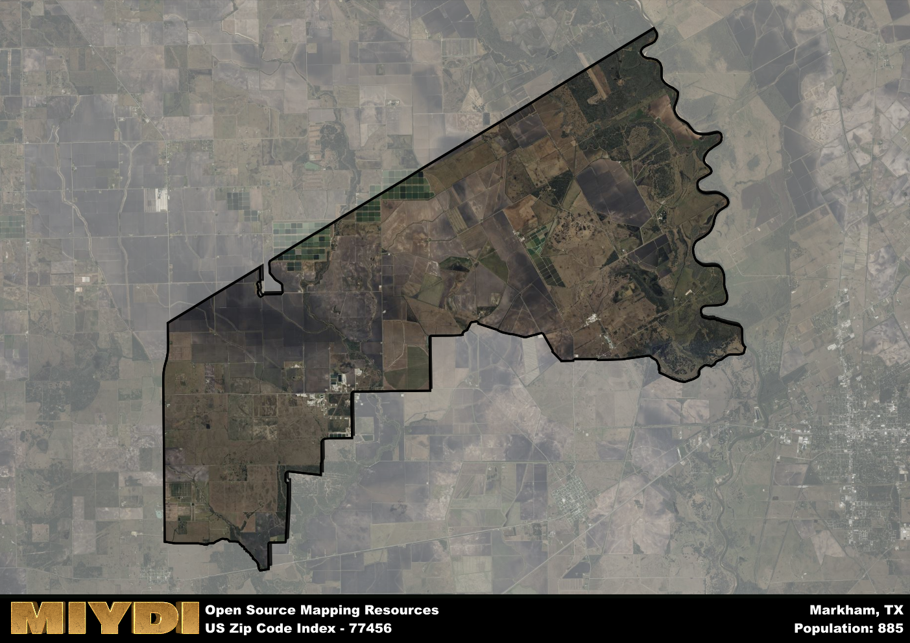

**Area Name:** Markham

**Zip Code:** 77456

**State:** TX

Markham is a part of the Bay City - TX Micro Area, and makes up  of the Metro's population.  

# Markham (Zip Code: 77456) - A Quaint Neighborhood in Texas  

Markham, located in zip code 77456, is a charming neighborhood situated in the southeastern part of Texas. The area is bordered by the cities of Bay City to the west and El Campo to the east, making it an integral part of the larger Matagorda County. Markham serves as a residential community for those working in the surrounding cities, providing a peaceful suburban environment with easy access to major population centers and urban amenities.

Originally established as a railroad stop in the late 19th century, Markham has a rich history tied to the development of transportation in the region. The area saw significant growth during the early 20th century with the expansion of agriculture and oil industries, shaping its current identity as a small but thriving community. Markham was named after an early settler and has maintained its close-knit community feel throughout the years, preserving its historic charm and character.

Today, Markham boasts a mix of residential homes, local businesses, and recreational facilities that cater to its residents and visitors alike. The area is known for its agricultural activities, including rice farming and cattle ranching, which contribute to the local economy. Markham also offers various services such as schools, parks, and small-town shops, making it a desirable place to live for those seeking a peaceful and close community atmosphere. Additionally, the neighborhood is home to historic sites that showcase its past, adding to the cultural richness of the area.

# Markham Demographics

The population of Markham is 885.  
Markham has a population density of 14.92 per square mile.  
The area of Markham is 59.32 square miles.  

## Markham AI and Census Variables

The values presented in this dataset for Markham are AI-optimized, streamlined, and categorized into relevant buckets for enhanced utility in AI and mapping programs. These simplified values have been optimized to facilitate efficient analysis and integration into various technological applications, offering users accessible and actionable insights into demographics within the Markham area.

| AI Variables for Markham | Value |
|-------------|-------|
| Shape Area | 201680778.757813 |
| Shape Length | 88458.9138108458 |
| CBSA Federal Processing Standard Code | 13060 |

## How to use this free AI optimized Geo-Spatial Data for Markham, TX

This data is made freely available under the Creative Commons license, allowing for unrestricted use for any purpose. Users can access static resources directly from GitHub or leverage more advanced functionalities by utilizing the GeoJSON files. All datasets originate from official government or private sector sources and are meticulously compiled into relevant datasets within QGIS. However, the versatility of the data ensures compatibility with any mapping application.

## Data Accuracy Disclaimer
It's important to note that the data provided here may contain errors or discrepancies and should be considered as 'close enough' for business applications and AI rather than a definitive source of truth. This data is aggregated from multiple sources, some of which publish information on wildly different intervals, leading to potential inconsistencies. Additionally, certain data points may not be corrected for Covid-related changes, further impacting accuracy. Moreover, the assumption that demographic trends are consistent throughout a region may lead to discrepancies, as trends often concentrate in areas of highest population density. As a result, dense areas may be slightly underrepresented, while rural areas may be slightly overrepresented, resulting in a more conservative dataset. Furthermore, the focus primarily on areas within US Major and Minor Statistical areas means that approximately 40 million Americans living outside of these areas may not be fully represented. Lastly, the historical background and area descriptions generated using AI are susceptible to potential mistakes, so users should exercise caution when interpreting the information provided.
