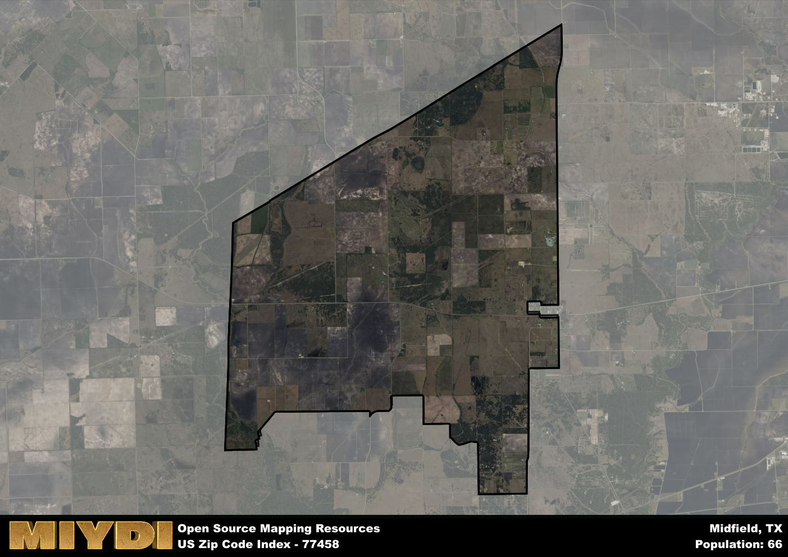

**Area Name:** Midfield

**Zip Code:** 77458

**State:** TX

Midfield is a part of the Bay City - TX Micro Area, and makes up  of the Metro's population.  

# Midfield: A Hidden Gem in the Heart of Coastal Texas  

Midfield, located within the zip code 77458, is a charming neighborhood nestled in the heart of coastal Texas. Bordered by the cities of Blessing to the north and Wadsworth to the south, Midfield is an integral part of the larger Matagorda County. Situated along the Gulf Coast, this area is known for its scenic views and proximity to the natural beauty of the Colorado River.

Originally settled in the late 19th century, Midfield has a rich history of agriculture and ranching. The area experienced significant growth during the oil boom of the early 20th century, attracting new residents and businesses to the region. The name "Midfield" is believed to have originated from its central location within Matagorda County, serving as a hub for local commerce and community activities.

Today, Midfield is a vibrant community with a mix of residential and commercial properties. The area is known for its agricultural industry, including rice and cattle farming. Residents enjoy access to local parks, fishing spots along the Colorado River, and historic sites such as the Midfield Cemetery. With its small-town charm and close-knit community, Midfield offers a peaceful retreat for those looking to experience the beauty of coastal Texas.

# Midfield Demographics

The population of Midfield is 66.  
Midfield has a population density of 1.9 per square mile.  
The area of Midfield is 34.65 square miles.  

## Midfield AI and Census Variables

The values presented in this dataset for Midfield are AI-optimized, streamlined, and categorized into relevant buckets for enhanced utility in AI and mapping programs. These simplified values have been optimized to facilitate efficient analysis and integration into various technological applications, offering users accessible and actionable insights into demographics within the Midfield area.

| AI Variables for Midfield | Value |
|-------------|-------|
| Shape Area | 117631420.277344 |
| Shape Length | 56202.2692441245 |
| CBSA Federal Processing Standard Code | 13060 |

## How to use this free AI optimized Geo-Spatial Data for Midfield, TX

This data is made freely available under the Creative Commons license, allowing for unrestricted use for any purpose. Users can access static resources directly from GitHub or leverage more advanced functionalities by utilizing the GeoJSON files. All datasets originate from official government or private sector sources and are meticulously compiled into relevant datasets within QGIS. However, the versatility of the data ensures compatibility with any mapping application.

## Data Accuracy Disclaimer
It's important to note that the data provided here may contain errors or discrepancies and should be considered as 'close enough' for business applications and AI rather than a definitive source of truth. This data is aggregated from multiple sources, some of which publish information on wildly different intervals, leading to potential inconsistencies. Additionally, certain data points may not be corrected for Covid-related changes, further impacting accuracy. Moreover, the assumption that demographic trends are consistent throughout a region may lead to discrepancies, as trends often concentrate in areas of highest population density. As a result, dense areas may be slightly underrepresented, while rural areas may be slightly overrepresented, resulting in a more conservative dataset. Furthermore, the focus primarily on areas within US Major and Minor Statistical areas means that approximately 40 million Americans living outside of these areas may not be fully represented. Lastly, the historical background and area descriptions generated using AI are susceptible to potential mistakes, so users should exercise caution when interpreting the information provided.
