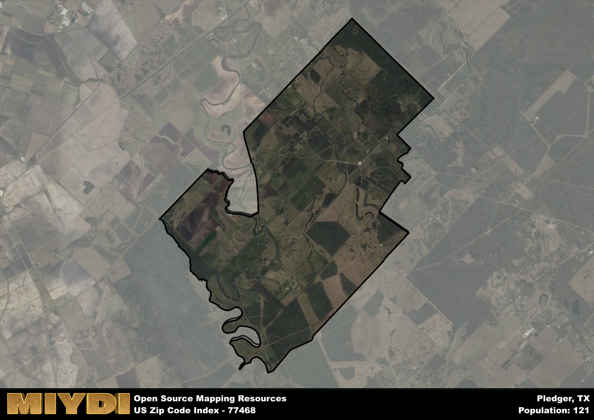

**Area Name:** Pledger

**Zip Code:** 77468

**State:** TX

Pledger is a part of the Bay City - TX Micro Area, and makes up  of the Metro's population.  

# Pledger: A Historic Community in Zip Code 77468  

Located in southeastern Texas, zip code 77468 encompasses the small community of Pledger. Situated within Matagorda County, Pledger is surrounded by the towns of Boling-Iago, West Columbia, and Bay City. It is a rural area with a close-knit community that enjoys a peaceful and scenic environment, making it a desirable place to live for those seeking a quieter lifestyle within proximity to larger urban centers.

Pledger has a rich history dating back to its establishment in the 19th century. Named after local landowner John R. Pledger, the area was primarily used for agriculture, particularly rice farming. Over the years, Pledger has grown into a charming residential area while still maintaining its rural roots. The community takes pride in its historical heritage, with many residents actively preserving and celebrating the area's past.

Presently, Pledger is a vibrant community with a mix of residential and agricultural properties. The economy is driven by farming activities, with rice and soybeans being the main crops grown in the area. Residents enjoy a range of services such as local schools, churches, and small businesses. Pledger also boasts recreational amenities like parks and outdoor spaces, providing opportunities for outdoor activities and community gatherings. Additionally, the area is home to historic sites that offer insight into its past, adding to the overall charm of this quaint neighborhood in Matagorda County.

# Pledger Demographics

The population of Pledger is 121.  
Pledger has a population density of 5.53 per square mile.  
The area of Pledger is 21.89 square miles.  

## Pledger AI and Census Variables

The values presented in this dataset for Pledger are AI-optimized, streamlined, and categorized into relevant buckets for enhanced utility in AI and mapping programs. These simplified values have been optimized to facilitate efficient analysis and integration into various technological applications, offering users accessible and actionable insights into demographics within the Pledger area.

| AI Variables for Pledger | Value |
|-------------|-------|
| Shape Area | 74634629.2695313 |
| Shape Length | 50618.69469465 |
| CBSA Federal Processing Standard Code | 13060 |

## How to use this free AI optimized Geo-Spatial Data for Pledger, TX

This data is made freely available under the Creative Commons license, allowing for unrestricted use for any purpose. Users can access static resources directly from GitHub or leverage more advanced functionalities by utilizing the GeoJSON files. All datasets originate from official government or private sector sources and are meticulously compiled into relevant datasets within QGIS. However, the versatility of the data ensures compatibility with any mapping application.

## Data Accuracy Disclaimer
It's important to note that the data provided here may contain errors or discrepancies and should be considered as 'close enough' for business applications and AI rather than a definitive source of truth. This data is aggregated from multiple sources, some of which publish information on wildly different intervals, leading to potential inconsistencies. Additionally, certain data points may not be corrected for Covid-related changes, further impacting accuracy. Moreover, the assumption that demographic trends are consistent throughout a region may lead to discrepancies, as trends often concentrate in areas of highest population density. As a result, dense areas may be slightly underrepresented, while rural areas may be slightly overrepresented, resulting in a more conservative dataset. Furthermore, the focus primarily on areas within US Major and Minor Statistical areas means that approximately 40 million Americans living outside of these areas may not be fully represented. Lastly, the historical background and area descriptions generated using AI are susceptible to potential mistakes, so users should exercise caution when interpreting the information provided.
