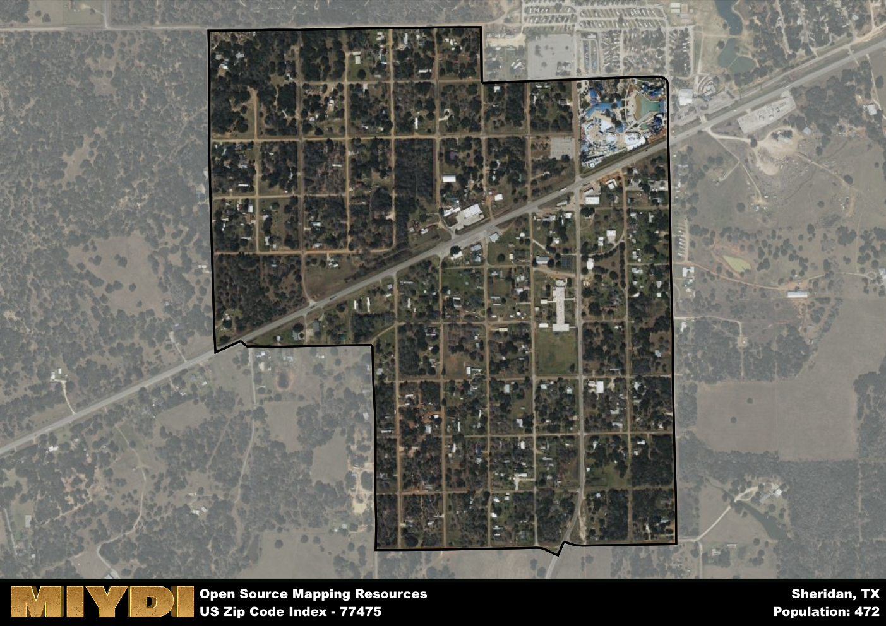

**Area Name:** Sheridan

**Zip Code:** 77475

**State:** TX

# Sheridan: A Historic and Vibrant Community in Zip Code 77475

Located in south-central Texas, zip code 77475 encompasses the charming neighborhood of Sheridan. Bordered by the Colorado River to the east and surrounded by lush greenery, Sheridan seamlessly integrates with nearby towns such as Hallettsville and Columbus. This zip code area is part of the larger metropolitan context of the Greater Houston area, providing residents with easy access to urban amenities while enjoying the peaceful and serene atmosphere of a small town.

Sheridan has a rich historical narrative that dates back to its founding in the mid-19th century. Originally settled by German immigrants, the area quickly grew into a thriving community centered around agriculture and ranching. The town was officially named Sheridan in honor of General Philip Sheridan, a prominent Union Army leader during the Civil War. Over the years, Sheridan has maintained its strong sense of heritage and pride, with many historic buildings and landmarks still standing as a testament to its past.

Today, Sheridan offers a mix of modern conveniences and small-town charm. The local economy is predominantly based on agriculture, with many residents working in farming and ranching. The neighborhood boasts a variety of services, including shops, restaurants, and schools, making it a self-sustaining community. In addition, Sheridan is home to several recreational amenities such as parks and outdoor spaces, where residents can enjoy hiking, biking, and picnicking. Cultural and historic sites like the Sheridan Historical Museum showcase the area's unique identity and provide insight into its fascinating past.

# Sheridan Demographics

The population of Sheridan is 472.  
Sheridan has a population density of 1004.26 per square mile.  
The area of Sheridan is 0.47 square miles.  

## Sheridan AI and Census Variables

The values presented in this dataset for Sheridan are AI-optimized, streamlined, and categorized into relevant buckets for enhanced utility in AI and mapping programs. These simplified values have been optimized to facilitate efficient analysis and integration into various technological applications, offering users accessible and actionable insights into demographics within the Sheridan area.

| AI Variables for Sheridan | Value |
|-------------|-------|
| Shape Area | 1613223.13671875 |
| Shape Length | 5665.69227879156 |

## How to use this free AI optimized Geo-Spatial Data for Sheridan, TX

This data is made freely available under the Creative Commons license, allowing for unrestricted use for any purpose. Users can access static resources directly from GitHub or leverage more advanced functionalities by utilizing the GeoJSON files. All datasets originate from official government or private sector sources and are meticulously compiled into relevant datasets within QGIS. However, the versatility of the data ensures compatibility with any mapping application.

## Data Accuracy Disclaimer
It's important to note that the data provided here may contain errors or discrepancies and should be considered as 'close enough' for business applications and AI rather than a definitive source of truth. This data is aggregated from multiple sources, some of which publish information on wildly different intervals, leading to potential inconsistencies. Additionally, certain data points may not be corrected for Covid-related changes, further impacting accuracy. Moreover, the assumption that demographic trends are consistent throughout a region may lead to discrepancies, as trends often concentrate in areas of highest population density. As a result, dense areas may be slightly underrepresented, while rural areas may be slightly overrepresented, resulting in a more conservative dataset. Furthermore, the focus primarily on areas within US Major and Minor Statistical areas means that approximately 40 million Americans living outside of these areas may not be fully represented. Lastly, the historical background and area descriptions generated using AI are susceptible to potential mistakes, so users should exercise caution when interpreting the information provided.
