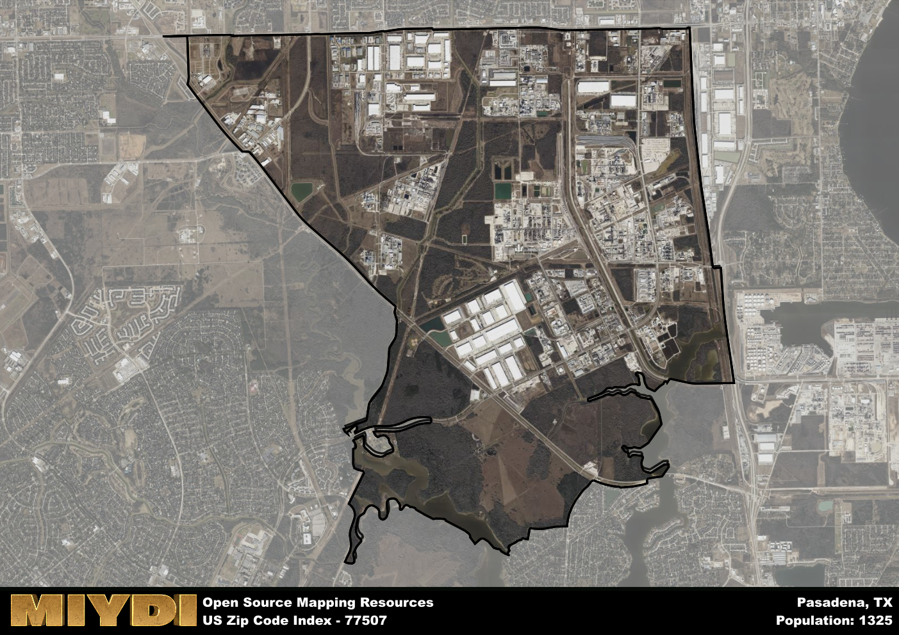

**Area Name:** Pasadena

**Zip Code:** 77507

**State:** TX

Pasadena is a part of the Houston-The Woodlands-Sugar Land - TX Metro Area, and makes up  of the Metro's population.  

# Pasadena: A Historic Neighborhood in Zip Code 77507

Located in the southeastern part of Harris County, Texas, zip code 77507 encompasses the neighborhood of Pasadena. Bordered by Deer Park to the east and Houston to the northwest, Pasadena is a vibrant community that is an integral part of the Greater Houston metropolitan area. The zip code area is easily accessible via major highways such as the Sam Houston Tollway and Interstate 45, making it a convenient location for residents and businesses alike.

Pasadena has a rich history dating back to the early 19th century when it was first settled by John H. Burnett. The area experienced significant growth during the oil boom in the early 20th century, becoming a hub for petrochemical industries. The neighborhood was officially incorporated as the City of Pasadena in 1928, and since then, it has continued to flourish as a diverse and dynamic community with a strong sense of identity and pride.

Today, Pasadena is a bustling neighborhood with a thriving economy centered around the petrochemical industry. The area is home to a variety of businesses ranging from small shops to large corporations, providing ample job opportunities for residents. Pasadena also boasts numerous parks, recreational facilities, and cultural attractions, including the Pasadena Historical Museum and Strawberry Park, making it a desirable place to live and visit within the Greater Houston area.

# Pasadena Demographics

The population of Pasadena is 1325.  
Pasadena has a population density of 83.23 per square mile.  
The area of Pasadena is 15.92 square miles.  

## Pasadena AI and Census Variables

The values presented in this dataset for Pasadena are AI-optimized, streamlined, and categorized into relevant buckets for enhanced utility in AI and mapping programs. These simplified values have been optimized to facilitate efficient analysis and integration into various technological applications, offering users accessible and actionable insights into demographics within the Pasadena area.

| AI Variables for Pasadena | Value |
|-------------|-------|
| Shape Area | 54740606.3984375 |
| Shape Length | 47106.5281226821 |
| CBSA Federal Processing Standard Code | 26420 |

## How to use this free AI optimized Geo-Spatial Data for Pasadena, TX

This data is made freely available under the Creative Commons license, allowing for unrestricted use for any purpose. Users can access static resources directly from GitHub or leverage more advanced functionalities by utilizing the GeoJSON files. All datasets originate from official government or private sector sources and are meticulously compiled into relevant datasets within QGIS. However, the versatility of the data ensures compatibility with any mapping application.

## Data Accuracy Disclaimer
It's important to note that the data provided here may contain errors or discrepancies and should be considered as 'close enough' for business applications and AI rather than a definitive source of truth. This data is aggregated from multiple sources, some of which publish information on wildly different intervals, leading to potential inconsistencies. Additionally, certain data points may not be corrected for Covid-related changes, further impacting accuracy. Moreover, the assumption that demographic trends are consistent throughout a region may lead to discrepancies, as trends often concentrate in areas of highest population density. As a result, dense areas may be slightly underrepresented, while rural areas may be slightly overrepresented, resulting in a more conservative dataset. Furthermore, the focus primarily on areas within US Major and Minor Statistical areas means that approximately 40 million Americans living outside of these areas may not be fully represented. Lastly, the historical background and area descriptions generated using AI are susceptible to potential mistakes, so users should exercise caution when interpreting the information provided.
