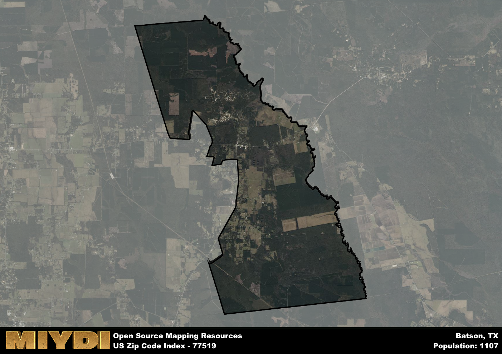

**Area Name:** Batson

**Zip Code:** 77519

**State:** TX

Batson is a part of the Beaumont-Port Arthur - TX Metro Area, and makes up  of the Metro's population.  

# Batson: A Charming Neighborhood in Southeast Texas

Located in southeastern Texas, Batson is a small community within the zip code 77519. Situated in Hardin County, Batson is surrounded by other small towns such as Daisetta and Hull. The area is part of the larger Beaumont-Port Arthur metropolitan area, providing residents with easy access to urban amenities while enjoying the tranquility of a rural setting.

Batson has a rich historical narrative that dates back to its establishment in the early 1900s. Originally a logging town, Batson experienced a boom in population with the discovery of oil in the area. The town was named after local businessman George E. Batson, who played a significant role in the development of the community. Over the years, Batson has maintained its small-town charm while adapting to modern times.

Today, Batson is a close-knit community known for its friendly residents and strong sense of community. The area's economy is primarily driven by agriculture and oil production, providing locals with stable job opportunities. Residents can enjoy the numerous parks and recreational facilities in the area, as well as historic sites that showcase Batson's unique heritage. With its blend of rural tranquility and urban convenience, Batson remains a beloved neighborhood in southeast Texas.

# Batson Demographics

The population of Batson is 1107.  
Batson has a population density of 28.68 per square mile.  
The area of Batson is 38.6 square miles.  

## Batson Income and Economic Data

These demographic numbers are sourced from IRS return data, providing comprehensive insights into the population dynamics and economic trends within Batson.

**Breakdown of return types for Batson**

The table offers insight into the composition of tax returns filed with the IRS, categorizing them into three main types. Single returns represent filings by individuals, joint returns by married couples, and head of household returns by individuals who qualify as heads of households, typically having dependents. This breakdown provides an understanding of the different filing statuses adopted by taxpayers when submitting their tax documentation.

| Return Types filed for Batson                              | Percentage          |
|----------------------------------------------------------|---------------------|
| Single Returns                                            | 0.35 |
| Joint Returns                                             | 0.52 |
| Head Household Returns                                    | 0.11 |

The income and economic data presented here is sourced from the IRS income brackets, utilized for categorizing tax returns by income levels. This table displays income ranges for both single filers and married couples, along with the corresponding number of returns and the percentage within each bracket, providing valuable insight into the distribution of taxes across various income groups.

| Bracket Name       | Single Filer Income Range | Married Couple Range | Number of Returns | Percentage of Returns |
|--------------------|----------------------------|----------------------|-------------------|-----------------------|
| 10% Bracket        | Up to $10,275              | Up to $20,550        | 150 | 0.33% |
| 12% Bracket        | $10,276 - $41,775          | $20,551 - $83,550    | 100 | 0.22% |
| 22% Bracket        | $41,776 - $89,075          | $83,551 - $178,150   | 70 | 0.15% |
| 24% Bracket        | $89,076 - $170,050         | $178,151 - $340,100  | 50 | 0.11% |
| 32% Bracket        | $170,051 - $215,950        | $340,101 - $431,900  | 90 | 0.2% |
| 35% Bracket        | $215,951 - $539,900        | $431,901 - $647,850  | 0 | 0% |

### Exploring Taxpayer Diversity: A Breakdown of Different Types of Tax Returns in Batson

The table offers insights into various types of tax returns filed, reflecting different aspects of taxpayer activities and demographics. Categories include charitable returns for donations, dependent returns for claimed dependents, educator population, elderly population, real estate returns, self-employment returns, student loan returns, and unemployment returns, providing valuable insights into taxpayer behavior and demographics.

| Batson Filing Types                    | Count | Percentage |
|--------------------------------------|-------|------------|
| Charitable Donations                 | 0 | 0% |
| Dependents Claimed                   | 0 | 0% |
| Educator Residents                   | 0 | 0% |
| Elderly Population                   | 110 | 0.24% |
| Farming Population                   | 40 | 0.087% |
| Real Estate Transactions             | 0 | 0% |
| Self-Employed Individuals            | 50 | 0.109% |
| Student Loan Cases                   | 0 | 0% |
| Unemployment Benefit Filings         | 80 | 0.17% |

## Batson AI and Census Variables

The values presented in this dataset for Batson are AI-optimized, streamlined, and categorized into relevant buckets for enhanced utility in AI and mapping programs. These simplified values have been optimized to facilitate efficient analysis and integration into various technological applications, offering users accessible and actionable insights into demographics within the Batson area.

| AI Variables for Batson | Value |
|-------------|-------|
| Shape Area | 134387643.710938 |
| Shape Length | 78308.968338428 |
| CBSA Federal Processing Standard Code | 13140 |

## How to use this free AI optimized Geo-Spatial Data for Batson, TX

This data is made freely available under the Creative Commons license, allowing for unrestricted use for any purpose. Users can access static resources directly from GitHub or leverage more advanced functionalities by utilizing the GeoJSON files. All datasets originate from official government or private sector sources and are meticulously compiled into relevant datasets within QGIS. However, the versatility of the data ensures compatibility with any mapping application.

## Data Accuracy Disclaimer
It's important to note that the data provided here may contain errors or discrepancies and should be considered as 'close enough' for business applications and AI rather than a definitive source of truth. This data is aggregated from multiple sources, some of which publish information on wildly different intervals, leading to potential inconsistencies. Additionally, certain data points may not be corrected for Covid-related changes, further impacting accuracy. Moreover, the assumption that demographic trends are consistent throughout a region may lead to discrepancies, as trends often concentrate in areas of highest population density. As a result, dense areas may be slightly underrepresented, while rural areas may be slightly overrepresented, resulting in a more conservative dataset. Furthermore, the focus primarily on areas within US Major and Minor Statistical areas means that approximately 40 million Americans living outside of these areas may not be fully represented. Lastly, the historical background and area descriptions generated using AI are susceptible to potential mistakes, so users should exercise caution when interpreting the information provided.
