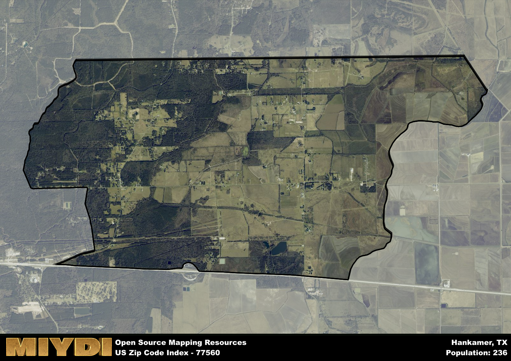

**Area Name:** Hankamer

**Zip Code:** 77560

**State:** TX

Hankamer is a part of the Houston-The Woodlands-Sugar Land - TX Metro Area, and makes up  of the Metro's population.  

# Hankamer: A Quaint Community in Southeast Texas  

Hankamer, located in zip code 77560, is a small community in Chambers County, Southeast Texas. Bordered by the Trinity Bay to the east and vast rural areas to the west, Hankamer is situated within close proximity to larger cities such as Baytown and Houston. The area serves as a peaceful retreat from the urban hustle and bustle, while still maintaining links to major population centers through well-connected roadways.

Originally settled in the mid-19th century, Hankamer has a rich history rooted in agriculture and ranching. The town was named after a prominent local family and has since grown into a close-knit community known for its friendly residents and picturesque surroundings. Throughout the years, Hankamer has preserved its rural charm while adapting to modern times, making it a desirable place to live for those seeking a tranquil lifestyle away from the city.

Presently, Hankamer boasts a mix of agricultural and oil industry activities, providing employment opportunities for its residents. The area is home to local businesses, shops, and restaurants that cater to the community's needs. Hankamer also offers recreational amenities such as parks, fishing spots, and nature trails, making it an ideal location for outdoor enthusiasts. With its historic sites and cultural events, Hankamer continues to thrive as a small but vibrant community in Southeast Texas.

# Hankamer Demographics

The population of Hankamer is 236.  
Hankamer has a population density of 11.92 per square mile.  
The area of Hankamer is 19.8 square miles.  

## Hankamer Income and Economic Data

These demographic numbers are sourced from IRS return data, providing comprehensive insights into the population dynamics and economic trends within Hankamer.

**Breakdown of return types for Hankamer**

The table offers insight into the composition of tax returns filed with the IRS, categorizing them into three main types. Single returns represent filings by individuals, joint returns by married couples, and head of household returns by individuals who qualify as heads of households, typically having dependents. This breakdown provides an understanding of the different filing statuses adopted by taxpayers when submitting their tax documentation.

| Return Types filed for Hankamer                              | Percentage          |
|----------------------------------------------------------|---------------------|
| Single Returns                                            | 0.47 |
| Joint Returns                                             | 0.34 |
| Head Household Returns                                    | 0.19 |

The income and economic data presented here is sourced from the IRS income brackets, utilized for categorizing tax returns by income levels. This table displays income ranges for both single filers and married couples, along with the corresponding number of returns and the percentage within each bracket, providing valuable insight into the distribution of taxes across various income groups.

| Bracket Name       | Single Filer Income Range | Married Couple Range | Number of Returns | Percentage of Returns |
|--------------------|----------------------------|----------------------|-------------------|-----------------------|
| 10% Bracket        | Up to $10,275              | Up to $20,550        | 150 | 0.32% |
| 12% Bracket        | $10,276 - $41,775          | $20,551 - $83,550    | 150 | 0.32% |
| 22% Bracket        | $41,776 - $89,075          | $83,551 - $178,150   | 50 | 0.11% |
| 24% Bracket        | $89,076 - $170,050         | $178,151 - $340,100  | 30 | 0.06% |
| 32% Bracket        | $170,051 - $215,950        | $340,101 - $431,900  | 90 | 0.19% |
| 35% Bracket        | $215,951 - $539,900        | $431,901 - $647,850  | 0 | 0% |

### Exploring Taxpayer Diversity: A Breakdown of Different Types of Tax Returns in Hankamer

The table offers insights into various types of tax returns filed, reflecting different aspects of taxpayer activities and demographics. Categories include charitable returns for donations, dependent returns for claimed dependents, educator population, elderly population, real estate returns, self-employment returns, student loan returns, and unemployment returns, providing valuable insights into taxpayer behavior and demographics.

| Hankamer Filing Types                    | Count | Percentage |
|--------------------------------------|-------|------------|
| Charitable Donations                 | 0 | 0% |
| Dependents Claimed                   | 0 | 0% |
| Educator Residents                   | 0 | 0% |
| Elderly Population                   | 100 | 0.21% |
| Farming Population                   | 50 | 0.106% |
| Real Estate Transactions             | 0 | 0% |
| Self-Employed Individuals            | 30 | 0.064% |
| Student Loan Cases                   | 0 | 0% |
| Unemployment Benefit Filings         | 60 | 0.13% |

## Hankamer AI and Census Variables

The values presented in this dataset for Hankamer are AI-optimized, streamlined, and categorized into relevant buckets for enhanced utility in AI and mapping programs. These simplified values have been optimized to facilitate efficient analysis and integration into various technological applications, offering users accessible and actionable insights into demographics within the Hankamer area.

| AI Variables for Hankamer | Value |
|-------------|-------|
| Shape Area | 68419087.7734375 |
| Shape Length | 40577.6065316865 |
| CBSA Federal Processing Standard Code | 26420 |

## How to use this free AI optimized Geo-Spatial Data for Hankamer, TX

This data is made freely available under the Creative Commons license, allowing for unrestricted use for any purpose. Users can access static resources directly from GitHub or leverage more advanced functionalities by utilizing the GeoJSON files. All datasets originate from official government or private sector sources and are meticulously compiled into relevant datasets within QGIS. However, the versatility of the data ensures compatibility with any mapping application.

## Data Accuracy Disclaimer
It's important to note that the data provided here may contain errors or discrepancies and should be considered as 'close enough' for business applications and AI rather than a definitive source of truth. This data is aggregated from multiple sources, some of which publish information on wildly different intervals, leading to potential inconsistencies. Additionally, certain data points may not be corrected for Covid-related changes, further impacting accuracy. Moreover, the assumption that demographic trends are consistent throughout a region may lead to discrepancies, as trends often concentrate in areas of highest population density. As a result, dense areas may be slightly underrepresented, while rural areas may be slightly overrepresented, resulting in a more conservative dataset. Furthermore, the focus primarily on areas within US Major and Minor Statistical areas means that approximately 40 million Americans living outside of these areas may not be fully represented. Lastly, the historical background and area descriptions generated using AI are susceptible to potential mistakes, so users should exercise caution when interpreting the information provided.
