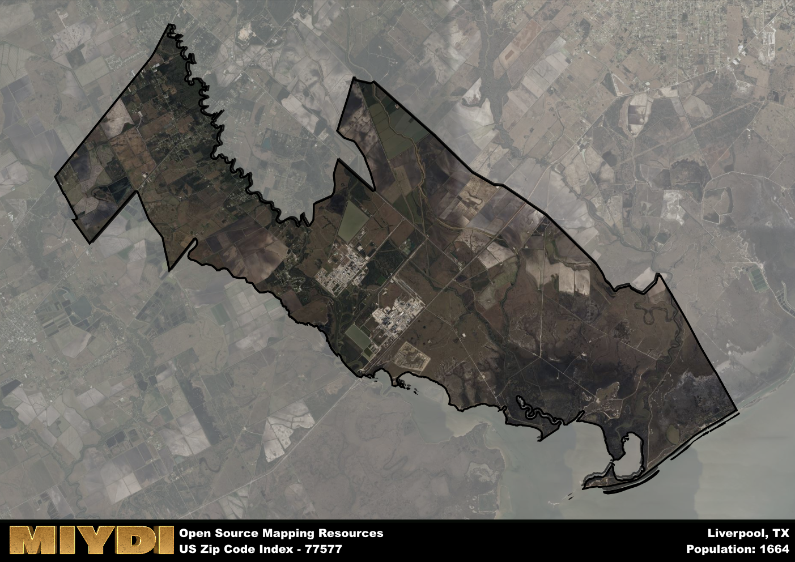

**Area Name:** Liverpool

**Zip Code:** 77577

**State:** TX

Liverpool is a part of the Houston-The Woodlands-Sugar Land - TX Metro Area, and makes up  of the Metro's population.  

# The Historic Neighborhood of Liverpool: Zip Code 77577 

Located in the greater Houston metropolitan area, the zip code 77577 corresponds to the charming neighborhood of Liverpool. Situated in Brazoria County, Liverpool is bordered by the cities of Alvin to the north and Danbury to the south. This neighborhood is seamlessly integrated into the urban fabric of the Houston metropolitan area, with easy access to major highways and transportation networks for residents commuting to downtown Houston or other nearby cities.

Liverpool has a rich historical narrative dating back to the mid-1800s when it was established as a shipping port along the Brazos River. Originally known as "New Liverpool," the area quickly grew into a bustling hub for trade and agriculture, attracting settlers looking to capitalize on its strategic location. Over the years, Liverpool has maintained its small-town charm while adapting to modern developments, preserving its historic buildings and landmarks that tell the story of its past.

Today, Liverpool is a close-knit community that offers a mix of residential, commercial, and recreational opportunities for its residents. The neighborhood is home to local businesses, parks, and community centers that cater to the needs of its diverse population. Residents can enjoy outdoor activities at nearby parks or learn about the area's heritage at historical sites such as the Liverpool Heritage Museum. With its unique blend of history and modern amenities, Liverpool continues to be a vibrant and thriving neighborhood within the Houston metropolitan area.

# Liverpool Demographics

The population of Liverpool is 1664.  
Liverpool has a population density of 24.9 per square mile.  
The area of Liverpool is 66.82 square miles.  

## Liverpool Income and Economic Data

These demographic numbers are sourced from IRS return data, providing comprehensive insights into the population dynamics and economic trends within Liverpool.

**Breakdown of return types for Liverpool**

The table offers insight into the composition of tax returns filed with the IRS, categorizing them into three main types. Single returns represent filings by individuals, joint returns by married couples, and head of household returns by individuals who qualify as heads of households, typically having dependents. This breakdown provides an understanding of the different filing statuses adopted by taxpayers when submitting their tax documentation.

| Return Types filed for Liverpool                              | Percentage          |
|----------------------------------------------------------|---------------------|
| Single Returns                                            | 0.44 |
| Joint Returns                                             | 0.41 |
| Head Household Returns                                    | 0.12 |

The income and economic data presented here is sourced from the IRS income brackets, utilized for categorizing tax returns by income levels. This table displays income ranges for both single filers and married couples, along with the corresponding number of returns and the percentage within each bracket, providing valuable insight into the distribution of taxes across various income groups.

| Bracket Name       | Single Filer Income Range | Married Couple Range | Number of Returns | Percentage of Returns |
|--------------------|----------------------------|----------------------|-------------------|-----------------------|
| 10% Bracket        | Up to $10,275              | Up to $20,550        | 240 | 0.35% |
| 12% Bracket        | $10,276 - $41,775          | $20,551 - $83,550    | 160 | 0.24% |
| 22% Bracket        | $41,776 - $89,075          | $83,551 - $178,150   | 80 | 0.12% |
| 24% Bracket        | $89,076 - $170,050         | $178,151 - $340,100  | 70 | 0.1% |
| 32% Bracket        | $170,051 - $215,950        | $340,101 - $431,900  | 110 | 0.16% |
| 35% Bracket        | $215,951 - $539,900        | $431,901 - $647,850  | 20 | 0.03% |

### Exploring Taxpayer Diversity: A Breakdown of Different Types of Tax Returns in Liverpool

The table offers insights into various types of tax returns filed, reflecting different aspects of taxpayer activities and demographics. Categories include charitable returns for donations, dependent returns for claimed dependents, educator population, elderly population, real estate returns, self-employment returns, student loan returns, and unemployment returns, providing valuable insights into taxpayer behavior and demographics.

| Liverpool Filing Types                    | Count | Percentage |
|--------------------------------------|-------|------------|
| Charitable Donations                 | 20 | 0.029% |
| Dependents Claimed                   | 0 | 0% |
| Educator Residents                   | 0 | 0% |
| Elderly Population                   | 180 | 0.26% |
| Farming Population                   | 40 | 0.059% |
| Real Estate Transactions             | 30 | 0.044% |
| Self-Employed Individuals            | 90 | 0.132% |
| Student Loan Cases                   | 0 | 0% |
| Unemployment Benefit Filings         | 110 | 0.16% |

## Liverpool AI and Census Variables

The values presented in this dataset for Liverpool are AI-optimized, streamlined, and categorized into relevant buckets for enhanced utility in AI and mapping programs. These simplified values have been optimized to facilitate efficient analysis and integration into various technological applications, offering users accessible and actionable insights into demographics within the Liverpool area.

| AI Variables for Liverpool | Value |
|-------------|-------|
| Shape Area | 228154034.746094 |
| Shape Length | 153458.736651613 |
| CBSA Federal Processing Standard Code | 26420 |

## How to use this free AI optimized Geo-Spatial Data for Liverpool, TX

This data is made freely available under the Creative Commons license, allowing for unrestricted use for any purpose. Users can access static resources directly from GitHub or leverage more advanced functionalities by utilizing the GeoJSON files. All datasets originate from official government or private sector sources and are meticulously compiled into relevant datasets within QGIS. However, the versatility of the data ensures compatibility with any mapping application.

## Data Accuracy Disclaimer
It's important to note that the data provided here may contain errors or discrepancies and should be considered as 'close enough' for business applications and AI rather than a definitive source of truth. This data is aggregated from multiple sources, some of which publish information on wildly different intervals, leading to potential inconsistencies. Additionally, certain data points may not be corrected for Covid-related changes, further impacting accuracy. Moreover, the assumption that demographic trends are consistent throughout a region may lead to discrepancies, as trends often concentrate in areas of highest population density. As a result, dense areas may be slightly underrepresented, while rural areas may be slightly overrepresented, resulting in a more conservative dataset. Furthermore, the focus primarily on areas within US Major and Minor Statistical areas means that approximately 40 million Americans living outside of these areas may not be fully represented. Lastly, the historical background and area descriptions generated using AI are susceptible to potential mistakes, so users should exercise caution when interpreting the information provided.
