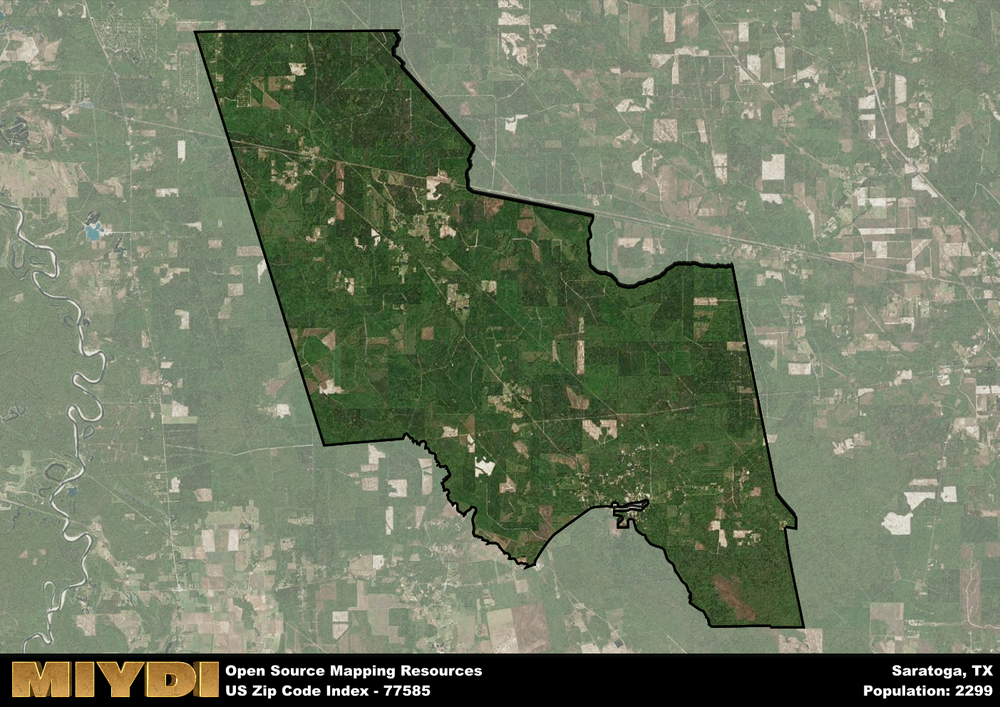

**Area Name:** Saratoga

**Zip Code:** 77585

**State:** TX

Saratoga is a part of the Beaumont-Port Arthur - TX Metro Area, and makes up  of the Metro's population.  

# Saratoga: A Charming Neighborhood in Zip Code 77585

Located in the southeastern part of Texas, zip code 77585 encompasses the quaint neighborhood of Saratoga. Bordered by lush greenery and rolling hills, Saratoga seamlessly integrates with the nearby cities of Dayton and Liberty. This zip code area is situated within the larger metropolitan context of the Houston-The Woodlands-Sugar Land metropolitan area, providing residents with access to urban amenities while enjoying a more suburban setting.

Saratoga has a rich historical narrative, with its roots dating back to the early 19th century. Originally settled by pioneers attracted to the fertile land and abundant natural resources, Saratoga quickly grew into a thriving community. The area was named after the famous Saratoga Race Course in New York, reflecting the residents' appreciation for equestrian culture. Over the years, Saratoga has retained its small-town charm while adapting to modern developments, making it a desirable place to live for families and professionals alike.

Today, Saratoga boasts a mix of agricultural and industrial economic activities, with residents finding employment opportunities in various sectors. The neighborhood offers a range of services, from local shops and restaurants to schools and healthcare facilities. Saratoga is also known for its recreational amenities, including parks, playgrounds, and nature trails that showcase the area's natural beauty. Visitors can explore historic sites like the Old Saratoga Cemetery, providing a glimpse into the neighborhood's past while enjoying the tranquil surroundings.

# Saratoga Demographics

The population of Saratoga is 2299.  
Saratoga has a population density of 14.36 per square mile.  
The area of Saratoga is 160.09 square miles.  

## Saratoga Income and Economic Data

These demographic numbers are sourced from IRS return data, providing comprehensive insights into the population dynamics and economic trends within Saratoga.

**Breakdown of return types for Saratoga**

The table offers insight into the composition of tax returns filed with the IRS, categorizing them into three main types. Single returns represent filings by individuals, joint returns by married couples, and head of household returns by individuals who qualify as heads of households, typically having dependents. This breakdown provides an understanding of the different filing statuses adopted by taxpayers when submitting their tax documentation.

| Return Types filed for Saratoga                              | Percentage          |
|----------------------------------------------------------|---------------------|
| Single Returns                                            | 0.32 |
| Joint Returns                                             | 0.49 |
| Head Household Returns                                    | 0.16 |

The income and economic data presented here is sourced from the IRS income brackets, utilized for categorizing tax returns by income levels. This table displays income ranges for both single filers and married couples, along with the corresponding number of returns and the percentage within each bracket, providing valuable insight into the distribution of taxes across various income groups.

| Bracket Name       | Single Filer Income Range | Married Couple Range | Number of Returns | Percentage of Returns |
|--------------------|----------------------------|----------------------|-------------------|-----------------------|
| 10% Bracket        | Up to $10,275              | Up to $20,550        | 130 | 0.35% |
| 12% Bracket        | $10,276 - $41,775          | $20,551 - $83,550    | 70 | 0.19% |
| 22% Bracket        | $41,776 - $89,075          | $83,551 - $178,150   | 70 | 0.19% |
| 24% Bracket        | $89,076 - $170,050         | $178,151 - $340,100  | 40 | 0.11% |
| 32% Bracket        | $170,051 - $215,950        | $340,101 - $431,900  | 60 | 0.16% |
| 35% Bracket        | $215,951 - $539,900        | $431,901 - $647,850  | 0 | 0% |

### Exploring Taxpayer Diversity: A Breakdown of Different Types of Tax Returns in Saratoga

The table offers insights into various types of tax returns filed, reflecting different aspects of taxpayer activities and demographics. Categories include charitable returns for donations, dependent returns for claimed dependents, educator population, elderly population, real estate returns, self-employment returns, student loan returns, and unemployment returns, providing valuable insights into taxpayer behavior and demographics.

| Saratoga Filing Types                    | Count | Percentage |
|--------------------------------------|-------|------------|
| Charitable Donations                 | 0 | 0% |
| Dependents Claimed                   | 0 | 0% |
| Educator Residents                   | 0 | 0% |
| Elderly Population                   | 80 | 0.22% |
| Farming Population                   | 20 | 0.054% |
| Real Estate Transactions             | 0 | 0% |
| Self-Employed Individuals            | 40 | 0.108% |
| Student Loan Cases                   | 0 | 0% |
| Unemployment Benefit Filings         | 70 | 0.19% |

## Saratoga AI and Census Variables

The values presented in this dataset for Saratoga are AI-optimized, streamlined, and categorized into relevant buckets for enhanced utility in AI and mapping programs. These simplified values have been optimized to facilitate efficient analysis and integration into various technological applications, offering users accessible and actionable insights into demographics within the Saratoga area.

| AI Variables for Saratoga | Value |
|-------------|-------|
| Shape Area | 558759970.757813 |
| Shape Length | 136684.27580644 |
| CBSA Federal Processing Standard Code | 13140 |

## How to use this free AI optimized Geo-Spatial Data for Saratoga, TX

This data is made freely available under the Creative Commons license, allowing for unrestricted use for any purpose. Users can access static resources directly from GitHub or leverage more advanced functionalities by utilizing the GeoJSON files. All datasets originate from official government or private sector sources and are meticulously compiled into relevant datasets within QGIS. However, the versatility of the data ensures compatibility with any mapping application.

## Data Accuracy Disclaimer
It's important to note that the data provided here may contain errors or discrepancies and should be considered as 'close enough' for business applications and AI rather than a definitive source of truth. This data is aggregated from multiple sources, some of which publish information on wildly different intervals, leading to potential inconsistencies. Additionally, certain data points may not be corrected for Covid-related changes, further impacting accuracy. Moreover, the assumption that demographic trends are consistent throughout a region may lead to discrepancies, as trends often concentrate in areas of highest population density. As a result, dense areas may be slightly underrepresented, while rural areas may be slightly overrepresented, resulting in a more conservative dataset. Furthermore, the focus primarily on areas within US Major and Minor Statistical areas means that approximately 40 million Americans living outside of these areas may not be fully represented. Lastly, the historical background and area descriptions generated using AI are susceptible to potential mistakes, so users should exercise caution when interpreting the information provided.
