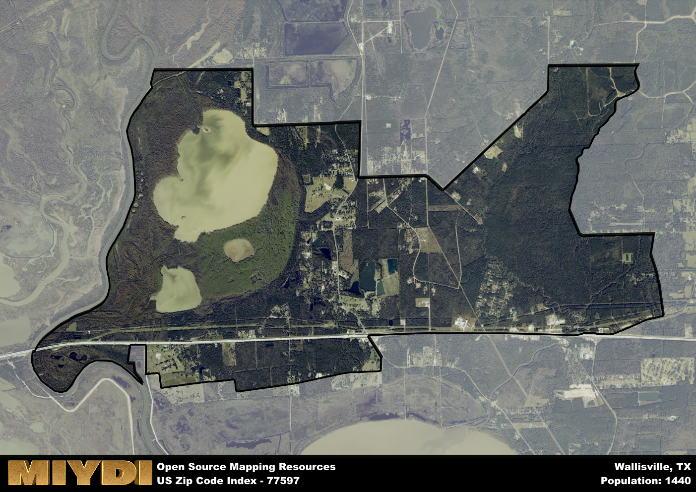

**Area Name:** Wallisville

**Zip Code:** 77597

**State:** TX

Wallisville is a part of the Houston-The Woodlands-Sugar Land - TX Metro Area, and makes up  of the Metro's population.  

# Wallisville: A Historic Gem in Southeast Texas

Located in zip code 77597, Wallisville is a charming rural neighborhood nestled in the southeastern region of Texas. Bordered by the Trinity River to the west and vast stretches of farmland to the east, Wallisville seamlessly integrates with surrounding cities such as Baytown and Liberty. Despite its rural setting, Wallisville is only a short drive away from the bustling metropolitan area of Houston, making it a peaceful retreat for residents who work in the city but desire a quieter lifestyle.

Established in the early 19th century, Wallisville has a rich historical narrative that dates back to its founding by William Wallis, a local landowner. The area flourished as a trading post and river port, attracting settlers who were drawn to its fertile land and strategic location along the Trinity River. Over the years, Wallisville became a hub for agriculture and commerce, playing a significant role in the development of the region. Today, remnants of its past can be seen in the historic buildings and landmarks that dot the landscape, serving as a reminder of its storied heritage.

Present-day Wallisville is a vibrant community that offers a mix of small-town charm and modern conveniences. The area is home to a variety of businesses, including local shops, restaurants, and services that cater to residents' needs. Outdoor enthusiasts can explore the nearby Trinity River National Wildlife Refuge or enjoy recreational activities at the Wallisville Lake Project. Additionally, visitors can immerse themselves in the area's history by visiting the Wallisville Heritage Park, which showcases artifacts and exhibits detailing the area's past. With its blend of heritage and modern amenities, Wallisville remains a hidden gem in Southeast Texas.

# Wallisville Demographics

The population of Wallisville is 1440.  
Wallisville has a population density of 76.88 per square mile.  
The area of Wallisville is 18.73 square miles.  

## Wallisville Income and Economic Data

These demographic numbers are sourced from IRS return data, providing comprehensive insights into the population dynamics and economic trends within Wallisville.

**Breakdown of return types for Wallisville**

The table offers insight into the composition of tax returns filed with the IRS, categorizing them into three main types. Single returns represent filings by individuals, joint returns by married couples, and head of household returns by individuals who qualify as heads of households, typically having dependents. This breakdown provides an understanding of the different filing statuses adopted by taxpayers when submitting their tax documentation.

| Return Types filed for Wallisville                              | Percentage          |
|----------------------------------------------------------|---------------------|
| Single Returns                                            | 0.41 |
| Joint Returns                                             | 0.44 |
| Head Household Returns                                    | 0.12 |

The income and economic data presented here is sourced from the IRS income brackets, utilized for categorizing tax returns by income levels. This table displays income ranges for both single filers and married couples, along with the corresponding number of returns and the percentage within each bracket, providing valuable insight into the distribution of taxes across various income groups.

| Bracket Name       | Single Filer Income Range | Married Couple Range | Number of Returns | Percentage of Returns |
|--------------------|----------------------------|----------------------|-------------------|-----------------------|
| 10% Bracket        | Up to $10,275              | Up to $20,550        | 100 | 0.24% |
| 12% Bracket        | $10,276 - $41,775          | $20,551 - $83,550    | 80 | 0.2% |
| 22% Bracket        | $41,776 - $89,075          | $83,551 - $178,150   | 60 | 0.15% |
| 24% Bracket        | $89,076 - $170,050         | $178,151 - $340,100  | 40 | 0.1% |
| 32% Bracket        | $170,051 - $215,950        | $340,101 - $431,900  | 110 | 0.27% |
| 35% Bracket        | $215,951 - $539,900        | $431,901 - $647,850  | 20 | 0.05% |

### Exploring Taxpayer Diversity: A Breakdown of Different Types of Tax Returns in Wallisville

The table offers insights into various types of tax returns filed, reflecting different aspects of taxpayer activities and demographics. Categories include charitable returns for donations, dependent returns for claimed dependents, educator population, elderly population, real estate returns, self-employment returns, student loan returns, and unemployment returns, providing valuable insights into taxpayer behavior and demographics.

| Wallisville Filing Types                    | Count | Percentage |
|--------------------------------------|-------|------------|
| Charitable Donations                 | 0 | 0% |
| Dependents Claimed                   | 0 | 0% |
| Educator Residents                   | 0 | 0% |
| Elderly Population                   | 110 | 0.27% |
| Farming Population                   | 20 | 0.049% |
| Real Estate Transactions             | 20 | 0.049% |
| Self-Employed Individuals            | 30 | 0.073% |
| Student Loan Cases                   | 0 | 0% |
| Unemployment Benefit Filings         | 70 | 0.17% |

## Wallisville AI and Census Variables

The values presented in this dataset for Wallisville are AI-optimized, streamlined, and categorized into relevant buckets for enhanced utility in AI and mapping programs. These simplified values have been optimized to facilitate efficient analysis and integration into various technological applications, offering users accessible and actionable insights into demographics within the Wallisville area.

| AI Variables for Wallisville | Value |
|-------------|-------|
| Shape Area | 64731205.2304688 |
| Shape Length | 50625.2166533771 |
| CBSA Federal Processing Standard Code | 26420 |

## How to use this free AI optimized Geo-Spatial Data for Wallisville, TX

This data is made freely available under the Creative Commons license, allowing for unrestricted use for any purpose. Users can access static resources directly from GitHub or leverage more advanced functionalities by utilizing the GeoJSON files. All datasets originate from official government or private sector sources and are meticulously compiled into relevant datasets within QGIS. However, the versatility of the data ensures compatibility with any mapping application.

## Data Accuracy Disclaimer
It's important to note that the data provided here may contain errors or discrepancies and should be considered as 'close enough' for business applications and AI rather than a definitive source of truth. This data is aggregated from multiple sources, some of which publish information on wildly different intervals, leading to potential inconsistencies. Additionally, certain data points may not be corrected for Covid-related changes, further impacting accuracy. Moreover, the assumption that demographic trends are consistent throughout a region may lead to discrepancies, as trends often concentrate in areas of highest population density. As a result, dense areas may be slightly underrepresented, while rural areas may be slightly overrepresented, resulting in a more conservative dataset. Furthermore, the focus primarily on areas within US Major and Minor Statistical areas means that approximately 40 million Americans living outside of these areas may not be fully represented. Lastly, the historical background and area descriptions generated using AI are susceptible to potential mistakes, so users should exercise caution when interpreting the information provided.
