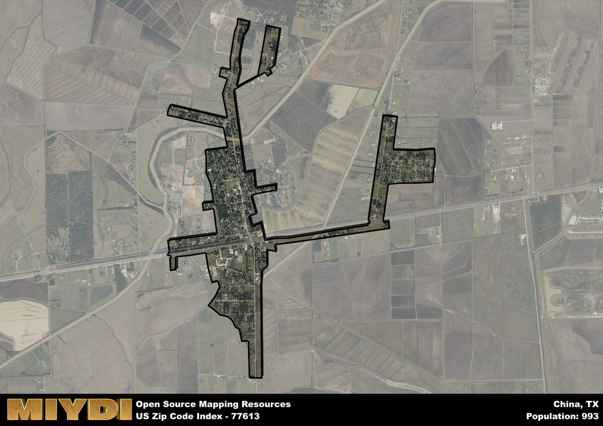

**Area Name:** China

**Zip Code:** 77613

**State:** TX

China is a part of the Beaumont-Port Arthur - TX Metro Area, and makes up  of the Metro's population.  

# Exploring the Historic Charm of China, TX (Zip Code 77613)

Located in the heart of Texas, zip code 77613 encompasses the charming neighborhood of China. Situated within the greater metropolitan area, China is bordered by the city of Beaumont to the south and Lumberton to the north. This quaint neighborhood seamlessly integrates with the surrounding districts, providing a peaceful retreat from the bustling city life while still offering easy access to urban amenities.

China has a rich historical narrative dating back to its early settlement by European immigrants in the 1800s. The area experienced significant growth during the oil boom era, attracting workers and families seeking opportunities in the booming industry. This period of prosperity contributed to the development of China as a thriving community with a strong sense of identity and pride in its heritage. The neighborhood's name reflects its diverse population, which includes descendants of Chinese immigrants who played a vital role in shaping the local culture.

Today, China remains a vibrant community known for its agricultural heritage and small-town charm. The area boasts a range of economic activities, including farming, ranching, and small businesses that contribute to its thriving economy. Residents and visitors can enjoy a variety of neighborhood-specific services, such as local markets, shops, and restaurants that showcase the area's unique character. China also offers recreational amenities like parks, hiking trails, and community centers, as well as cultural and historic sites that pay homage to its storied past.

# China Demographics

The population of China is 993.  
China has a population density of 752.27 per square mile.  
The area of China is 1.32 square miles.  

## China AI and Census Variables

The values presented in this dataset for China are AI-optimized, streamlined, and categorized into relevant buckets for enhanced utility in AI and mapping programs. These simplified values have been optimized to facilitate efficient analysis and integration into various technological applications, offering users accessible and actionable insights into demographics within the China area.

| AI Variables for China | Value |
|-------------|-------|
| Shape Area | 4575193.02734375 |
| Shape Length | 30516.8501144779 |
| CBSA Federal Processing Standard Code | 13140 |

## How to use this free AI optimized Geo-Spatial Data for China, TX

This data is made freely available under the Creative Commons license, allowing for unrestricted use for any purpose. Users can access static resources directly from GitHub or leverage more advanced functionalities by utilizing the GeoJSON files. All datasets originate from official government or private sector sources and are meticulously compiled into relevant datasets within QGIS. However, the versatility of the data ensures compatibility with any mapping application.

## Data Accuracy Disclaimer
It's important to note that the data provided here may contain errors or discrepancies and should be considered as 'close enough' for business applications and AI rather than a definitive source of truth. This data is aggregated from multiple sources, some of which publish information on wildly different intervals, leading to potential inconsistencies. Additionally, certain data points may not be corrected for Covid-related changes, further impacting accuracy. Moreover, the assumption that demographic trends are consistent throughout a region may lead to discrepancies, as trends often concentrate in areas of highest population density. As a result, dense areas may be slightly underrepresented, while rural areas may be slightly overrepresented, resulting in a more conservative dataset. Furthermore, the focus primarily on areas within US Major and Minor Statistical areas means that approximately 40 million Americans living outside of these areas may not be fully represented. Lastly, the historical background and area descriptions generated using AI are susceptible to potential mistakes, so users should exercise caution when interpreting the information provided.
