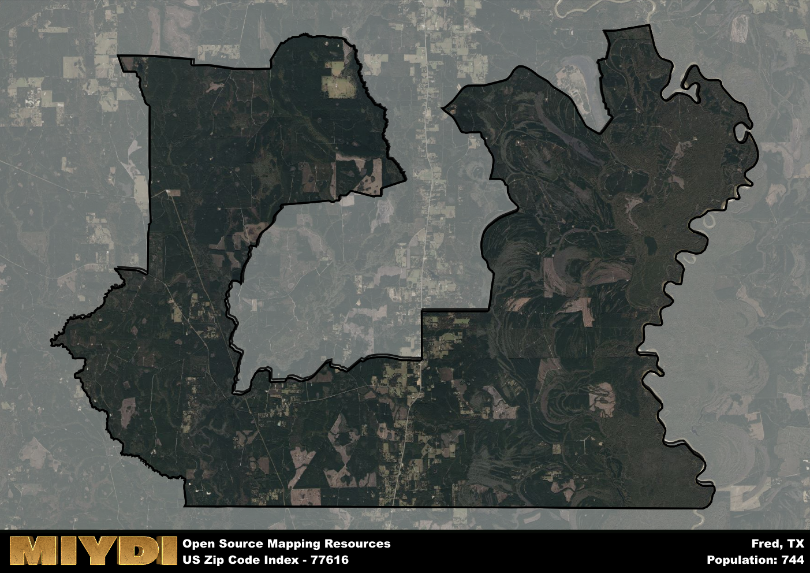

**Area Name:** Fred

**Zip Code:** 77616

**State:** TX

Fred is a part of the Beaumont-Port Arthur - TX Metro Area, and makes up  of the Metro's population.  

# Exploring the Charms of Fred, Texas (Zip Code: 77616)

Situated in the heart of Southeast Texas, the zip code area 77616 corresponds to the quaint neighborhood of Fred. Bordered by the towns of Spurger to the north and Fredonia to the south, this area is nestled within the larger metropolitan context of Jasper County. Fred serves as a rural oasis within the region, offering a peaceful atmosphere while still being within driving distance of major population centers like Beaumont and Houston.

Fred has a rich historical narrative that dates back to the early 19th century. The area was originally settled by pioneers drawn to the fertile land and abundant natural resources. Over time, Fred grew into a vibrant community centered around agriculture and logging industries. The neighborhood was named after Fred Patten, a prominent local landowner and businessman who played a pivotal role in shaping the area's development. Today, Fred retains its small-town charm and strong sense of community, with many residents proud of their heritage and the area's unique identity.

Presently, Fred offers a mix of agricultural and recreational activities that cater to both residents and visitors. The area is known for its picturesque landscapes, with sprawling farmlands and lush forests providing a scenic backdrop. Residents can enjoy a variety of outdoor pursuits, including hunting, fishing, and hiking. In addition, Fred is home to a number of local businesses, including family-owned shops and restaurants that serve as hubs for social interaction. The neighborhood is also dotted with historic sites and landmarks that offer a glimpse into its storied past, making Fred a destination worth exploring in Southeast Texas.

# Fred Demographics

The population of Fred is 744.  
Fred has a population density of 7.54 per square mile.  
The area of Fred is 98.7 square miles.  

## Fred Income and Economic Data

These demographic numbers are sourced from IRS return data, providing comprehensive insights into the population dynamics and economic trends within Fred.

**Breakdown of return types for Fred**

The table offers insight into the composition of tax returns filed with the IRS, categorizing them into three main types. Single returns represent filings by individuals, joint returns by married couples, and head of household returns by individuals who qualify as heads of households, typically having dependents. This breakdown provides an understanding of the different filing statuses adopted by taxpayers when submitting their tax documentation.

| Return Types filed for Fred                              | Percentage          |
|----------------------------------------------------------|---------------------|
| Single Returns                                            | 0.4 |
| Joint Returns                                             | 0.48 |
| Head Household Returns                                    | 0.12 |

The income and economic data presented here is sourced from the IRS income brackets, utilized for categorizing tax returns by income levels. This table displays income ranges for both single filers and married couples, along with the corresponding number of returns and the percentage within each bracket, providing valuable insight into the distribution of taxes across various income groups.

| Bracket Name       | Single Filer Income Range | Married Couple Range | Number of Returns | Percentage of Returns |
|--------------------|----------------------------|----------------------|-------------------|-----------------------|
| 10% Bracket        | Up to $10,275              | Up to $20,550        | 150 | 0.3% |
| 12% Bracket        | $10,276 - $41,775          | $20,551 - $83,550    | 130 | 0.26% |
| 22% Bracket        | $41,776 - $89,075          | $83,551 - $178,150   | 100 | 0.2% |
| 24% Bracket        | $89,076 - $170,050         | $178,151 - $340,100  | 60 | 0.12% |
| 32% Bracket        | $170,051 - $215,950        | $340,101 - $431,900  | 60 | 0.12% |
| 35% Bracket        | $215,951 - $539,900        | $431,901 - $647,850  | 0 | 0% |

### Exploring Taxpayer Diversity: A Breakdown of Different Types of Tax Returns in Fred

The table offers insights into various types of tax returns filed, reflecting different aspects of taxpayer activities and demographics. Categories include charitable returns for donations, dependent returns for claimed dependents, educator population, elderly population, real estate returns, self-employment returns, student loan returns, and unemployment returns, providing valuable insights into taxpayer behavior and demographics.

| Fred Filing Types                    | Count | Percentage |
|--------------------------------------|-------|------------|
| Charitable Donations                 | 0 | 0% |
| Dependents Claimed                   | 0 | 0% |
| Educator Residents                   | 0 | 0% |
| Elderly Population                   | 130 | 0.26% |
| Farming Population                   | 50 | 0.1% |
| Real Estate Transactions             | 0 | 0% |
| Self-Employed Individuals            | 40 | 0.08% |
| Student Loan Cases                   | 0 | 0% |
| Unemployment Benefit Filings         | 90 | 0.18% |

## Fred AI and Census Variables

The values presented in this dataset for Fred are AI-optimized, streamlined, and categorized into relevant buckets for enhanced utility in AI and mapping programs. These simplified values have been optimized to facilitate efficient analysis and integration into various technological applications, offering users accessible and actionable insights into demographics within the Fred area.

| AI Variables for Fred | Value |
|-------------|-------|
| Shape Area | 346141847.890625 |
| Shape Length | 170430.148116719 |
| CBSA Federal Processing Standard Code | 13140 |

## How to use this free AI optimized Geo-Spatial Data for Fred, TX

This data is made freely available under the Creative Commons license, allowing for unrestricted use for any purpose. Users can access static resources directly from GitHub or leverage more advanced functionalities by utilizing the GeoJSON files. All datasets originate from official government or private sector sources and are meticulously compiled into relevant datasets within QGIS. However, the versatility of the data ensures compatibility with any mapping application.

## Data Accuracy Disclaimer
It's important to note that the data provided here may contain errors or discrepancies and should be considered as 'close enough' for business applications and AI rather than a definitive source of truth. This data is aggregated from multiple sources, some of which publish information on wildly different intervals, leading to potential inconsistencies. Additionally, certain data points may not be corrected for Covid-related changes, further impacting accuracy. Moreover, the assumption that demographic trends are consistent throughout a region may lead to discrepancies, as trends often concentrate in areas of highest population density. As a result, dense areas may be slightly underrepresented, while rural areas may be slightly overrepresented, resulting in a more conservative dataset. Furthermore, the focus primarily on areas within US Major and Minor Statistical areas means that approximately 40 million Americans living outside of these areas may not be fully represented. Lastly, the historical background and area descriptions generated using AI are susceptible to potential mistakes, so users should exercise caution when interpreting the information provided.
