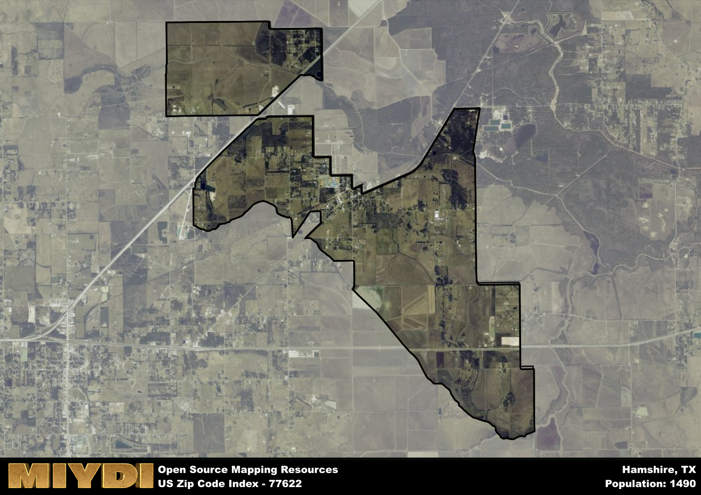

**Area Name:** Hamshire

**Zip Code:** 77622

**State:** TX

Hamshire is a part of the Beaumont-Port Arthur - TX Metro Area, and makes up 0.29% of the Metro's population.  

# Hamshire: A Hidden Gem in Southeast Texas  

Hamshire, corresponding to the zip code 77622, is a charming rural community located in Southeast Texas. Bordered by the towns of Hampshire and Fannett, this area seamlessly integrates with the larger metropolitan area of Beaumont. With easy access to major highways, Hamshire serves as a peaceful retreat from the hustle and bustle of the city, while still providing residents with convenient connections to urban amenities.

Originally settled by farmers and ranchers in the mid-1800s, Hamshire has a rich history rooted in agriculture and small-town charm. The area experienced steady growth throughout the 20th century, attracting families looking for a close-knit community with a slower pace of life. Named after a prominent local family, Hamshire has preserved its historic buildings and landmarks, offering visitors a glimpse into its proud past.

Today, Hamshire maintains its agricultural heritage while also diversifying its economy to include small businesses, local shops, and recreational opportunities. Residents enjoy a range of services, from family-owned restaurants to community parks and sports facilities. The area is also home to cultural events and historic sites, such as the Hamshire-Fannett Heritage Museum, which highlight the unique character and history of this hidden gem in Southeast Texas.

# Hamshire Demographics

The population of Hamshire is 1490.  
Hamshire has a population density of 104.56 per square mile.  
The area of Hamshire is 14.25 square miles.  

## Hamshire Income and Economic Data

These demographic numbers are sourced from IRS return data, providing comprehensive insights into the population dynamics and economic trends within Hamshire.

**Breakdown of return types for Hamshire**

The table offers insight into the composition of tax returns filed with the IRS, categorizing them into three main types. Single returns represent filings by individuals, joint returns by married couples, and head of household returns by individuals who qualify as heads of households, typically having dependents. This breakdown provides an understanding of the different filing statuses adopted by taxpayers when submitting their tax documentation.

| Return Types filed for Hamshire                              | Percentage          |
|----------------------------------------------------------|---------------------|
| Single Returns                                            | 0.43 |
| Joint Returns                                             | 0.47 |
| Head Household Returns                                    | 0.09 |

The income and economic data presented here is sourced from the IRS income brackets, utilized for categorizing tax returns by income levels. This table displays income ranges for both single filers and married couples, along with the corresponding number of returns and the percentage within each bracket, providing valuable insight into the distribution of taxes across various income groups.

| Bracket Name       | Single Filer Income Range | Married Couple Range | Number of Returns | Percentage of Returns |
|--------------------|----------------------------|----------------------|-------------------|-----------------------|
| 10% Bracket        | Up to $10,275              | Up to $20,550        | 210 | 0.28% |
| 12% Bracket        | $10,276 - $41,775          | $20,551 - $83,550    | 170 | 0.23% |
| 22% Bracket        | $41,776 - $89,075          | $83,551 - $178,150   | 110 | 0.15% |
| 24% Bracket        | $89,076 - $170,050         | $178,151 - $340,100  | 80 | 0.11% |
| 32% Bracket        | $170,051 - $215,950        | $340,101 - $431,900  | 150 | 0.2% |
| 35% Bracket        | $215,951 - $539,900        | $431,901 - $647,850  | 30 | 0.04% |

### Exploring Taxpayer Diversity: A Breakdown of Different Types of Tax Returns in Hamshire

The table offers insights into various types of tax returns filed, reflecting different aspects of taxpayer activities and demographics. Categories include charitable returns for donations, dependent returns for claimed dependents, educator population, elderly population, real estate returns, self-employment returns, student loan returns, and unemployment returns, providing valuable insights into taxpayer behavior and demographics.

| Hamshire Filing Types                    | Count | Percentage |
|--------------------------------------|-------|------------|
| Charitable Donations                 | 30 | 0.04% |
| Dependents Claimed                   | 40 | 0.053% |
| Educator Residents                   | 0 | 0% |
| Elderly Population                   | 210 | 0.28% |
| Farming Population                   | 70 | 0.093% |
| Real Estate Transactions             | 20 | 0.027% |
| Self-Employed Individuals            | 90 | 0.12% |
| Student Loan Cases                   | 20 | 0.027% |
| Unemployment Benefit Filings         | 100 | 0.13% |

### Exploring Real Estate Trends: A Comprehensive Analysis of the Hamshire Area and its Neighbors

This table contains an in-depth examination of the real estate market in the Hamshire area. Sourced from trusted real estate market firms, this dataset provides a wealth of raw data detailing the local real estate landscape, along with comparative analyses juxtaposing the market dynamics with those of neighboring areas. Explore the intricacies of the Hamshire real estate market and gain valuable insights into its relationship with adjacent regions.

| Real Estate Data for Hamshire                       | Value    |
|------------------------------------------------|----------|
| Average Listing Price for Hamshire               | 266627 |
| Median Listing Price for Hamshire                | 278500 |
| Median Days on Market for Hamshire               | 75 |
| Median Listing Price per Square Foot for Hamshire| 37 |
| Median Square Feet for Hamshire                  | 1997 |
| Real Estate Prices to Income Ratio           | 81.21% |
| Price per Square Foot Ratio                  | 99.91% |
| Price Median Ratio                           | 107.82% |
| Market Sales Speed Ratio                     | 125.6% |

This table offers essential real estate data for the Hamshire area, including average and median listing prices, median days on market, and property size. It also presents ratio metrics as percentages, providing insights into how the local market compares to the surrounding region. A ratio of 100% signifies performance in line with the regional average, while values above or below indicate overperformance or underperformance, respectively, relative to expectations.

## Hamshire Sports and Recreation Data

#### Annual Youth Sports Spending for Hamshire

This table provides fundamental insights into the Sports and Recreation data for the Hamshire area, detailing the estimated annual expenditure on Youth Athletics. This includes estimated spending by the major consumer brackets. 
| Sports Spending for Hamshire| Value |
|-------------------------|-------|
| Athlete Spending Compared to the region | 10.24% |
| Total Youth Athlete Spending | 07,544 |
| Athletic Spending - Essential Focused Consumer | 4,989 |
| Athletic Spending - Typical Consumer | 1,924 |
| Athletic Spending - Affluent Consumers | 30,582 |

#### Youth Coaching Estimates for Hamshire

This table presents the estimated number of coaches for the Hamshire area, derived from comprehensive national coaching surveys and athletic participation rates by state. It offers valuable insights into the vital role of coaching personnel in fostering athletic development and facilitating sports participation within the local community.

| Coaching Data for Hamshire | Value |
|-------------|-------|
| Total Coaches | 24 |
| Paid Coaches | 6 |
| Volunteer Coaches | 18 |

#### Youth Athlete Participation for Hamshire

This table shows the estimated total number of youth athletes in the Hamshire area, sourced from comprehensive national coaching surveys and athletic participation rates by state.

| Total YA Athletes in Hamshire | Value |
|-------------|-------|
| Total High School Athletes | 37 |
| Total Youth Athletes | 112 |
| Total Young Adult Athletes | 74 |
| Total Athletes to Age 25 | 223 |

#### High School Age Athletes - Breakdown by Sport for Hamshire

This table shows insights regarding high school age estimated players by sport in the Hamshire area, derived from national and state-level athletic participation trends. 

| HS Players by Sport in Hamshire | Value |
|-------------|-------|
| Football Players | 9 |
| Basketball Players | 5 |
| Soccer Players | 4 |
| Volleyball Players | 3 |
| Baseball Players | 4 |
| Tennis Players | 2 |
| Track Athletes | 6 |
| Golf Players | 1 |
| Swimming Athletes | 1 |
| Wrestling Competitors | 1 |
| Lacrosse Players | 0 |

Estimating the number of younger athletes presents unique challenges due to their varied starting ages, typically beginning around six years old, and a gradual decline in participation rates as they age. Unlike high school-aged athletes, younger athletes are less likely to switch sports as they grow older, contributing to the stability of participation numbers within specific sports at younger ages.  

As a general trend, the total number of younger athletes is approximately three times the number of high school-aged athletes, underscoring the significant presence of youth athletes in sports programs and highlighting the importance of early engagement in athletic activities.

## Hamshire AI and Census Variables

The values presented in this dataset for Hamshire are AI-optimized, streamlined, and categorized into relevant buckets for enhanced utility in AI and mapping programs. These simplified values have been optimized to facilitate efficient analysis and integration into various technological applications, offering users accessible and actionable insights into demographics within the Hamshire area.

| AI Variables for Hamshire | Value |
|-------------|-------|
| Shape Area | 49248325.6601563 |
| Shape Length | 55042.8856449339 |
| CBSA Federal Processing Standard Code | 13140 |
| RE Price per Square Foot Ratio | 99.91% |
| RE Price Average Ratio | 91.96% |
| RE Speed Ratio | 125.6% |
| RE Income Ratio | 81.21% |
| Elderly Opportunity Flag | 3 |
| Farm Opportunity Flag | 7 |
| RE Affordability Index Flag | 4 |
| Income Bracket Flag | 6 |
| RE Income Flag | 2 |
| RE Median Square Footage Price Flag | 3 |
| RE Median Square Footage Size Flag | 4 |
| RE Activity Flag | 6 |
| Poverty Line Risk Flag | 6 |

## How to use this free AI optimized Geo-Spatial Data for Hamshire, TX

This data is made freely available under the Creative Commons license, allowing for unrestricted use for any purpose. Users can access static resources directly from GitHub or leverage more advanced functionalities by utilizing the GeoJSON files. All datasets originate from official government or private sector sources and are meticulously compiled into relevant datasets within QGIS. However, the versatility of the data ensures compatibility with any mapping application.

## Data Accuracy Disclaimer
It's important to note that the data provided here may contain errors or discrepancies and should be considered as 'close enough' for business applications and AI rather than a definitive source of truth. This data is aggregated from multiple sources, some of which publish information on wildly different intervals, leading to potential inconsistencies. Additionally, certain data points may not be corrected for Covid-related changes, further impacting accuracy. Moreover, the assumption that demographic trends are consistent throughout a region may lead to discrepancies, as trends often concentrate in areas of highest population density. As a result, dense areas may be slightly underrepresented, while rural areas may be slightly overrepresented, resulting in a more conservative dataset. Furthermore, the focus primarily on areas within US Major and Minor Statistical areas means that approximately 40 million Americans living outside of these areas may not be fully represented. Lastly, the historical background and area descriptions generated using AI are susceptible to potential mistakes, so users should exercise caution when interpreting the information provided.
