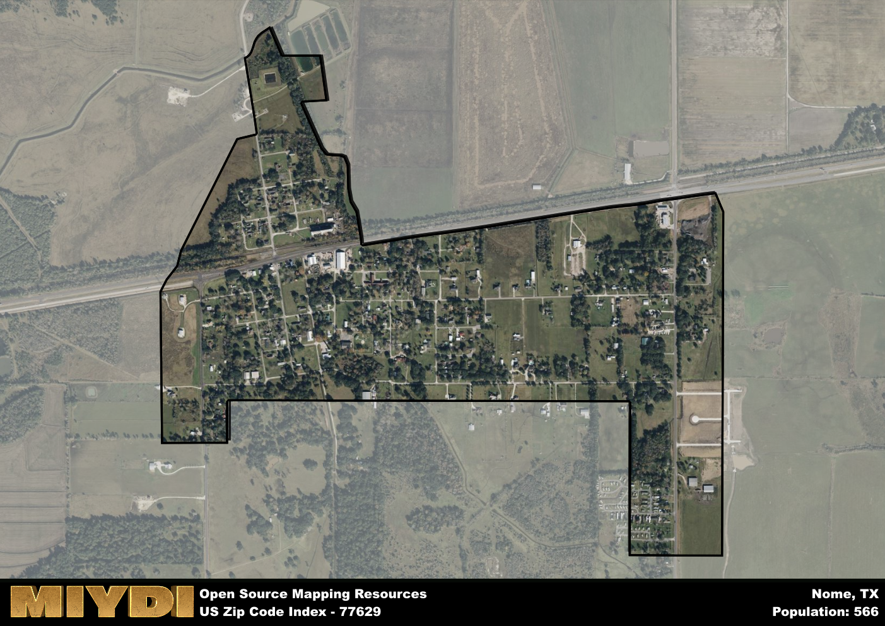

**Area Name:** Nome

**Zip Code:** 77629

**State:** TX

Nome is a part of the Beaumont-Port Arthur - TX Metro Area, and makes up  of the Metro's population.  

# A Unique Slice of History and Culture in Nome (77629)  

Located on the southeastern outskirts of Beaumont, Texas, the zip code area 77629 encompasses the small community of Nome. Bordered by major roadways such as State Highway 90 and Farm to Market Road 365, Nome is a part of the greater Beaumont-Port Arthur metropolitan area. As a rural enclave within this urban fabric, Nome offers residents a peaceful retreat from the hustle and bustle of city life while providing easy access to nearby amenities and services.

Nome has a rich historical narrative that dates back to its founding in the early 19th century. Originally settled as a farming community, Nome grew with the establishment of churches, schools, and small businesses that served the local population. The area's name is believed to have been inspired by the city of Nome in Alaska, although the exact origins remain a subject of speculation. Over the years, Nome has retained its small-town charm and tight-knit community spirit, making it a beloved neighborhood for both longtime residents and newcomers.

Presently, Nome is a thriving community known for its agricultural heritage and tranquil atmosphere. Local farms provide fresh produce to residents and surrounding areas, contributing to the area's economy and sense of identity. In addition to its farming roots, Nome offers residents access to parks, recreational facilities, and community events that foster a strong sense of community pride. Visitors can explore historic sites such as the Old Nome Schoolhouse Museum, showcasing the area's past and preserving its cultural heritage for future generations.

# Nome Demographics

The population of Nome is 566.  
Nome has a population density of 744.74 per square mile.  
The area of Nome is 0.76 square miles.  

## Nome AI and Census Variables

The values presented in this dataset for Nome are AI-optimized, streamlined, and categorized into relevant buckets for enhanced utility in AI and mapping programs. These simplified values have been optimized to facilitate efficient analysis and integration into various technological applications, offering users accessible and actionable insights into demographics within the Nome area.

| AI Variables for Nome | Value |
|-------------|-------|
| Shape Area | 2645101.046875 |
| Shape Length | 9933.19746186098 |
| CBSA Federal Processing Standard Code | 13140 |

## How to use this free AI optimized Geo-Spatial Data for Nome, TX

This data is made freely available under the Creative Commons license, allowing for unrestricted use for any purpose. Users can access static resources directly from GitHub or leverage more advanced functionalities by utilizing the GeoJSON files. All datasets originate from official government or private sector sources and are meticulously compiled into relevant datasets within QGIS. However, the versatility of the data ensures compatibility with any mapping application.

## Data Accuracy Disclaimer
It's important to note that the data provided here may contain errors or discrepancies and should be considered as 'close enough' for business applications and AI rather than a definitive source of truth. This data is aggregated from multiple sources, some of which publish information on wildly different intervals, leading to potential inconsistencies. Additionally, certain data points may not be corrected for Covid-related changes, further impacting accuracy. Moreover, the assumption that demographic trends are consistent throughout a region may lead to discrepancies, as trends often concentrate in areas of highest population density. As a result, dense areas may be slightly underrepresented, while rural areas may be slightly overrepresented, resulting in a more conservative dataset. Furthermore, the focus primarily on areas within US Major and Minor Statistical areas means that approximately 40 million Americans living outside of these areas may not be fully represented. Lastly, the historical background and area descriptions generated using AI are susceptible to potential mistakes, so users should exercise caution when interpreting the information provided.
