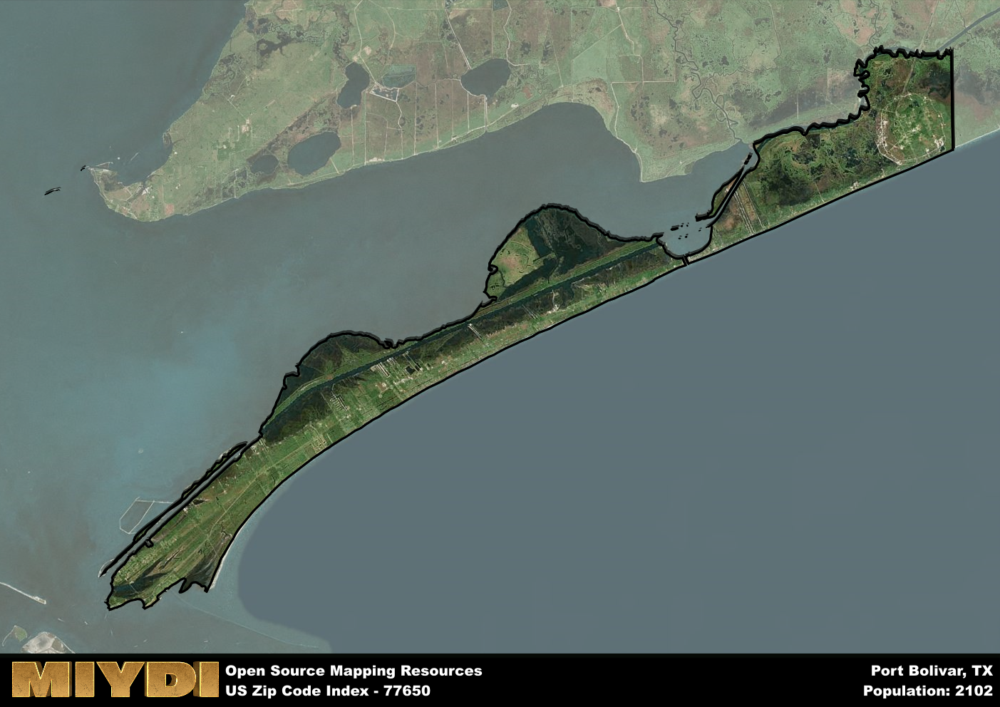

**Area Name:** Port Bolivar

**Zip Code:** 77650

**State:** TX

Port Bolivar is a part of the Houston-The Woodlands-Sugar Land - TX Metro Area, and makes up 0.03% of the Metro's population.  

# Port Bolivar: A Historic Coastal Community in Southeast Texas  

Port Bolivar, located in the 77650 zip code, is a picturesque coastal community situated on the Bolivar Peninsula in southeast Texas. Bordered by the Gulf of Mexico to the south and East Bay to the north, Port Bolivar is connected to Galveston Island by the Galveston-Port Bolivar Ferry. This zip code area is part of the larger Galveston metropolitan area, offering residents and visitors easy access to urban amenities while still maintaining its unique small-town charm.

Originally settled in the mid-19th century, Port Bolivar was named after South American revolutionary leader Simon Bolivar. The area experienced significant growth during the late 19th and early 20th centuries due to its strategic location for trade and shipping. The community has weathered several hurricanes throughout its history, including Hurricane Ike in 2008, which caused widespread damage but also spurred a revitalization effort that has brought new life to the area.

Today, Port Bolivar is a popular tourist destination known for its sandy beaches, fishing opportunities, and historic sites. The economy is driven by tourism, fishing, and maritime industries, with local businesses catering to visitors and residents alike. The area offers a range of services, including restaurants, shops, and accommodations, as well as recreational amenities such as parks and nature reserves. Port Bolivar also boasts several cultural and historic sites, including the historic Bolivar Lighthouse, providing a glimpse into the area's rich maritime heritage.

# Port Bolivar Demographics

The population of Port Bolivar is 2102.  
Port Bolivar has a population density of 36.01 per square mile.  
The area of Port Bolivar is 58.38 square miles.  

### Exploring Real Estate Trends: A Comprehensive Analysis of the Port Bolivar Area and its Neighbors

This table contains an in-depth examination of the real estate market in the Port Bolivar area. Sourced from trusted real estate market firms, this dataset provides a wealth of raw data detailing the local real estate landscape, along with comparative analyses juxtaposing the market dynamics with those of neighboring areas. Explore the intricacies of the Port Bolivar real estate market and gain valuable insights into its relationship with adjacent regions.

| Real Estate Data for Port Bolivar                       | Value    |
|------------------------------------------------|----------|
| Average Listing Price for Port Bolivar               | 647333 |
| Median Listing Price for Port Bolivar                | 563725 |
| Median Days on Market for Port Bolivar               | 88 |
| Median Listing Price per Square Foot for Port Bolivar| 92 |
| Median Square Feet for Port Bolivar                  | 1498 |
| Real Estate Prices to Income Ratio           | 350.97% |
| Price per Square Foot Ratio                  | 214.61% |
| Price Median Ratio                           | 147.82% |
| Market Sales Speed Ratio                     | 209.9% |

This table offers essential real estate data for the Port Bolivar area, including average and median listing prices, median days on market, and property size. It also presents ratio metrics as percentages, providing insights into how the local market compares to the surrounding region. A ratio of 100% signifies performance in line with the regional average, while values above or below indicate overperformance or underperformance, respectively, relative to expectations.

## Port Bolivar Sports and Recreation Data

#### Annual Youth Sports Spending for Port Bolivar

This table provides fundamental insights into the Sports and Recreation data for the Port Bolivar area, detailing the estimated annual expenditure on Youth Athletics. This includes estimated spending by the major consumer brackets. 
| Sports Spending for Port Bolivar| Value |
|-------------------------|-------|
| Athlete Spending Compared to the region | 4.53% |
| Total Youth Athlete Spending | 27,729 |
| Athletic Spending - Essential Focused Consumer | 9,456 |
| Athletic Spending - Typical Consumer | 48,050 |
| Athletic Spending - Affluent Consumers | 30,154 |

#### Youth Coaching Estimates for Port Bolivar

This table presents the estimated number of coaches for the Port Bolivar area, derived from comprehensive national coaching surveys and athletic participation rates by state. It offers valuable insights into the vital role of coaching personnel in fostering athletic development and facilitating sports participation within the local community.

| Coaching Data for Port Bolivar | Value |
|-------------|-------|
| Total Coaches | 35 |
| Paid Coaches | 9 |
| Volunteer Coaches | 26 |

#### Youth Athlete Participation for Port Bolivar

This table shows the estimated total number of youth athletes in the Port Bolivar area, sourced from comprehensive national coaching surveys and athletic participation rates by state.

| Total YA Athletes in Port Bolivar | Value |
|-------------|-------|
| Total High School Athletes | 53 |
| Total Youth Athletes | 158 |
| Total Young Adult Athletes | 105 |
| Total Athletes to Age 25 | 315 |

#### High School Age Athletes - Breakdown by Sport for Port Bolivar

This table shows insights regarding high school age estimated players by sport in the Port Bolivar area, derived from national and state-level athletic participation trends. 

| HS Players by Sport in Port Bolivar | Value |
|-------------|-------|
| Football Players | 12 |
| Basketball Players | 7 |
| Soccer Players | 6 |
| Volleyball Players | 4 |
| Baseball Players | 6 |
| Tennis Players | 3 |
| Track Athletes | 9 |
| Golf Players | 2 |
| Swimming Athletes | 2 |
| Wrestling Competitors | 2 |
| Lacrosse Players | 0 |

Estimating the number of younger athletes presents unique challenges due to their varied starting ages, typically beginning around six years old, and a gradual decline in participation rates as they age. Unlike high school-aged athletes, younger athletes are less likely to switch sports as they grow older, contributing to the stability of participation numbers within specific sports at younger ages.  

As a general trend, the total number of younger athletes is approximately three times the number of high school-aged athletes, underscoring the significant presence of youth athletes in sports programs and highlighting the importance of early engagement in athletic activities.

## Port Bolivar AI and Census Variables

The values presented in this dataset for Port Bolivar are AI-optimized, streamlined, and categorized into relevant buckets for enhanced utility in AI and mapping programs. These simplified values have been optimized to facilitate efficient analysis and integration into various technological applications, offering users accessible and actionable insights into demographics within the Port Bolivar area.

| AI Variables for Port Bolivar | Value |
|-------------|-------|
| Shape Area | 200262377.464844 |
| Shape Length | 182120.338757771 |
| CBSA Federal Processing Standard Code | 26420 |
| RE Price per Square Foot Ratio | 214.61% |
| RE Price Average Ratio | 136.86% |
| RE Speed Ratio | 209.9% |
| RE Income Ratio | 350.97% |
| RE Affordability Index Flag | 6 |
| Income Bracket Flag | 1 |
| RE Income Flag | 7 |
| RE Median Square Footage Price Flag | 6 |
| RE Median Square Footage Size Flag | 2 |
| RE Activity Flag | 7 |
| Poverty Line Risk Flag | 3 |

## How to use this free AI optimized Geo-Spatial Data for Port Bolivar, TX

This data is made freely available under the Creative Commons license, allowing for unrestricted use for any purpose. Users can access static resources directly from GitHub or leverage more advanced functionalities by utilizing the GeoJSON files. All datasets originate from official government or private sector sources and are meticulously compiled into relevant datasets within QGIS. However, the versatility of the data ensures compatibility with any mapping application.

## Data Accuracy Disclaimer
It's important to note that the data provided here may contain errors or discrepancies and should be considered as 'close enough' for business applications and AI rather than a definitive source of truth. This data is aggregated from multiple sources, some of which publish information on wildly different intervals, leading to potential inconsistencies. Additionally, certain data points may not be corrected for Covid-related changes, further impacting accuracy. Moreover, the assumption that demographic trends are consistent throughout a region may lead to discrepancies, as trends often concentrate in areas of highest population density. As a result, dense areas may be slightly underrepresented, while rural areas may be slightly overrepresented, resulting in a more conservative dataset. Furthermore, the focus primarily on areas within US Major and Minor Statistical areas means that approximately 40 million Americans living outside of these areas may not be fully represented. Lastly, the historical background and area descriptions generated using AI are susceptible to potential mistakes, so users should exercise caution when interpreting the information provided.
