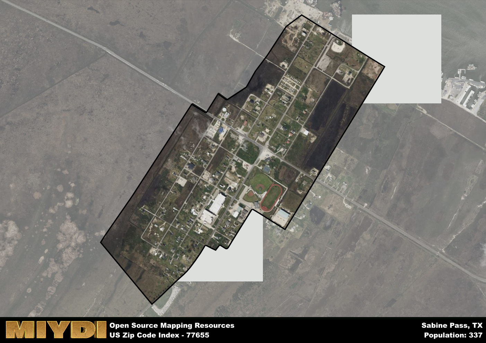

**Area Name:** Sabine Pass

**Zip Code:** 77655

**State:** TX

Sabine Pass is a part of the Beaumont-Port Arthur - TX Metro Area, and makes up  of the Metro's population.  

# Sabine Pass: A Historic Neighborhood in Southeast Texas  

Located in the southeastern corner of Texas, zip code 77655 encompasses the historic neighborhood of Sabine Pass. Bordered by the Sabine River to the east and the Gulf of Mexico to the south, Sabine Pass is situated within the larger metropolitan area of Port Arthur. This neighborhood serves as an important gateway to the Gulf Coast and is known for its rich history and strategic location along major waterways.

Sabine Pass has a unique historical narrative that dates back to the early 19th century when it served as a key port for trade and transportation. The area played a significant role in the Civil War, with the Battle of Sabine Pass in 1863 resulting in a Confederate victory that thwarted Union efforts to invade Texas. Over the years, Sabine Pass has evolved into a vibrant community that celebrates its maritime heritage and connection to the sea.

Today, Sabine Pass is a thriving neighborhood with a mix of residential, commercial, and industrial activities. The area is home to a diverse range of businesses, including shipping companies, seafood restaurants, and tourist attractions. Residents and visitors alike can enjoy recreational amenities such as parks, fishing piers, and historic sites that showcase the neighborhood's unique charm and character. Sabine Pass continues to be a vital part of the Port Arthur metropolitan area, offering a blend of history, culture, and economic opportunities for all who visit.

# Sabine Pass Demographics

The population of Sabine Pass is 337.  
Sabine Pass has a population density of 717.02 per square mile.  
The area of Sabine Pass is 0.47 square miles.  

## Sabine Pass Income and Economic Data

These demographic numbers are sourced from IRS return data, providing comprehensive insights into the population dynamics and economic trends within Sabine Pass.

**Breakdown of return types for Sabine Pass**

The table offers insight into the composition of tax returns filed with the IRS, categorizing them into three main types. Single returns represent filings by individuals, joint returns by married couples, and head of household returns by individuals who qualify as heads of households, typically having dependents. This breakdown provides an understanding of the different filing statuses adopted by taxpayers when submitting their tax documentation.

| Return Types filed for Sabine Pass                              | Percentage          |
|----------------------------------------------------------|---------------------|
| Single Returns                                            | 0.56 |
| Joint Returns                                             | 0.38 |
| Head Household Returns                                    | 0.13 |

The income and economic data presented here is sourced from the IRS income brackets, utilized for categorizing tax returns by income levels. This table displays income ranges for both single filers and married couples, along with the corresponding number of returns and the percentage within each bracket, providing valuable insight into the distribution of taxes across various income groups.

| Bracket Name       | Single Filer Income Range | Married Couple Range | Number of Returns | Percentage of Returns |
|--------------------|----------------------------|----------------------|-------------------|-----------------------|
| 10% Bracket        | Up to $10,275              | Up to $20,550        | 40 | 0.25% |
| 12% Bracket        | $10,276 - $41,775          | $20,551 - $83,550    | 50 | 0.31% |
| 22% Bracket        | $41,776 - $89,075          | $83,551 - $178,150   | 30 | 0.19% |
| 24% Bracket        | $89,076 - $170,050         | $178,151 - $340,100  | 0 | 0% |
| 32% Bracket        | $170,051 - $215,950        | $340,101 - $431,900  | 40 | 0.25% |
| 35% Bracket        | $215,951 - $539,900        | $431,901 - $647,850  | 0 | 0% |

### Exploring Taxpayer Diversity: A Breakdown of Different Types of Tax Returns in Sabine Pass

The table offers insights into various types of tax returns filed, reflecting different aspects of taxpayer activities and demographics. Categories include charitable returns for donations, dependent returns for claimed dependents, educator population, elderly population, real estate returns, self-employment returns, student loan returns, and unemployment returns, providing valuable insights into taxpayer behavior and demographics.

| Sabine Pass Filing Types                    | Count | Percentage |
|--------------------------------------|-------|------------|
| Charitable Donations                 | 0 | 0% |
| Dependents Claimed                   | 0 | 0% |
| Educator Residents                   | 0 | 0% |
| Elderly Population                   | 50 | 0.31% |
| Farming Population                   | 0 | 0% |
| Real Estate Transactions             | 0 | 0% |
| Self-Employed Individuals            | 0 | 0% |
| Student Loan Cases                   | 0 | 0% |
| Unemployment Benefit Filings         | 30 | 0.19% |

## Sabine Pass AI and Census Variables

The values presented in this dataset for Sabine Pass are AI-optimized, streamlined, and categorized into relevant buckets for enhanced utility in AI and mapping programs. These simplified values have been optimized to facilitate efficient analysis and integration into various technological applications, offering users accessible and actionable insights into demographics within the Sabine Pass area.

| AI Variables for Sabine Pass | Value |
|-------------|-------|
| Shape Area | 1629375.1171875 |
| Shape Length | 6105.66832210742 |
| CBSA Federal Processing Standard Code | 13140 |

## How to use this free AI optimized Geo-Spatial Data for Sabine Pass, TX

This data is made freely available under the Creative Commons license, allowing for unrestricted use for any purpose. Users can access static resources directly from GitHub or leverage more advanced functionalities by utilizing the GeoJSON files. All datasets originate from official government or private sector sources and are meticulously compiled into relevant datasets within QGIS. However, the versatility of the data ensures compatibility with any mapping application.

## Data Accuracy Disclaimer
It's important to note that the data provided here may contain errors or discrepancies and should be considered as 'close enough' for business applications and AI rather than a definitive source of truth. This data is aggregated from multiple sources, some of which publish information on wildly different intervals, leading to potential inconsistencies. Additionally, certain data points may not be corrected for Covid-related changes, further impacting accuracy. Moreover, the assumption that demographic trends are consistent throughout a region may lead to discrepancies, as trends often concentrate in areas of highest population density. As a result, dense areas may be slightly underrepresented, while rural areas may be slightly overrepresented, resulting in a more conservative dataset. Furthermore, the focus primarily on areas within US Major and Minor Statistical areas means that approximately 40 million Americans living outside of these areas may not be fully represented. Lastly, the historical background and area descriptions generated using AI are susceptible to potential mistakes, so users should exercise caution when interpreting the information provided.
