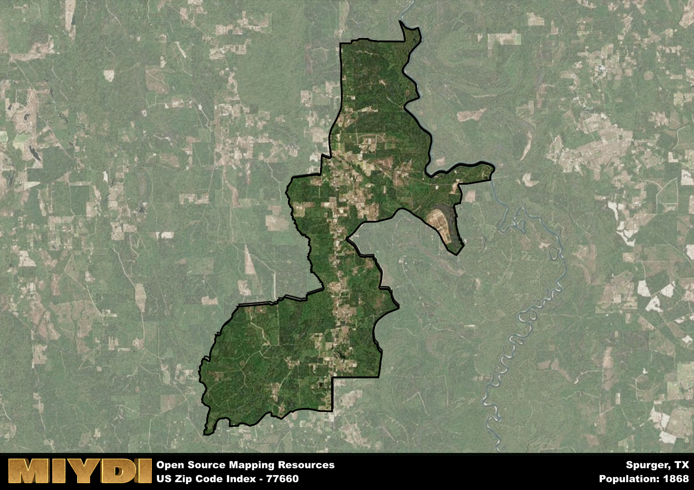

**Area Name:** Spurger

**Zip Code:** 77660

**State:** TX

# Spurger, Texas: A Tranquil Community in the Heart of East Texas  

Located in the heart of East Texas, the zip code area of 77660 corresponds to the peaceful community of Spurger. Surrounded by dense pine forests, this neighborhood is nestled within Tyler County and is in close proximity to the cities of Woodville and Jasper. It serves as a quiet retreat for those seeking a slower pace of life while still being connected to larger urban centers such as Beaumont and Houston.

Spurger has a rich historical legacy dating back to the early 20th century when it was first settled by pioneers attracted to the fertile lands and abundant natural resources of the region. The area saw significant growth with the development of the timber industry, which brought prosperity to the community. Spurger was officially established as a town in 1924 and has since maintained its small-town charm while embracing modern amenities.

Today, Spurger is known for its tight-knit community, local businesses, and outdoor recreational opportunities. The area boasts a mix of agricultural and forestry activities, with many residents working in these industries. Residents and visitors alike can enjoy fishing and hunting in the nearby national forests, as well as explore historic sites such as the Spurger ISD Museum. With its serene environment and strong community spirit, Spurger continues to be a hidden gem in East Texas.

# Spurger Demographics

The population of Spurger is 1868.  
Spurger has a population density of 42.33 per square mile.  
The area of Spurger is 44.13 square miles.  

## Spurger Income and Economic Data

These demographic numbers are sourced from IRS return data, providing comprehensive insights into the population dynamics and economic trends within Spurger.

**Breakdown of return types for Spurger**

The table offers insight into the composition of tax returns filed with the IRS, categorizing them into three main types. Single returns represent filings by individuals, joint returns by married couples, and head of household returns by individuals who qualify as heads of households, typically having dependents. This breakdown provides an understanding of the different filing statuses adopted by taxpayers when submitting their tax documentation.

| Return Types filed for Spurger                              | Percentage          |
|----------------------------------------------------------|---------------------|
| Single Returns                                            | 0.42 |
| Joint Returns                                             | 0.46 |
| Head Household Returns                                    | 0.11 |

The income and economic data presented here is sourced from the IRS income brackets, utilized for categorizing tax returns by income levels. This table displays income ranges for both single filers and married couples, along with the corresponding number of returns and the percentage within each bracket, providing valuable insight into the distribution of taxes across various income groups.

| Bracket Name       | Single Filer Income Range | Married Couple Range | Number of Returns | Percentage of Returns |
|--------------------|----------------------------|----------------------|-------------------|-----------------------|
| 10% Bracket        | Up to $10,275              | Up to $20,550        | 240 | 0.37% |
| 12% Bracket        | $10,276 - $41,775          | $20,551 - $83,550    | 140 | 0.22% |
| 22% Bracket        | $41,776 - $89,075          | $83,551 - $178,150   | 100 | 0.15% |
| 24% Bracket        | $89,076 - $170,050         | $178,151 - $340,100  | 70 | 0.11% |
| 32% Bracket        | $170,051 - $215,950        | $340,101 - $431,900  | 100 | 0.15% |
| 35% Bracket        | $215,951 - $539,900        | $431,901 - $647,850  | 0 | 0% |

### Exploring Taxpayer Diversity: A Breakdown of Different Types of Tax Returns in Spurger

The table offers insights into various types of tax returns filed, reflecting different aspects of taxpayer activities and demographics. Categories include charitable returns for donations, dependent returns for claimed dependents, educator population, elderly population, real estate returns, self-employment returns, student loan returns, and unemployment returns, providing valuable insights into taxpayer behavior and demographics.

| Spurger Filing Types                    | Count | Percentage |
|--------------------------------------|-------|------------|
| Charitable Donations                 | 0 | 0% |
| Dependents Claimed                   | 0 | 0% |
| Educator Residents                   | 0 | 0% |
| Elderly Population                   | 190 | 0.29% |
| Farming Population                   | 60 | 0.092% |
| Real Estate Transactions             | 0 | 0% |
| Self-Employed Individuals            | 80 | 0.123% |
| Student Loan Cases                   | 0 | 0% |
| Unemployment Benefit Filings         | 110 | 0.17% |

## Spurger AI and Census Variables

The values presented in this dataset for Spurger are AI-optimized, streamlined, and categorized into relevant buckets for enhanced utility in AI and mapping programs. These simplified values have been optimized to facilitate efficient analysis and integration into various technological applications, offering users accessible and actionable insights into demographics within the Spurger area.

| AI Variables for Spurger | Value |
|-------------|-------|
| Shape Area | 154913061.683594 |
| Shape Length | 100155.734307611 |

## How to use this free AI optimized Geo-Spatial Data for Spurger, TX

This data is made freely available under the Creative Commons license, allowing for unrestricted use for any purpose. Users can access static resources directly from GitHub or leverage more advanced functionalities by utilizing the GeoJSON files. All datasets originate from official government or private sector sources and are meticulously compiled into relevant datasets within QGIS. However, the versatility of the data ensures compatibility with any mapping application.

## Data Accuracy Disclaimer
It's important to note that the data provided here may contain errors or discrepancies and should be considered as 'close enough' for business applications and AI rather than a definitive source of truth. This data is aggregated from multiple sources, some of which publish information on wildly different intervals, leading to potential inconsistencies. Additionally, certain data points may not be corrected for Covid-related changes, further impacting accuracy. Moreover, the assumption that demographic trends are consistent throughout a region may lead to discrepancies, as trends often concentrate in areas of highest population density. As a result, dense areas may be slightly underrepresented, while rural areas may be slightly overrepresented, resulting in a more conservative dataset. Furthermore, the focus primarily on areas within US Major and Minor Statistical areas means that approximately 40 million Americans living outside of these areas may not be fully represented. Lastly, the historical background and area descriptions generated using AI are susceptible to potential mistakes, so users should exercise caution when interpreting the information provided.
