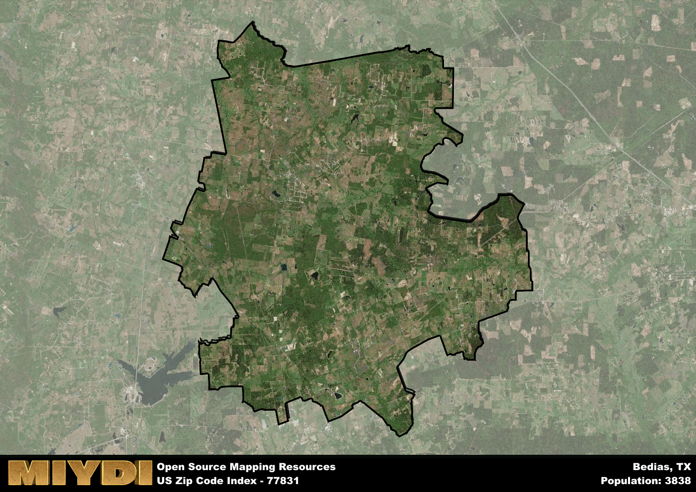

**Area Name:** Bedias

**Zip Code:** 77831

**State:** TX

Bedias is a part of the Huntsville - TX Micro Area, and makes up  of the Metro's population.  

# Bedias: A Historic and Vibrant Community in Zip Code 77831

Located in the eastern part of Texas, zip code 77831 encompasses the community of Bedias. Situated in Grimes County, Bedias is a small but integral part of the larger metropolitan area of College Station. Surrounded by the cities of Huntsville and Madisonville, Bedias serves as a quiet retreat from the bustling urban centers while still offering convenient access to nearby amenities and services.

Established in the mid-19th century, Bedias has a rich history rooted in its origins as a trading post along the Bedias Creek. Named after the creek itself, the town grew steadily with the arrival of the railroad and became a hub for agricultural trade in the region. The area's historical significance is preserved in landmarks such as the Bedias Museum and the Bedias Methodist Church, reflecting the community's proud heritage and commitment to preserving its past.

Today, Bedias thrives as a close-knit community with a focus on agriculture and small businesses. Residents enjoy a range of local services, including schools, grocery stores, and medical facilities. The area's natural beauty is showcased in the Bedias Creek Nature Trail, offering opportunities for hiking and birdwatching. With its blend of history, community spirit, and scenic surroundings, Bedias remains a hidden gem within the larger urban landscape of College Station.

# Bedias Demographics

The population of Bedias is 3838.  
Bedias has a population density of 17.18 per square mile.  
The area of Bedias is 223.43 square miles.  

## Bedias Income and Economic Data

These demographic numbers are sourced from IRS return data, providing comprehensive insights into the population dynamics and economic trends within Bedias.

**Breakdown of return types for Bedias**

The table offers insight into the composition of tax returns filed with the IRS, categorizing them into three main types. Single returns represent filings by individuals, joint returns by married couples, and head of household returns by individuals who qualify as heads of households, typically having dependents. This breakdown provides an understanding of the different filing statuses adopted by taxpayers when submitting their tax documentation.

| Return Types filed for Bedias                              | Percentage          |
|----------------------------------------------------------|---------------------|
| Single Returns                                            | 0.42 |
| Joint Returns                                             | 0.42 |
| Head Household Returns                                    | 0.14 |

The income and economic data presented here is sourced from the IRS income brackets, utilized for categorizing tax returns by income levels. This table displays income ranges for both single filers and married couples, along with the corresponding number of returns and the percentage within each bracket, providing valuable insight into the distribution of taxes across various income groups.

| Bracket Name       | Single Filer Income Range | Married Couple Range | Number of Returns | Percentage of Returns |
|--------------------|----------------------------|----------------------|-------------------|-----------------------|
| 10% Bracket        | Up to $10,275              | Up to $20,550        | 540 | 0.37% |
| 12% Bracket        | $10,276 - $41,775          | $20,551 - $83,550    | 390 | 0.27% |
| 22% Bracket        | $41,776 - $89,075          | $83,551 - $178,150   | 210 | 0.14% |
| 24% Bracket        | $89,076 - $170,050         | $178,151 - $340,100  | 140 | 0.1% |
| 32% Bracket        | $170,051 - $215,950        | $340,101 - $431,900  | 140 | 0.1% |
| 35% Bracket        | $215,951 - $539,900        | $431,901 - $647,850  | 40 | 0.03% |

### Exploring Taxpayer Diversity: A Breakdown of Different Types of Tax Returns in Bedias

The table offers insights into various types of tax returns filed, reflecting different aspects of taxpayer activities and demographics. Categories include charitable returns for donations, dependent returns for claimed dependents, educator population, elderly population, real estate returns, self-employment returns, student loan returns, and unemployment returns, providing valuable insights into taxpayer behavior and demographics.

| Bedias Filing Types                    | Count | Percentage |
|--------------------------------------|-------|------------|
| Charitable Donations                 | 50 | 0.034% |
| Dependents Claimed                   | 30 | 0.021% |
| Educator Residents                   | 0 | 0% |
| Elderly Population                   | 420 | 0.29% |
| Farming Population                   | 190 | 0.13% |
| Real Estate Transactions             | 50 | 0.034% |
| Self-Employed Individuals            | 230 | 0.158% |
| Student Loan Cases                   | 60 | 0.041% |
| Unemployment Benefit Filings         | 200 | 0.14% |

## Bedias AI and Census Variables

The values presented in this dataset for Bedias are AI-optimized, streamlined, and categorized into relevant buckets for enhanced utility in AI and mapping programs. These simplified values have been optimized to facilitate efficient analysis and integration into various technological applications, offering users accessible and actionable insights into demographics within the Bedias area.

| AI Variables for Bedias | Value |
|-------------|-------|
| Shape Area | 785773824.503906 |
| Shape Length | 184490.22699009 |
| CBSA Federal Processing Standard Code | 26660 |

## How to use this free AI optimized Geo-Spatial Data for Bedias, TX

This data is made freely available under the Creative Commons license, allowing for unrestricted use for any purpose. Users can access static resources directly from GitHub or leverage more advanced functionalities by utilizing the GeoJSON files. All datasets originate from official government or private sector sources and are meticulously compiled into relevant datasets within QGIS. However, the versatility of the data ensures compatibility with any mapping application.

## Data Accuracy Disclaimer
It's important to note that the data provided here may contain errors or discrepancies and should be considered as 'close enough' for business applications and AI rather than a definitive source of truth. This data is aggregated from multiple sources, some of which publish information on wildly different intervals, leading to potential inconsistencies. Additionally, certain data points may not be corrected for Covid-related changes, further impacting accuracy. Moreover, the assumption that demographic trends are consistent throughout a region may lead to discrepancies, as trends often concentrate in areas of highest population density. As a result, dense areas may be slightly underrepresented, while rural areas may be slightly overrepresented, resulting in a more conservative dataset. Furthermore, the focus primarily on areas within US Major and Minor Statistical areas means that approximately 40 million Americans living outside of these areas may not be fully represented. Lastly, the historical background and area descriptions generated using AI are susceptible to potential mistakes, so users should exercise caution when interpreting the information provided.
