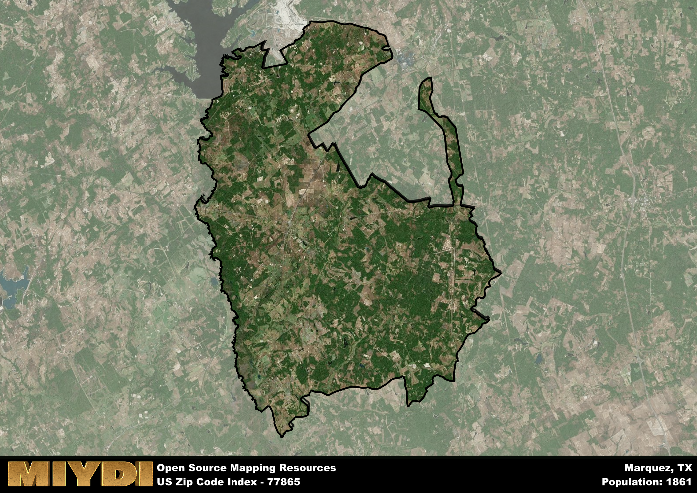

**Area Name:** Marquez

**Zip Code:** 77865

**State:** TX

Marquez is a part of the College Station-Bryan - TX Metro Area, and makes up  of the Metro's population.  

# Marquez: A Historic Community in Southeast Texas

Located in the heart of Southeast Texas, zip code 77865 encompasses the charming community of Marquez. Nestled within Leon County, Marquez is surrounded by the towns of Normangee to the north, Flynn to the east, and Hilltop Lakes to the south. This zip code area is an integral part of the larger metropolitan area of Bryan-College Station, providing a serene retreat from the bustling city life while still offering easy access to urban amenities.

Marquez has a rich historical narrative that dates back to its founding in the late 19th century. Originally established as a railroad town along the International-Great Northern Railroad, Marquez quickly grew into a thriving hub for agriculture and commerce. The area was named after a prominent local landowner, Manuel Marquez, whose legacy still echoes through the community today. Over the years, Marquez has retained its small-town charm and close-knit community spirit, making it a beloved destination for residents and visitors alike.

Today, Marquez boasts a diverse economy supported by agriculture, small businesses, and tourism. The area is known for its picturesque landscapes, including rolling hills and lush forests, making it a popular destination for outdoor enthusiasts. Residents and visitors can enjoy a range of recreational amenities, such as fishing and hunting, as well as cultural attractions like historic sites and local festivals. With its strong sense of community and rich heritage, Marquez continues to thrive as a hidden gem in Southeast Texas.

# Marquez Demographics

The population of Marquez is 1861.  
Marquez has a population density of 11.85 per square mile.  
The area of Marquez is 157.02 square miles.  

## Marquez Income and Economic Data

These demographic numbers are sourced from IRS return data, providing comprehensive insights into the population dynamics and economic trends within Marquez.

**Breakdown of return types for Marquez**

The table offers insight into the composition of tax returns filed with the IRS, categorizing them into three main types. Single returns represent filings by individuals, joint returns by married couples, and head of household returns by individuals who qualify as heads of households, typically having dependents. This breakdown provides an understanding of the different filing statuses adopted by taxpayers when submitting their tax documentation.

| Return Types filed for Marquez                              | Percentage          |
|----------------------------------------------------------|---------------------|
| Single Returns                                            | 0.4 |
| Joint Returns                                             | 0.45 |
| Head Household Returns                                    | 0.12 |

The income and economic data presented here is sourced from the IRS income brackets, utilized for categorizing tax returns by income levels. This table displays income ranges for both single filers and married couples, along with the corresponding number of returns and the percentage within each bracket, providing valuable insight into the distribution of taxes across various income groups.

| Bracket Name       | Single Filer Income Range | Married Couple Range | Number of Returns | Percentage of Returns |
|--------------------|----------------------------|----------------------|-------------------|-----------------------|
| 10% Bracket        | Up to $10,275              | Up to $20,550        | 250 | 0.34% |
| 12% Bracket        | $10,276 - $41,775          | $20,551 - $83,550    | 160 | 0.22% |
| 22% Bracket        | $41,776 - $89,075          | $83,551 - $178,150   | 120 | 0.16% |
| 24% Bracket        | $89,076 - $170,050         | $178,151 - $340,100  | 70 | 0.1% |
| 32% Bracket        | $170,051 - $215,950        | $340,101 - $431,900  | 110 | 0.15% |
| 35% Bracket        | $215,951 - $539,900        | $431,901 - $647,850  | 20 | 0.03% |

### Exploring Taxpayer Diversity: A Breakdown of Different Types of Tax Returns in Marquez

The table offers insights into various types of tax returns filed, reflecting different aspects of taxpayer activities and demographics. Categories include charitable returns for donations, dependent returns for claimed dependents, educator population, elderly population, real estate returns, self-employment returns, student loan returns, and unemployment returns, providing valuable insights into taxpayer behavior and demographics.

| Marquez Filing Types                    | Count | Percentage |
|--------------------------------------|-------|------------|
| Charitable Donations                 | 0 | 0% |
| Dependents Claimed                   | 0 | 0% |
| Educator Residents                   | 0 | 0% |
| Elderly Population                   | 250 | 0.34% |
| Farming Population                   | 150 | 0.205% |
| Real Estate Transactions             | 20 | 0.027% |
| Self-Employed Individuals            | 130 | 0.178% |
| Student Loan Cases                   | 0 | 0% |
| Unemployment Benefit Filings         | 70 | 0.1% |

## Marquez AI and Census Variables

The values presented in this dataset for Marquez are AI-optimized, streamlined, and categorized into relevant buckets for enhanced utility in AI and mapping programs. These simplified values have been optimized to facilitate efficient analysis and integration into various technological applications, offering users accessible and actionable insights into demographics within the Marquez area.

| AI Variables for Marquez | Value |
|-------------|-------|
| Shape Area | 557993450.082031 |
| Shape Length | 188603.881783025 |
| CBSA Federal Processing Standard Code | 17780 |

## How to use this free AI optimized Geo-Spatial Data for Marquez, TX

This data is made freely available under the Creative Commons license, allowing for unrestricted use for any purpose. Users can access static resources directly from GitHub or leverage more advanced functionalities by utilizing the GeoJSON files. All datasets originate from official government or private sector sources and are meticulously compiled into relevant datasets within QGIS. However, the versatility of the data ensures compatibility with any mapping application.

## Data Accuracy Disclaimer
It's important to note that the data provided here may contain errors or discrepancies and should be considered as 'close enough' for business applications and AI rather than a definitive source of truth. This data is aggregated from multiple sources, some of which publish information on wildly different intervals, leading to potential inconsistencies. Additionally, certain data points may not be corrected for Covid-related changes, further impacting accuracy. Moreover, the assumption that demographic trends are consistent throughout a region may lead to discrepancies, as trends often concentrate in areas of highest population density. As a result, dense areas may be slightly underrepresented, while rural areas may be slightly overrepresented, resulting in a more conservative dataset. Furthermore, the focus primarily on areas within US Major and Minor Statistical areas means that approximately 40 million Americans living outside of these areas may not be fully represented. Lastly, the historical background and area descriptions generated using AI are susceptible to potential mistakes, so users should exercise caution when interpreting the information provided.
