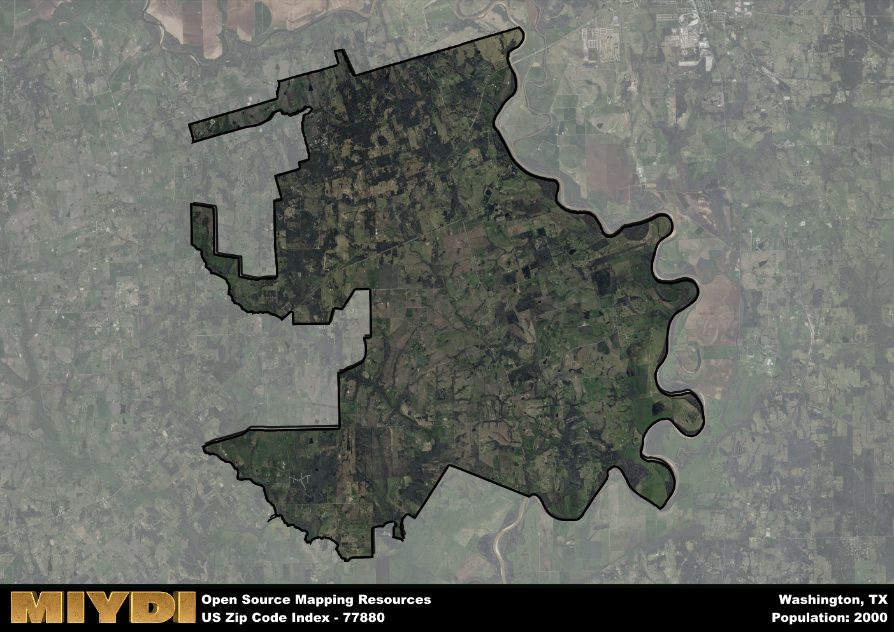

**Area Name:** Washington

**Zip Code:** 77880

**State:** TX

Washington is a part of the Brenham - TX Micro Area, and makes up  of the Metro's population.  

# Exploring the Charm of Washington, TX (Zip Code: 77880)

Washington, TX, located within the zip code 77880, is a quaint neighborhood nestled within the larger metropolitan area of Washington. The boundaries of this area extend from Main Street to the Washington Loop, integrating seamlessly with the neighboring districts of Old Town and New Washington. Washington is a historical gem situated within the greater urban fabric of Washington, known for its preserved architecture and charming streets.

Founded in the early 1800s, Washington has a rich historical narrative that dates back to the days of the Texas Revolution. This area played a significant role in Texas history as the site where the Texas Declaration of Independence was signed in 1836. The legacy of this event is still palpable in Washington, with many historic sites and landmarks commemorating the area's pivotal role in shaping the state's identity.

Today, Washington is a vibrant community that blends its historical charm with modern amenities. The neighborhood boasts a variety of local businesses, including charming cafes, boutique shops, and art galleries. Residents and visitors alike can enjoy the scenic beauty of the area through its parks and walking trails, while history enthusiasts can explore the numerous museums and historic sites that showcase the rich heritage of Washington. With its unique blend of past and present, Washington continues to be a beloved destination within the larger metropolitan area.

# Washington Demographics

The population of Washington is 2000.  
Washington has a population density of 26.09 per square mile.  
The area of Washington is 76.67 square miles.  

## Washington Income and Economic Data

These demographic numbers are sourced from IRS return data, providing comprehensive insights into the population dynamics and economic trends within Washington.

**Breakdown of return types for Washington**

The table offers insight into the composition of tax returns filed with the IRS, categorizing them into three main types. Single returns represent filings by individuals, joint returns by married couples, and head of household returns by individuals who qualify as heads of households, typically having dependents. This breakdown provides an understanding of the different filing statuses adopted by taxpayers when submitting their tax documentation.

| Return Types filed for Washington                              | Percentage          |
|----------------------------------------------------------|---------------------|
| Single Returns                                            | 0.44 |
| Joint Returns                                             | 0.4 |
| Head Household Returns                                    | 0.18 |

The income and economic data presented here is sourced from the IRS income brackets, utilized for categorizing tax returns by income levels. This table displays income ranges for both single filers and married couples, along with the corresponding number of returns and the percentage within each bracket, providing valuable insight into the distribution of taxes across various income groups.

| Bracket Name       | Single Filer Income Range | Married Couple Range | Number of Returns | Percentage of Returns |
|--------------------|----------------------------|----------------------|-------------------|-----------------------|
| 10% Bracket        | Up to $10,275              | Up to $20,550        | 310 | 0.36% |
| 12% Bracket        | $10,276 - $41,775          | $20,551 - $83,550    | 210 | 0.25% |
| 22% Bracket        | $41,776 - $89,075          | $83,551 - $178,150   | 110 | 0.13% |
| 24% Bracket        | $89,076 - $170,050         | $178,151 - $340,100  | 60 | 0.07% |
| 32% Bracket        | $170,051 - $215,950        | $340,101 - $431,900  | 110 | 0.13% |
| 35% Bracket        | $215,951 - $539,900        | $431,901 - $647,850  | 50 | 0.06% |

### Exploring Taxpayer Diversity: A Breakdown of Different Types of Tax Returns in Washington

The table offers insights into various types of tax returns filed, reflecting different aspects of taxpayer activities and demographics. Categories include charitable returns for donations, dependent returns for claimed dependents, educator population, elderly population, real estate returns, self-employment returns, student loan returns, and unemployment returns, providing valuable insights into taxpayer behavior and demographics.

| Washington Filing Types                    | Count | Percentage |
|--------------------------------------|-------|------------|
| Charitable Donations                 | 60 | 0.071% |
| Dependents Claimed                   | 20 | 0.024% |
| Educator Residents                   | 0 | 0% |
| Elderly Population                   | 300 | 0.35% |
| Farming Population                   | 160 | 0.188% |
| Real Estate Transactions             | 60 | 0.071% |
| Self-Employed Individuals            | 120 | 0.141% |
| Student Loan Cases                   | 20 | 0.024% |
| Unemployment Benefit Filings         | 80 | 0.09% |

## Washington AI and Census Variables

The values presented in this dataset for Washington are AI-optimized, streamlined, and categorized into relevant buckets for enhanced utility in AI and mapping programs. These simplified values have been optimized to facilitate efficient analysis and integration into various technological applications, offering users accessible and actionable insights into demographics within the Washington area.

| AI Variables for Washington | Value |
|-------------|-------|
| Shape Area | 267168830.929688 |
| Shape Length | 131014.227688303 |
| CBSA Federal Processing Standard Code | 14780 |

## How to use this free AI optimized Geo-Spatial Data for Washington, TX

This data is made freely available under the Creative Commons license, allowing for unrestricted use for any purpose. Users can access static resources directly from GitHub or leverage more advanced functionalities by utilizing the GeoJSON files. All datasets originate from official government or private sector sources and are meticulously compiled into relevant datasets within QGIS. However, the versatility of the data ensures compatibility with any mapping application.

## Data Accuracy Disclaimer
It's important to note that the data provided here may contain errors or discrepancies and should be considered as 'close enough' for business applications and AI rather than a definitive source of truth. This data is aggregated from multiple sources, some of which publish information on wildly different intervals, leading to potential inconsistencies. Additionally, certain data points may not be corrected for Covid-related changes, further impacting accuracy. Moreover, the assumption that demographic trends are consistent throughout a region may lead to discrepancies, as trends often concentrate in areas of highest population density. As a result, dense areas may be slightly underrepresented, while rural areas may be slightly overrepresented, resulting in a more conservative dataset. Furthermore, the focus primarily on areas within US Major and Minor Statistical areas means that approximately 40 million Americans living outside of these areas may not be fully represented. Lastly, the historical background and area descriptions generated using AI are susceptible to potential mistakes, so users should exercise caution when interpreting the information provided.
