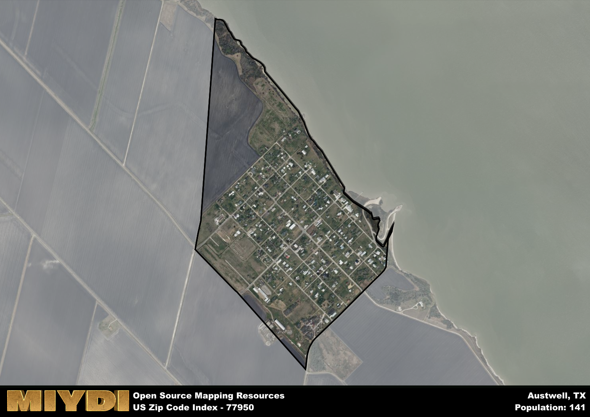

**Area Name:** Austwell

**Zip Code:** 77950

**State:** TX

# Austwell: A Charming Coastal Community in South Texas  

Austwell, with the zip code 77950, is a small coastal community located in South Texas. Situated in Refugio County, Austwell is bordered by the San Antonio Bay to the east and the town of Tivoli to the west. It is part of the larger metropolitan area that includes the city of Victoria, providing residents with access to urban amenities while maintaining its small-town charm. Austwell is known for its picturesque views of the bay and its close-knit community atmosphere.

Founded in the late 19th century, Austwell was originally a fishing and farming community. The town experienced a period of growth in the early 20th century with the construction of a school, churches, and a post office. The name "Austwell" is said to be a combination of the surnames of two local landowners, Austin and Boswell. Over the years, Austwell has maintained its identity as a quiet coastal town, attracting visitors with its scenic beauty and peaceful surroundings.

Today, Austwell remains a quaint community with a focus on fishing and tourism. The town is home to a few local businesses, including seafood restaurants and bed and breakfasts. Residents and visitors alike enjoy recreational activities such as fishing, birdwatching, and kayaking in the bay. Austwell is also known for its historic sites, including the Austwell Pier and the Old Schoolhouse Museum, which offer a glimpse into the town's past. With its unique blend of history, natural beauty, and community spirit, Austwell continues to be a hidden gem along the Texas coast.

# Austwell Demographics

The population of Austwell is 141.  
Austwell has a population density of 371.05 per square mile.  
The area of Austwell is 0.38 square miles.  

## Austwell AI and Census Variables

The values presented in this dataset for Austwell are AI-optimized, streamlined, and categorized into relevant buckets for enhanced utility in AI and mapping programs. These simplified values have been optimized to facilitate efficient analysis and integration into various technological applications, offering users accessible and actionable insights into demographics within the Austwell area.

| AI Variables for Austwell | Value |
|-------------|-------|
| Shape Area | 1260441.671875 |
| Shape Length | 5448.43217185618 |

## How to use this free AI optimized Geo-Spatial Data for Austwell, TX

This data is made freely available under the Creative Commons license, allowing for unrestricted use for any purpose. Users can access static resources directly from GitHub or leverage more advanced functionalities by utilizing the GeoJSON files. All datasets originate from official government or private sector sources and are meticulously compiled into relevant datasets within QGIS. However, the versatility of the data ensures compatibility with any mapping application.

## Data Accuracy Disclaimer
It's important to note that the data provided here may contain errors or discrepancies and should be considered as 'close enough' for business applications and AI rather than a definitive source of truth. This data is aggregated from multiple sources, some of which publish information on wildly different intervals, leading to potential inconsistencies. Additionally, certain data points may not be corrected for Covid-related changes, further impacting accuracy. Moreover, the assumption that demographic trends are consistent throughout a region may lead to discrepancies, as trends often concentrate in areas of highest population density. As a result, dense areas may be slightly underrepresented, while rural areas may be slightly overrepresented, resulting in a more conservative dataset. Furthermore, the focus primarily on areas within US Major and Minor Statistical areas means that approximately 40 million Americans living outside of these areas may not be fully represented. Lastly, the historical background and area descriptions generated using AI are susceptible to potential mistakes, so users should exercise caution when interpreting the information provided.
