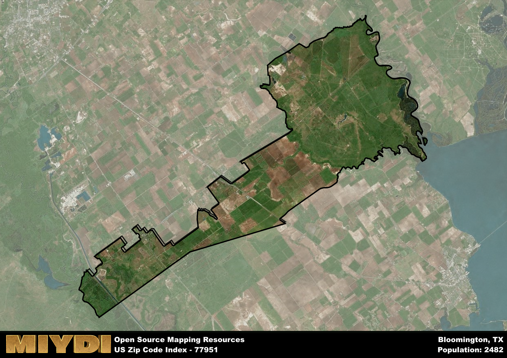

**Area Name:** Bloomington

**Zip Code:** 77951

**State:** TX

Bloomington is a part of the Victoria - TX Metro Area, and makes up  of the Metro's population.  

# Bloomington, Texas: A Charming Community in Zip Code 77951

Located in South Texas, Bloomington is a small unincorporated community that falls within the zip code 77951. Situated in Victoria County, Bloomington is surrounded by the towns of Inez, Placedo, and Telferner. The area is approximately 20 miles southwest of the city of Victoria, the largest urban center in the region. Despite its proximity to Victoria, Bloomington maintains its own distinct character and identity.

Bloomington has a rich historical background dating back to the mid-19th century. The area was originally settled by German and Czech immigrants who were drawn to the fertile lands for agriculture. The community was officially established in the late 1800s and named after Bloomington, Illinois. Over the years, Bloomington has experienced steady growth, evolving into a close-knit community with a strong sense of pride in its heritage and traditions.

Today, Bloomington is a vibrant community with a mix of residential and agricultural areas. The economy is primarily driven by farming and ranching, with many residents working in the nearby oil and gas industry. The town offers essential services such as schools, grocery stores, and small businesses. Residents and visitors can enjoy recreational activities at local parks and community centers. Bloomington also boasts historic sites and cultural attractions that showcase the area's unique past and provide insight into its development over the years.

# Bloomington Demographics

The population of Bloomington is 2482.  
Bloomington has a population density of 33.89 per square mile.  
The area of Bloomington is 73.23 square miles.  

## Bloomington AI and Census Variables

The values presented in this dataset for Bloomington are AI-optimized, streamlined, and categorized into relevant buckets for enhanced utility in AI and mapping programs. These simplified values have been optimized to facilitate efficient analysis and integration into various technological applications, offering users accessible and actionable insights into demographics within the Bloomington area.

| AI Variables for Bloomington | Value |
|-------------|-------|
| Shape Area | 247442789.308594 |
| Shape Length | 136202.03269018 |
| CBSA Federal Processing Standard Code | 47020 |

## How to use this free AI optimized Geo-Spatial Data for Bloomington, TX

This data is made freely available under the Creative Commons license, allowing for unrestricted use for any purpose. Users can access static resources directly from GitHub or leverage more advanced functionalities by utilizing the GeoJSON files. All datasets originate from official government or private sector sources and are meticulously compiled into relevant datasets within QGIS. However, the versatility of the data ensures compatibility with any mapping application.

## Data Accuracy Disclaimer
It's important to note that the data provided here may contain errors or discrepancies and should be considered as 'close enough' for business applications and AI rather than a definitive source of truth. This data is aggregated from multiple sources, some of which publish information on wildly different intervals, leading to potential inconsistencies. Additionally, certain data points may not be corrected for Covid-related changes, further impacting accuracy. Moreover, the assumption that demographic trends are consistent throughout a region may lead to discrepancies, as trends often concentrate in areas of highest population density. As a result, dense areas may be slightly underrepresented, while rural areas may be slightly overrepresented, resulting in a more conservative dataset. Furthermore, the focus primarily on areas within US Major and Minor Statistical areas means that approximately 40 million Americans living outside of these areas may not be fully represented. Lastly, the historical background and area descriptions generated using AI are susceptible to potential mistakes, so users should exercise caution when interpreting the information provided.
