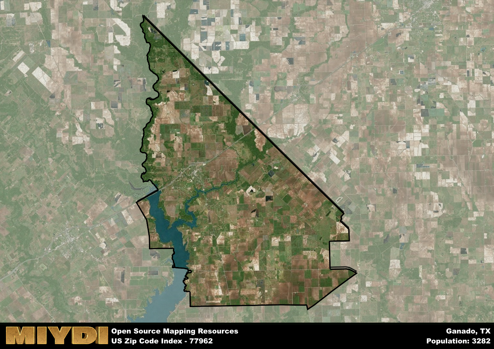

**Area Name:** Ganado

**Zip Code:** 77962

**State:** TX

Ganado is a part of the El Campo - TX Micro Area, and makes up  of the Metro's population.  

# Ganado: A Historic Gem in Texas  
Located in Jackson County, Ganado is a small town in Texas with the zip code 77962. It is situated approximately 14 miles northeast of the city of Edna and 60 miles southwest of Victoria. Ganado is surrounded by vast agricultural land and is a part of the greater Houston metropolitan area, serving as a peaceful retreat from the hustle and bustle of urban life.

Ganado has a rich history dating back to the mid-19th century when it was founded as a railroad town. The town's name is derived from the Spanish word for "herd" or "cattle," reflecting its roots in the ranching industry. Over the years, Ganado has grown into a close-knit community known for its friendly residents and strong sense of pride in its heritage. The town has preserved many historic buildings and landmarks, offering visitors a glimpse into its past.

Today, Ganado is a vibrant community with a mix of residential and commercial areas. The town's economy is primarily driven by agriculture, with cattle ranching and crop farming being the main industries. Ganado offers a range of services to its residents, including schools, healthcare facilities, and local businesses. The town also boasts several parks and recreational facilities, providing ample opportunities for outdoor activities. Visitors can explore the Ganado Museum to learn about the town's history or enjoy the annual Ganado Pow Wow, a celebration of Native American culture.

# Ganado Demographics

The population of Ganado is 3282.  
Ganado has a population density of 23.31 per square mile.  
The area of Ganado is 140.82 square miles.  

## Ganado Income and Economic Data

These demographic numbers are sourced from IRS return data, providing comprehensive insights into the population dynamics and economic trends within Ganado.

**Breakdown of return types for Ganado**

The table offers insight into the composition of tax returns filed with the IRS, categorizing them into three main types. Single returns represent filings by individuals, joint returns by married couples, and head of household returns by individuals who qualify as heads of households, typically having dependents. This breakdown provides an understanding of the different filing statuses adopted by taxpayers when submitting their tax documentation.

| Return Types filed for Ganado                              | Percentage          |
|----------------------------------------------------------|---------------------|
| Single Returns                                            | 0.42 |
| Joint Returns                                             | 0.45 |
| Head Household Returns                                    | 0.13 |

The income and economic data presented here is sourced from the IRS income brackets, utilized for categorizing tax returns by income levels. This table displays income ranges for both single filers and married couples, along with the corresponding number of returns and the percentage within each bracket, providing valuable insight into the distribution of taxes across various income groups.

| Bracket Name       | Single Filer Income Range | Married Couple Range | Number of Returns | Percentage of Returns |
|--------------------|----------------------------|----------------------|-------------------|-----------------------|
| 10% Bracket        | Up to $10,275              | Up to $20,550        | 480 | 0.3% |
| 12% Bracket        | $10,276 - $41,775          | $20,551 - $83,550    | 420 | 0.26% |
| 22% Bracket        | $41,776 - $89,075          | $83,551 - $178,150   | 230 | 0.14% |
| 24% Bracket        | $89,076 - $170,050         | $178,151 - $340,100  | 170 | 0.11% |
| 32% Bracket        | $170,051 - $215,950        | $340,101 - $431,900  | 240 | 0.15% |
| 35% Bracket        | $215,951 - $539,900        | $431,901 - $647,850  | 50 | 0.03% |

### Exploring Taxpayer Diversity: A Breakdown of Different Types of Tax Returns in Ganado

The table offers insights into various types of tax returns filed, reflecting different aspects of taxpayer activities and demographics. Categories include charitable returns for donations, dependent returns for claimed dependents, educator population, elderly population, real estate returns, self-employment returns, student loan returns, and unemployment returns, providing valuable insights into taxpayer behavior and demographics.

| Ganado Filing Types                    | Count | Percentage |
|--------------------------------------|-------|------------|
| Charitable Donations                 | 30 | 0.019% |
| Dependents Claimed                   | 60 | 0.038% |
| Educator Residents                   | 50 | 0.031% |
| Elderly Population                   | 410 | 0.26% |
| Farming Population                   | 150 | 0.094% |
| Real Estate Transactions             | 30 | 0.019% |
| Self-Employed Individuals            | 220 | 0.138% |
| Student Loan Cases                   | 50 | 0.031% |
| Unemployment Benefit Filings         | 180 | 0.11% |

## Ganado AI and Census Variables

The values presented in this dataset for Ganado are AI-optimized, streamlined, and categorized into relevant buckets for enhanced utility in AI and mapping programs. These simplified values have been optimized to facilitate efficient analysis and integration into various technological applications, offering users accessible and actionable insights into demographics within the Ganado area.

| AI Variables for Ganado | Value |
|-------------|-------|
| Shape Area | 478666194.632813 |
| Shape Length | 118945.189276816 |
| CBSA Federal Processing Standard Code | 20900 |

## How to use this free AI optimized Geo-Spatial Data for Ganado, TX

This data is made freely available under the Creative Commons license, allowing for unrestricted use for any purpose. Users can access static resources directly from GitHub or leverage more advanced functionalities by utilizing the GeoJSON files. All datasets originate from official government or private sector sources and are meticulously compiled into relevant datasets within QGIS. However, the versatility of the data ensures compatibility with any mapping application.

## Data Accuracy Disclaimer
It's important to note that the data provided here may contain errors or discrepancies and should be considered as 'close enough' for business applications and AI rather than a definitive source of truth. This data is aggregated from multiple sources, some of which publish information on wildly different intervals, leading to potential inconsistencies. Additionally, certain data points may not be corrected for Covid-related changes, further impacting accuracy. Moreover, the assumption that demographic trends are consistent throughout a region may lead to discrepancies, as trends often concentrate in areas of highest population density. As a result, dense areas may be slightly underrepresented, while rural areas may be slightly overrepresented, resulting in a more conservative dataset. Furthermore, the focus primarily on areas within US Major and Minor Statistical areas means that approximately 40 million Americans living outside of these areas may not be fully represented. Lastly, the historical background and area descriptions generated using AI are susceptible to potential mistakes, so users should exercise caution when interpreting the information provided.
