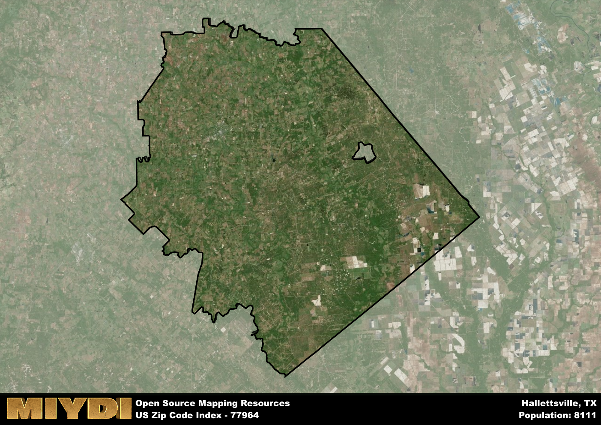

**Area Name:** Hallettsville

**Zip Code:** 77964

**State:** TX

# Hallettsville: A Charming Zip Code Area in Texas

Hallettsville, corresponding to zip code 77964, is a quaint neighborhood situated in Lavaca County, Texas. Bordered by the Lavaca River to the east and surrounded by vast farmlands, Hallettsville is located approximately 100 miles southeast of Austin and 90 miles west of Houston. As part of the Greater Houston metropolitan area, Hallettsville serves as a peaceful retreat from the hustle and bustle of the nearby urban centers.

The history of Hallettsville dates back to the mid-19th century when German and Czech immigrants settled in the area, drawn by the fertile soil and agricultural opportunities. The town was officially established in 1836 and named after John Hallett, one of the early settlers. Over the years, Hallettsville has grown into a close-knit community known for its rich cultural heritage and annual events such as the Kolache Fest, celebrating the Czech pastry that has become a local specialty.

Today, Hallettsville retains its small-town charm while offering a range of amenities and services to its residents. The economy is primarily driven by agriculture, with farmers producing crops such as corn, cotton, and sorghum. The neighborhood boasts a variety of local shops, restaurants, and businesses, providing essential services to the community. Residents and visitors can also enjoy recreational activities at nearby parks and historical sites, including the Lavaca Historical Museum and the Texas Polka Music Museum.

# Hallettsville Demographics

The population of Hallettsville is 8111.  
Hallettsville has a population density of 13.91 per square mile.  
The area of Hallettsville is 583.2 square miles.  

## Hallettsville Income and Economic Data

These demographic numbers are sourced from IRS return data, providing comprehensive insights into the population dynamics and economic trends within Hallettsville.

**Breakdown of return types for Hallettsville**

The table offers insight into the composition of tax returns filed with the IRS, categorizing them into three main types. Single returns represent filings by individuals, joint returns by married couples, and head of household returns by individuals who qualify as heads of households, typically having dependents. This breakdown provides an understanding of the different filing statuses adopted by taxpayers when submitting their tax documentation.

| Return Types filed for Hallettsville                              | Percentage          |
|----------------------------------------------------------|---------------------|
| Single Returns                                            | 0.44 |
| Joint Returns                                             | 0.45 |
| Head Household Returns                                    | 0.1 |

The income and economic data presented here is sourced from the IRS income brackets, utilized for categorizing tax returns by income levels. This table displays income ranges for both single filers and married couples, along with the corresponding number of returns and the percentage within each bracket, providing valuable insight into the distribution of taxes across various income groups.

| Bracket Name       | Single Filer Income Range | Married Couple Range | Number of Returns | Percentage of Returns |
|--------------------|----------------------------|----------------------|-------------------|-----------------------|
| 10% Bracket        | Up to $10,275              | Up to $20,550        | 1230 | 0.33% |
| 12% Bracket        | $10,276 - $41,775          | $20,551 - $83,550    | 850 | 0.22% |
| 22% Bracket        | $41,776 - $89,075          | $83,551 - $178,150   | 540 | 0.14% |
| 24% Bracket        | $89,076 - $170,050         | $178,151 - $340,100  | 410 | 0.11% |
| 32% Bracket        | $170,051 - $215,950        | $340,101 - $431,900  | 590 | 0.16% |
| 35% Bracket        | $215,951 - $539,900        | $431,901 - $647,850  | 160 | 0.04% |

### Exploring Taxpayer Diversity: A Breakdown of Different Types of Tax Returns in Hallettsville

The table offers insights into various types of tax returns filed, reflecting different aspects of taxpayer activities and demographics. Categories include charitable returns for donations, dependent returns for claimed dependents, educator population, elderly population, real estate returns, self-employment returns, student loan returns, and unemployment returns, providing valuable insights into taxpayer behavior and demographics.

| Hallettsville Filing Types                    | Count | Percentage |
|--------------------------------------|-------|------------|
| Charitable Donations                 | 110 | 0.029% |
| Dependents Claimed                   | 220 | 0.058% |
| Educator Residents                   | 150 | 0.04% |
| Elderly Population                   | 1280 | 0.34% |
| Farming Population                   | 970 | 0.257% |
| Real Estate Transactions             | 120 | 0.032% |
| Self-Employed Individuals            | 580 | 0.153% |
| Student Loan Cases                   | 140 | 0.037% |
| Unemployment Benefit Filings         | 300 | 0.08% |

## Hallettsville AI and Census Variables

The values presented in this dataset for Hallettsville are AI-optimized, streamlined, and categorized into relevant buckets for enhanced utility in AI and mapping programs. These simplified values have been optimized to facilitate efficient analysis and integration into various technological applications, offering users accessible and actionable insights into demographics within the Hallettsville area.

| AI Variables for Hallettsville | Value |
|-------------|-------|
| Shape Area | 1996118390.69922 |
| Shape Length | 244723.150028048 |

## How to use this free AI optimized Geo-Spatial Data for Hallettsville, TX

This data is made freely available under the Creative Commons license, allowing for unrestricted use for any purpose. Users can access static resources directly from GitHub or leverage more advanced functionalities by utilizing the GeoJSON files. All datasets originate from official government or private sector sources and are meticulously compiled into relevant datasets within QGIS. However, the versatility of the data ensures compatibility with any mapping application.

## Data Accuracy Disclaimer
It's important to note that the data provided here may contain errors or discrepancies and should be considered as 'close enough' for business applications and AI rather than a definitive source of truth. This data is aggregated from multiple sources, some of which publish information on wildly different intervals, leading to potential inconsistencies. Additionally, certain data points may not be corrected for Covid-related changes, further impacting accuracy. Moreover, the assumption that demographic trends are consistent throughout a region may lead to discrepancies, as trends often concentrate in areas of highest population density. As a result, dense areas may be slightly underrepresented, while rural areas may be slightly overrepresented, resulting in a more conservative dataset. Furthermore, the focus primarily on areas within US Major and Minor Statistical areas means that approximately 40 million Americans living outside of these areas may not be fully represented. Lastly, the historical background and area descriptions generated using AI are susceptible to potential mistakes, so users should exercise caution when interpreting the information provided.
