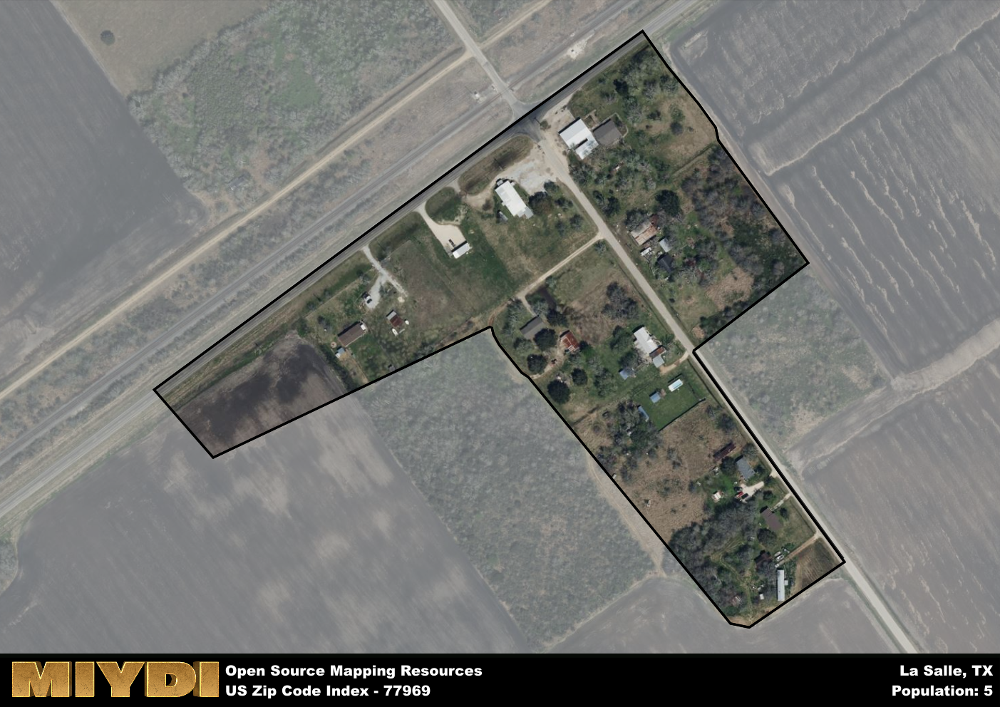

**Area Name:** La Salle

**Zip Code:** 77969

**State:** TX

# La Salle: A Historical and Vibrant Community in Zip Code 77969

Located in southern Texas, zip code 77969 encompasses the vibrant community of La Salle. Bordered by neighboring towns and cities such as Cotulla and Encinal, La Salle is an integral part of the larger metropolitan area. The area is known for its close-knit neighborhoods, bustling commercial districts, and easy access to major transportation routes, making it a desirable place to live and work.

La Salle has a rich historical narrative dating back to its settlement in the early 19th century. Originally founded as a trading post along the Frio River, the area quickly grew into a thriving community thanks to its strategic location and fertile land. Over the years, La Salle has experienced periods of economic prosperity and hardship, shaping the unique identity and character of the neighborhood that residents know and love today.

Today, La Salle is a bustling community with a diverse economy that includes agriculture, oil and gas production, and small businesses. The neighborhood is home to a variety of services and amenities, including schools, parks, and cultural attractions that cater to residents of all ages. Visitors can explore historic sites such as the La Salle County Courthouse and enjoy outdoor activities like hiking and fishing along the nearby rivers. With its strong sense of community and rich history, La Salle continues to thrive as a welcoming and dynamic place to call home.

# La Salle Demographics

The population of La Salle is 5.  
La Salle has a population density of 125 per square mile.  
The area of La Salle is 0.04 square miles.  

## La Salle AI and Census Variables

The values presented in this dataset for La Salle are AI-optimized, streamlined, and categorized into relevant buckets for enhanced utility in AI and mapping programs. These simplified values have been optimized to facilitate efficient analysis and integration into various technological applications, offering users accessible and actionable insights into demographics within the La Salle area.

| AI Variables for La Salle | Value |
|-------------|-------|
| Shape Area | 122128.34765625 |
| Shape Length | 1948.69653618735 |

## How to use this free AI optimized Geo-Spatial Data for La Salle, TX

This data is made freely available under the Creative Commons license, allowing for unrestricted use for any purpose. Users can access static resources directly from GitHub or leverage more advanced functionalities by utilizing the GeoJSON files. All datasets originate from official government or private sector sources and are meticulously compiled into relevant datasets within QGIS. However, the versatility of the data ensures compatibility with any mapping application.

## Data Accuracy Disclaimer
It's important to note that the data provided here may contain errors or discrepancies and should be considered as 'close enough' for business applications and AI rather than a definitive source of truth. This data is aggregated from multiple sources, some of which publish information on wildly different intervals, leading to potential inconsistencies. Additionally, certain data points may not be corrected for Covid-related changes, further impacting accuracy. Moreover, the assumption that demographic trends are consistent throughout a region may lead to discrepancies, as trends often concentrate in areas of highest population density. As a result, dense areas may be slightly underrepresented, while rural areas may be slightly overrepresented, resulting in a more conservative dataset. Furthermore, the focus primarily on areas within US Major and Minor Statistical areas means that approximately 40 million Americans living outside of these areas may not be fully represented. Lastly, the historical background and area descriptions generated using AI are susceptible to potential mistakes, so users should exercise caution when interpreting the information provided.
