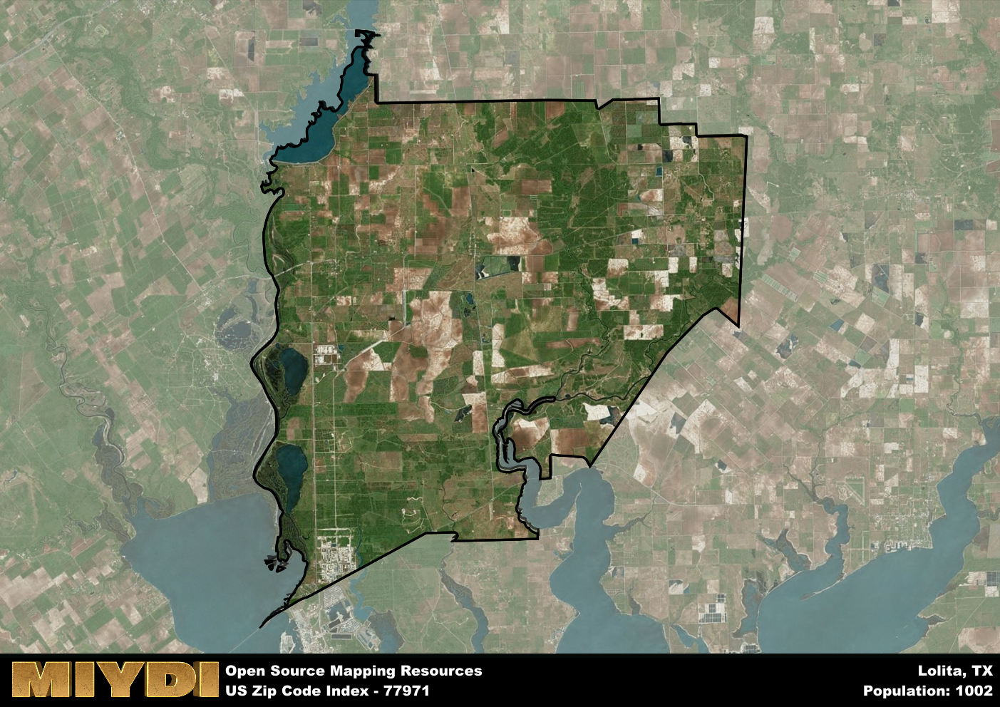

**Area Name:** Lolita

**Zip Code:** 77971

**State:** TX

Lolita is a part of the Port Lavaca - TX Micro Area, and makes up  of the Metro's population.  

# A Closer Look at Lolita (Zip Code 77971)

Located in the southern part of Texas, zip code 77971 encompasses the charming neighborhood of Lolita. Situated within Jackson County, Lolita is surrounded by the cities of Edna to the west and Ganado to the east. This zip code area is an integral part of the larger metropolitan context, contributing to the cultural and economic fabric of the region.

Lolita has a rich historical narrative that dates back to its settlement in the late 1800s. Originally established as a railroad town, Lolita experienced significant growth with the arrival of the railroad, leading to the development of local businesses and residential neighborhoods. The area was named after Lolita Reese, the daughter of a prominent landowner in the region, cementing its identity in local folklore.

Today, Lolita is a vibrant community with a mix of residential and commercial areas. The neighborhood is known for its agricultural activities, with farming and ranching playing a significant role in the local economy. In addition to its economic pursuits, Lolita offers a range of neighborhood-specific services, recreational amenities, and cultural sites that attract residents and visitors alike. The area's historical charm and tight-knit community make Lolita a unique destination within the larger urban landscape of southern Texas.

# Lolita Demographics

The population of Lolita is 1002.  
Lolita has a population density of 4.92 per square mile.  
The area of Lolita is 203.52 square miles.  

## Lolita Income and Economic Data

These demographic numbers are sourced from IRS return data, providing comprehensive insights into the population dynamics and economic trends within Lolita.

**Breakdown of return types for Lolita**

The table offers insight into the composition of tax returns filed with the IRS, categorizing them into three main types. Single returns represent filings by individuals, joint returns by married couples, and head of household returns by individuals who qualify as heads of households, typically having dependents. This breakdown provides an understanding of the different filing statuses adopted by taxpayers when submitting their tax documentation.

| Return Types filed for Lolita                              | Percentage          |
|----------------------------------------------------------|---------------------|
| Single Returns                                            | 0.44 |
| Joint Returns                                             | 0.44 |
| Head Household Returns                                    | 0.13 |

The income and economic data presented here is sourced from the IRS income brackets, utilized for categorizing tax returns by income levels. This table displays income ranges for both single filers and married couples, along with the corresponding number of returns and the percentage within each bracket, providing valuable insight into the distribution of taxes across various income groups.

| Bracket Name       | Single Filer Income Range | Married Couple Range | Number of Returns | Percentage of Returns |
|--------------------|----------------------------|----------------------|-------------------|-----------------------|
| 10% Bracket        | Up to $10,275              | Up to $20,550        | 120 | 0.31% |
| 12% Bracket        | $10,276 - $41,775          | $20,551 - $83,550    | 90 | 0.23% |
| 22% Bracket        | $41,776 - $89,075          | $83,551 - $178,150   | 60 | 0.15% |
| 24% Bracket        | $89,076 - $170,050         | $178,151 - $340,100  | 40 | 0.1% |
| 32% Bracket        | $170,051 - $215,950        | $340,101 - $431,900  | 80 | 0.21% |
| 35% Bracket        | $215,951 - $539,900        | $431,901 - $647,850  | 0 | 0% |

### Exploring Taxpayer Diversity: A Breakdown of Different Types of Tax Returns in Lolita

The table offers insights into various types of tax returns filed, reflecting different aspects of taxpayer activities and demographics. Categories include charitable returns for donations, dependent returns for claimed dependents, educator population, elderly population, real estate returns, self-employment returns, student loan returns, and unemployment returns, providing valuable insights into taxpayer behavior and demographics.

| Lolita Filing Types                    | Count | Percentage |
|--------------------------------------|-------|------------|
| Charitable Donations                 | 0 | 0% |
| Dependents Claimed                   | 0 | 0% |
| Educator Residents                   | 0 | 0% |
| Elderly Population                   | 100 | 0.26% |
| Farming Population                   | 30 | 0.077% |
| Real Estate Transactions             | 0 | 0% |
| Self-Employed Individuals            | 20 | 0.051% |
| Student Loan Cases                   | 0 | 0% |
| Unemployment Benefit Filings         | 40 | 0.1% |

## Lolita AI and Census Variables

The values presented in this dataset for Lolita are AI-optimized, streamlined, and categorized into relevant buckets for enhanced utility in AI and mapping programs. These simplified values have been optimized to facilitate efficient analysis and integration into various technological applications, offering users accessible and actionable insights into demographics within the Lolita area.

| AI Variables for Lolita | Value |
|-------------|-------|
| Shape Area | 689158099.515625 |
| Shape Length | 181143.088293647 |
| CBSA Federal Processing Standard Code | 38920 |

## How to use this free AI optimized Geo-Spatial Data for Lolita, TX

This data is made freely available under the Creative Commons license, allowing for unrestricted use for any purpose. Users can access static resources directly from GitHub or leverage more advanced functionalities by utilizing the GeoJSON files. All datasets originate from official government or private sector sources and are meticulously compiled into relevant datasets within QGIS. However, the versatility of the data ensures compatibility with any mapping application.

## Data Accuracy Disclaimer
It's important to note that the data provided here may contain errors or discrepancies and should be considered as 'close enough' for business applications and AI rather than a definitive source of truth. This data is aggregated from multiple sources, some of which publish information on wildly different intervals, leading to potential inconsistencies. Additionally, certain data points may not be corrected for Covid-related changes, further impacting accuracy. Moreover, the assumption that demographic trends are consistent throughout a region may lead to discrepancies, as trends often concentrate in areas of highest population density. As a result, dense areas may be slightly underrepresented, while rural areas may be slightly overrepresented, resulting in a more conservative dataset. Furthermore, the focus primarily on areas within US Major and Minor Statistical areas means that approximately 40 million Americans living outside of these areas may not be fully represented. Lastly, the historical background and area descriptions generated using AI are susceptible to potential mistakes, so users should exercise caution when interpreting the information provided.
