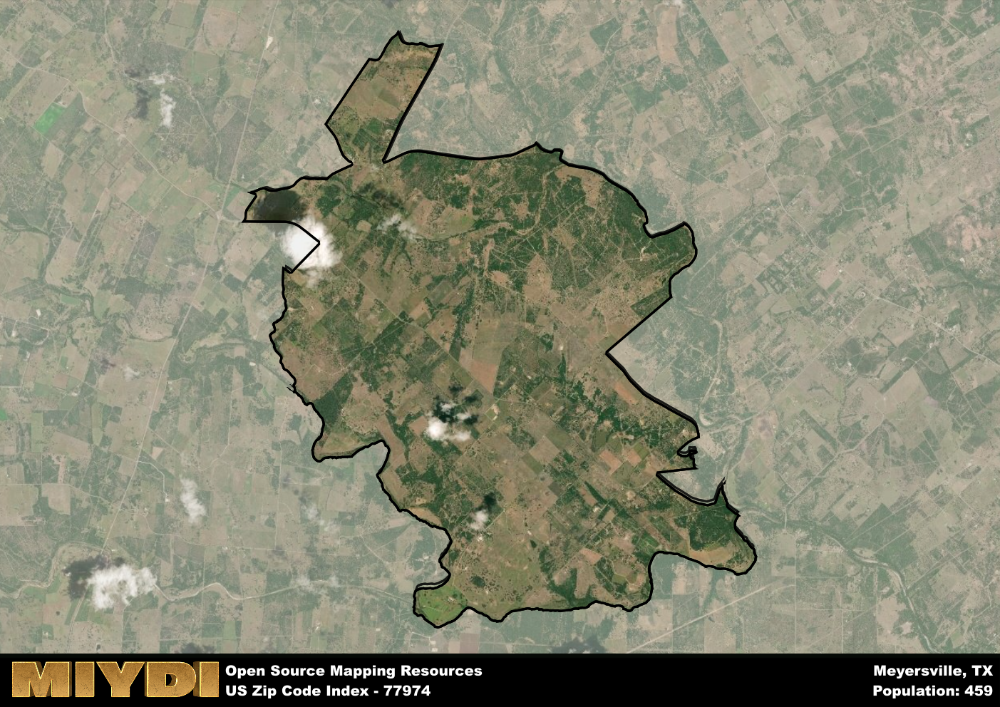

**Area Name:** Meyersville

**Zip Code:** 77974

**State:** TX

Meyersville is a part of the Victoria - TX Metro Area, and makes up  of the Metro's population.  

# Meyersville: A Charming Community in South Texas  
Meyersville, located within the 77974 zip code in South Texas, is a small rural community situated in DeWitt County. Surrounded by vast farmlands and ranches, Meyersville is a peaceful enclave that is approximately 20 miles southeast of Cuero and 15 miles northwest of Victoria. Despite its rural setting, Meyersville benefits from its proximity to these larger cities, allowing residents easy access to urban amenities while enjoying the quiet countryside lifestyle.

Founded in the mid-1800s, Meyersville has a rich history rooted in agriculture and ranching. The area was named after John Meyer, a prominent landowner and businessman who played a significant role in the development of the community. Over the years, Meyersville has maintained its small-town charm, with historic buildings and churches dotting its landscape. The community prides itself on its strong sense of community spirit and preservation of its heritage, making it a unique destination in South Texas.

Currently, Meyersville is predominantly an agricultural area, with farming and ranching serving as the primary economic activities. The community is home to local businesses, including family-owned farms and ranches, as well as small shops and services catering to residents' needs. Meyersville offers a peaceful retreat for nature enthusiasts, with opportunities for hunting, fishing, and outdoor recreation. Visitors can explore the area's historic sites, such as the Meyersville Hall, a community center that hosts various events and gatherings. Meyersville's tight-knit community and picturesque surroundings make it a hidden gem in the South Texas countryside.

# Meyersville Demographics

The population of Meyersville is 459.  
Meyersville has a population density of 17.74 per square mile.  
The area of Meyersville is 25.87 square miles.  

## Meyersville Income and Economic Data

These demographic numbers are sourced from IRS return data, providing comprehensive insights into the population dynamics and economic trends within Meyersville.

**Breakdown of return types for Meyersville**

The table offers insight into the composition of tax returns filed with the IRS, categorizing them into three main types. Single returns represent filings by individuals, joint returns by married couples, and head of household returns by individuals who qualify as heads of households, typically having dependents. This breakdown provides an understanding of the different filing statuses adopted by taxpayers when submitting their tax documentation.

| Return Types filed for Meyersville                              | Percentage          |
|----------------------------------------------------------|---------------------|
| Single Returns                                            | 0.39 |
| Joint Returns                                             | 0.43 |
| Head Household Returns                                    | 0.09 |

The income and economic data presented here is sourced from the IRS income brackets, utilized for categorizing tax returns by income levels. This table displays income ranges for both single filers and married couples, along with the corresponding number of returns and the percentage within each bracket, providing valuable insight into the distribution of taxes across various income groups.

| Bracket Name       | Single Filer Income Range | Married Couple Range | Number of Returns | Percentage of Returns |
|--------------------|----------------------------|----------------------|-------------------|-----------------------|
| 10% Bracket        | Up to $10,275              | Up to $20,550        | 80 | 0.35% |
| 12% Bracket        | $10,276 - $41,775          | $20,551 - $83,550    | 40 | 0.17% |
| 22% Bracket        | $41,776 - $89,075          | $83,551 - $178,150   | 30 | 0.13% |
| 24% Bracket        | $89,076 - $170,050         | $178,151 - $340,100  | 30 | 0.13% |
| 32% Bracket        | $170,051 - $215,950        | $340,101 - $431,900  | 50 | 0.22% |
| 35% Bracket        | $215,951 - $539,900        | $431,901 - $647,850  | 0 | 0% |

### Exploring Taxpayer Diversity: A Breakdown of Different Types of Tax Returns in Meyersville

The table offers insights into various types of tax returns filed, reflecting different aspects of taxpayer activities and demographics. Categories include charitable returns for donations, dependent returns for claimed dependents, educator population, elderly population, real estate returns, self-employment returns, student loan returns, and unemployment returns, providing valuable insights into taxpayer behavior and demographics.

| Meyersville Filing Types                    | Count | Percentage |
|--------------------------------------|-------|------------|
| Charitable Donations                 | 0 | 0% |
| Dependents Claimed                   | 0 | 0% |
| Educator Residents                   | 0 | 0% |
| Elderly Population                   | 80 | 0.35% |
| Farming Population                   | 60 | 0.261% |
| Real Estate Transactions             | 0 | 0% |
| Self-Employed Individuals            | 30 | 0.13% |
| Student Loan Cases                   | 0 | 0% |
| Unemployment Benefit Filings         | 0 | 0% |

## Meyersville AI and Census Variables

The values presented in this dataset for Meyersville are AI-optimized, streamlined, and categorized into relevant buckets for enhanced utility in AI and mapping programs. These simplified values have been optimized to facilitate efficient analysis and integration into various technological applications, offering users accessible and actionable insights into demographics within the Meyersville area.

| AI Variables for Meyersville | Value |
|-------------|-------|
| Shape Area | 87718586.0234375 |
| Shape Length | 62236.0120622062 |
| CBSA Federal Processing Standard Code | 47020 |

## How to use this free AI optimized Geo-Spatial Data for Meyersville, TX

This data is made freely available under the Creative Commons license, allowing for unrestricted use for any purpose. Users can access static resources directly from GitHub or leverage more advanced functionalities by utilizing the GeoJSON files. All datasets originate from official government or private sector sources and are meticulously compiled into relevant datasets within QGIS. However, the versatility of the data ensures compatibility with any mapping application.

## Data Accuracy Disclaimer
It's important to note that the data provided here may contain errors or discrepancies and should be considered as 'close enough' for business applications and AI rather than a definitive source of truth. This data is aggregated from multiple sources, some of which publish information on wildly different intervals, leading to potential inconsistencies. Additionally, certain data points may not be corrected for Covid-related changes, further impacting accuracy. Moreover, the assumption that demographic trends are consistent throughout a region may lead to discrepancies, as trends often concentrate in areas of highest population density. As a result, dense areas may be slightly underrepresented, while rural areas may be slightly overrepresented, resulting in a more conservative dataset. Furthermore, the focus primarily on areas within US Major and Minor Statistical areas means that approximately 40 million Americans living outside of these areas may not be fully represented. Lastly, the historical background and area descriptions generated using AI are susceptible to potential mistakes, so users should exercise caution when interpreting the information provided.
