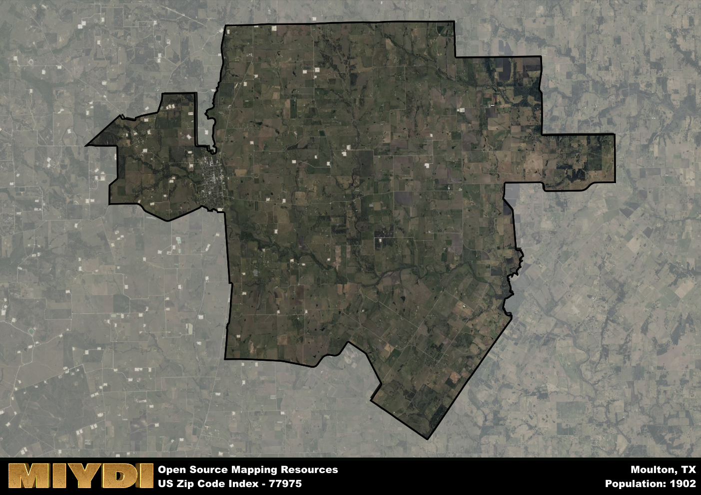

**Area Name:** Moulton

**Zip Code:** 77975

**State:** TX

# Discover the Charm of Moulton, Texas (Zip Code: 77975)

Moulton, Texas, located in zip code 77975, is a quaint rural community situated in Lavaca County. The area is bordered by the towns of Shiner to the west and Hallettsville to the east, both of which are known for their strong agricultural roots. Moulton is approximately 90 miles southeast of Austin and 110 miles west of Houston, making it a peaceful retreat from the hustle and bustle of larger urban centers.

Founded in the late 1800s, Moulton was named after William Moulton, a settler who established the first general store in the area. The town quickly grew as German immigrants arrived, bringing with them their rich cultural heritage that is still evident in the local architecture and cuisine. Moulton became known for its fertile farmland, particularly for growing cotton and corn, which sustained the community for generations.

Today, Moulton remains a close-knit community with a mix of agricultural and small businesses. The town boasts a variety of family-owned shops, local eateries serving up traditional German fare, and a strong sense of community pride. Residents and visitors alike can enjoy the Moulton City Park, where they can picnic, play sports, or simply relax in the peaceful surroundings. The area is also home to several historic sites, including the St. Joseph's Catholic Church, known for its stunning stained glass windows.

# Moulton Demographics

The population of Moulton is 1902.  
Moulton has a population density of 27.45 per square mile.  
The area of Moulton is 69.29 square miles.  

## Moulton Income and Economic Data

These demographic numbers are sourced from IRS return data, providing comprehensive insights into the population dynamics and economic trends within Moulton.

**Breakdown of return types for Moulton**

The table offers insight into the composition of tax returns filed with the IRS, categorizing them into three main types. Single returns represent filings by individuals, joint returns by married couples, and head of household returns by individuals who qualify as heads of households, typically having dependents. This breakdown provides an understanding of the different filing statuses adopted by taxpayers when submitting their tax documentation.

| Return Types filed for Moulton                              | Percentage          |
|----------------------------------------------------------|---------------------|
| Single Returns                                            | 0.44 |
| Joint Returns                                             | 0.46 |
| Head Household Returns                                    | 0.08 |

The income and economic data presented here is sourced from the IRS income brackets, utilized for categorizing tax returns by income levels. This table displays income ranges for both single filers and married couples, along with the corresponding number of returns and the percentage within each bracket, providing valuable insight into the distribution of taxes across various income groups.

| Bracket Name       | Single Filer Income Range | Married Couple Range | Number of Returns | Percentage of Returns |
|--------------------|----------------------------|----------------------|-------------------|-----------------------|
| 10% Bracket        | Up to $10,275              | Up to $20,550        | 260 | 0.31% |
| 12% Bracket        | $10,276 - $41,775          | $20,551 - $83,550    | 200 | 0.24% |
| 22% Bracket        | $41,776 - $89,075          | $83,551 - $178,150   | 140 | 0.16% |
| 24% Bracket        | $89,076 - $170,050         | $178,151 - $340,100  | 90 | 0.11% |
| 32% Bracket        | $170,051 - $215,950        | $340,101 - $431,900  | 120 | 0.14% |
| 35% Bracket        | $215,951 - $539,900        | $431,901 - $647,850  | 40 | 0.05% |

### Exploring Taxpayer Diversity: A Breakdown of Different Types of Tax Returns in Moulton

The table offers insights into various types of tax returns filed, reflecting different aspects of taxpayer activities and demographics. Categories include charitable returns for donations, dependent returns for claimed dependents, educator population, elderly population, real estate returns, self-employment returns, student loan returns, and unemployment returns, providing valuable insights into taxpayer behavior and demographics.

| Moulton Filing Types                    | Count | Percentage |
|--------------------------------------|-------|------------|
| Charitable Donations                 | 0 | 0% |
| Dependents Claimed                   | 30 | 0.035% |
| Educator Residents                   | 0 | 0% |
| Elderly Population                   | 310 | 0.36% |
| Farming Population                   | 210 | 0.247% |
| Real Estate Transactions             | 0 | 0% |
| Self-Employed Individuals            | 160 | 0.188% |
| Student Loan Cases                   | 30 | 0.035% |
| Unemployment Benefit Filings         | 70 | 0.08% |

## Moulton AI and Census Variables

The values presented in this dataset for Moulton are AI-optimized, streamlined, and categorized into relevant buckets for enhanced utility in AI and mapping programs. These simplified values have been optimized to facilitate efficient analysis and integration into various technological applications, offering users accessible and actionable insights into demographics within the Moulton area.

| AI Variables for Moulton | Value |
|-------------|-------|
| Shape Area | 238041520.601563 |
| Shape Length | 91122.5799148893 |

## How to use this free AI optimized Geo-Spatial Data for Moulton, TX

This data is made freely available under the Creative Commons license, allowing for unrestricted use for any purpose. Users can access static resources directly from GitHub or leverage more advanced functionalities by utilizing the GeoJSON files. All datasets originate from official government or private sector sources and are meticulously compiled into relevant datasets within QGIS. However, the versatility of the data ensures compatibility with any mapping application.

## Data Accuracy Disclaimer
It's important to note that the data provided here may contain errors or discrepancies and should be considered as 'close enough' for business applications and AI rather than a definitive source of truth. This data is aggregated from multiple sources, some of which publish information on wildly different intervals, leading to potential inconsistencies. Additionally, certain data points may not be corrected for Covid-related changes, further impacting accuracy. Moreover, the assumption that demographic trends are consistent throughout a region may lead to discrepancies, as trends often concentrate in areas of highest population density. As a result, dense areas may be slightly underrepresented, while rural areas may be slightly overrepresented, resulting in a more conservative dataset. Furthermore, the focus primarily on areas within US Major and Minor Statistical areas means that approximately 40 million Americans living outside of these areas may not be fully represented. Lastly, the historical background and area descriptions generated using AI are susceptible to potential mistakes, so users should exercise caution when interpreting the information provided.
