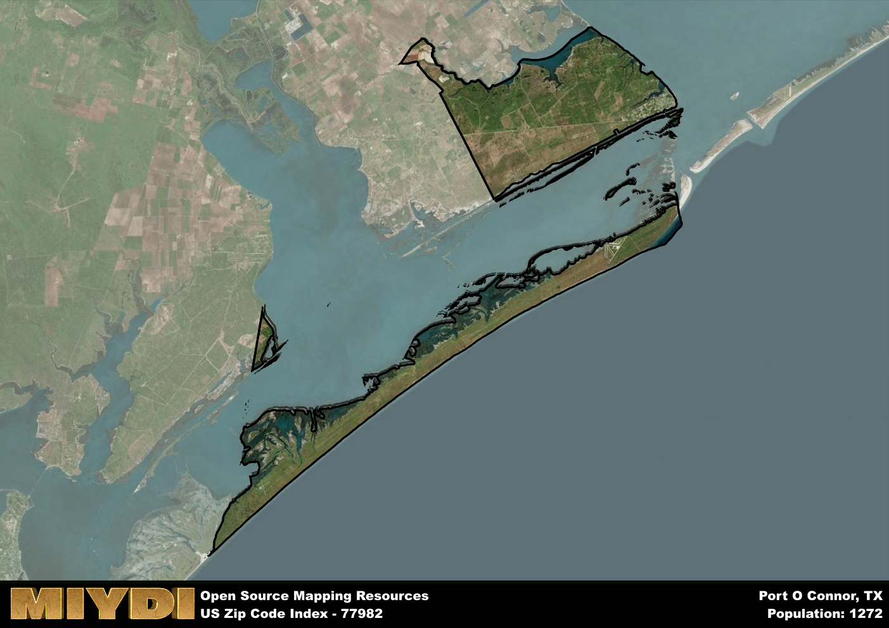

**Area Name:** Port O Connor

**Zip Code:** 77982

**State:** TX

Port O Connor is a part of the Port Lavaca - TX Micro Area, and makes up 1.86% of the Metro's population.  

# Port O'Connor: A Coastal Gem in Texas  

Located in the heart of the Texas Gulf Coast, zip code 77982 encompasses the charming waterfront community of Port O'Connor. Bordered by Matagorda Bay to the north and the Gulf of Mexico to the south, this area is a popular destination for fishing enthusiasts and outdoor lovers. Port O'Connor is part of Calhoun County and is situated approximately 60 miles southeast of Victoria and 150 miles southwest of Houston, making it an accessible retreat for both locals and tourists.

Port O'Connor has a rich history dating back to the early 1900s when it was primarily a fishing and hunting outpost. Over the years, the area has evolved into a thriving coastal community with a strong emphasis on recreational activities such as boating, kayaking, and birdwatching. The name "Port O'Connor" was derived from Thomas M. O'Connor, a prominent landowner in the region who played a significant role in the area's development. Today, Port O'Connor maintains its small-town charm while offering modern amenities to residents and visitors alike.

Presently, Port O'Connor boasts a vibrant economy driven by tourism and commercial fishing. The area is home to numerous marinas, seafood restaurants, and vacation rentals, catering to the steady stream of visitors seeking a coastal getaway. Residents enjoy a laid-back lifestyle with access to local shops, schools, and community events. Outdoor enthusiasts can explore the nearby beaches and wildlife reserves, while history buffs can visit landmarks such as the Matagorda Island Lighthouse. Port O'Connor truly embodies the spirit of coastal living in Texas.

# Port O Connor Demographics

The population of Port O Connor is 1272.  
Port O Connor has a population density of 8.55 per square mile.  
The area of Port O Connor is 148.73 square miles.  

### Exploring Real Estate Trends: A Comprehensive Analysis of the Port O Connor Area and its Neighbors

This table contains an in-depth examination of the real estate market in the Port O Connor area. Sourced from trusted real estate market firms, this dataset provides a wealth of raw data detailing the local real estate landscape, along with comparative analyses juxtaposing the market dynamics with those of neighboring areas. Explore the intricacies of the Port O Connor real estate market and gain valuable insights into its relationship with adjacent regions.

| Real Estate Data for Port O Connor                       | Value    |
|------------------------------------------------|----------|
| Average Listing Price for Port O Connor               | 597100 |
| Median Listing Price for Port O Connor                | 518750 |
| Median Days on Market for Port O Connor               | 87 |
| Median Listing Price per Square Foot for Port O Connor| 77 |
| Median Square Feet for Port O Connor                  | 2008 |
| Real Estate Prices to Income Ratio           | 354.28% |
| Price per Square Foot Ratio                  | 139.10% |
| Price Median Ratio                           | 156.17% |
| Market Sales Speed Ratio                     | 115.1% |

This table offers essential real estate data for the Port O Connor area, including average and median listing prices, median days on market, and property size. It also presents ratio metrics as percentages, providing insights into how the local market compares to the surrounding region. A ratio of 100% signifies performance in line with the regional average, while values above or below indicate overperformance or underperformance, respectively, relative to expectations.

## Port O Connor Sports and Recreation Data

#### Annual Youth Sports Spending for Port O Connor

This table provides fundamental insights into the Sports and Recreation data for the Port O Connor area, detailing the estimated annual expenditure on Youth Athletics. This includes estimated spending by the major consumer brackets. 
| Sports Spending for Port O Connor| Value |
|-------------------------|-------|
| Athlete Spending Compared to the region | 11.43% |
| Total Youth Athlete Spending | 98,689 |
| Athletic Spending - Essential Focused Consumer | 9,998 |
| Athletic Spending - Typical Consumer | 9,770 |
| Athletic Spending - Affluent Consumers | 8,879 |

#### Youth Coaching Estimates for Port O Connor

This table presents the estimated number of coaches for the Port O Connor area, derived from comprehensive national coaching surveys and athletic participation rates by state. It offers valuable insights into the vital role of coaching personnel in fostering athletic development and facilitating sports participation within the local community.

| Coaching Data for Port O Connor | Value |
|-------------|-------|
| Total Coaches | 21 |
| Paid Coaches | 5 |
| Volunteer Coaches | 15 |

#### Youth Athlete Participation for Port O Connor

This table shows the estimated total number of youth athletes in the Port O Connor area, sourced from comprehensive national coaching surveys and athletic participation rates by state.

| Total YA Athletes in Port O Connor | Value |
|-------------|-------|
| Total High School Athletes | 32 |
| Total Youth Athletes | 95 |
| Total Young Adult Athletes | 64 |
| Total Athletes to Age 25 | 191 |

#### High School Age Athletes - Breakdown by Sport for Port O Connor

This table shows insights regarding high school age estimated players by sport in the Port O Connor area, derived from national and state-level athletic participation trends. 

| HS Players by Sport in Port O Connor | Value |
|-------------|-------|
| Football Players | 7 |
| Basketball Players | 4 |
| Soccer Players | 3 |
| Volleyball Players | 2 |
| Baseball Players | 4 |
| Tennis Players | 2 |
| Track Athletes | 5 |
| Golf Players | 1 |
| Swimming Athletes | 1 |
| Wrestling Competitors | 1 |
| Lacrosse Players | 0 |

Estimating the number of younger athletes presents unique challenges due to their varied starting ages, typically beginning around six years old, and a gradual decline in participation rates as they age. Unlike high school-aged athletes, younger athletes are less likely to switch sports as they grow older, contributing to the stability of participation numbers within specific sports at younger ages.  

As a general trend, the total number of younger athletes is approximately three times the number of high school-aged athletes, underscoring the significant presence of youth athletes in sports programs and highlighting the importance of early engagement in athletic activities.

## Port O Connor AI and Census Variables

The values presented in this dataset for Port O Connor are AI-optimized, streamlined, and categorized into relevant buckets for enhanced utility in AI and mapping programs. These simplified values have been optimized to facilitate efficient analysis and integration into various technological applications, offering users accessible and actionable insights into demographics within the Port O Connor area.

| AI Variables for Port O Connor | Value |
|-------------|-------|
| Shape Area | 499110409.621094 |
| Shape Length | 532440.044485128 |
| CBSA Federal Processing Standard Code | 38920 |
| RE Price per Square Foot Ratio | 139.10% |
| RE Price Average Ratio | 152.85% |
| RE Speed Ratio | 115.1% |
| RE Income Ratio | 354.28% |
| RE Affordability Index Flag | 6 |
| Income Bracket Flag | 3 |
| RE Income Flag | 7 |
| RE Median Square Footage Price Flag | 6 |
| RE Median Square Footage Size Flag | 5 |
| RE Activity Flag | 5 |
| Poverty Line Risk Flag | 2 |

## How to use this free AI optimized Geo-Spatial Data for Port O Connor, TX

This data is made freely available under the Creative Commons license, allowing for unrestricted use for any purpose. Users can access static resources directly from GitHub or leverage more advanced functionalities by utilizing the GeoJSON files. All datasets originate from official government or private sector sources and are meticulously compiled into relevant datasets within QGIS. However, the versatility of the data ensures compatibility with any mapping application.

## Data Accuracy Disclaimer
It's important to note that the data provided here may contain errors or discrepancies and should be considered as 'close enough' for business applications and AI rather than a definitive source of truth. This data is aggregated from multiple sources, some of which publish information on wildly different intervals, leading to potential inconsistencies. Additionally, certain data points may not be corrected for Covid-related changes, further impacting accuracy. Moreover, the assumption that demographic trends are consistent throughout a region may lead to discrepancies, as trends often concentrate in areas of highest population density. As a result, dense areas may be slightly underrepresented, while rural areas may be slightly overrepresented, resulting in a more conservative dataset. Furthermore, the focus primarily on areas within US Major and Minor Statistical areas means that approximately 40 million Americans living outside of these areas may not be fully represented. Lastly, the historical background and area descriptions generated using AI are susceptible to potential mistakes, so users should exercise caution when interpreting the information provided.
