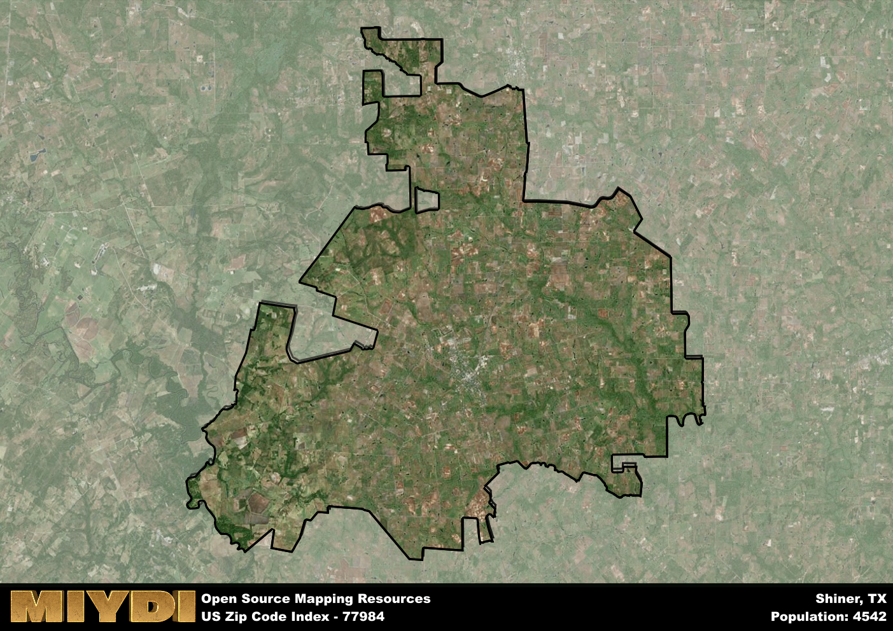

**Area Name:** Shiner

**Zip Code:** 77984

**State:** TX

# Shiner: A Small Texan Gem in Zip Code 77984

Nestled in the heart of Texas, zip code 77984 encompasses the charming town of Shiner. Surrounded by vast expanses of rolling hills and picturesque farmland, Shiner is located within Lavaca County. The town is a short drive away from larger cities like San Antonio and Houston, making it a peaceful retreat while still being connected to major urban centers.

Shiner has a rich history dating back to its founding in the late 19th century by Czech and German immigrants. The town's name is attributed to Henry B. Shiner, a railroad promoter who played a significant role in its early development. Over the years, Shiner has grown into a tight-knit community known for its strong Czech heritage, as evidenced by annual events like the Shiner Czech Music Fest.

Today, Shiner is a vibrant community with a thriving economy centered around agriculture, oil, and small businesses. Residents and visitors alike can enjoy local breweries, historical landmarks like the Spoetzl Brewery, and outdoor recreational activities in the nearby countryside. Shiner's small-town charm, cultural events, and friendly atmosphere make it a hidden gem in the Texan landscape.

# Shiner Demographics

The population of Shiner is 4542.  
Shiner has a population density of 31.19 per square mile.  
The area of Shiner is 145.63 square miles.  

## Shiner Income and Economic Data

These demographic numbers are sourced from IRS return data, providing comprehensive insights into the population dynamics and economic trends within Shiner.

**Breakdown of return types for Shiner**

The table offers insight into the composition of tax returns filed with the IRS, categorizing them into three main types. Single returns represent filings by individuals, joint returns by married couples, and head of household returns by individuals who qualify as heads of households, typically having dependents. This breakdown provides an understanding of the different filing statuses adopted by taxpayers when submitting their tax documentation.

| Return Types filed for Shiner                              | Percentage          |
|----------------------------------------------------------|---------------------|
| Single Returns                                            | 0.45 |
| Joint Returns                                             | 0.46 |
| Head Household Returns                                    | 0.08 |

The income and economic data presented here is sourced from the IRS income brackets, utilized for categorizing tax returns by income levels. This table displays income ranges for both single filers and married couples, along with the corresponding number of returns and the percentage within each bracket, providing valuable insight into the distribution of taxes across various income groups.

| Bracket Name       | Single Filer Income Range | Married Couple Range | Number of Returns | Percentage of Returns |
|--------------------|----------------------------|----------------------|-------------------|-----------------------|
| 10% Bracket        | Up to $10,275              | Up to $20,550        | 630 | 0.29% |
| 12% Bracket        | $10,276 - $41,775          | $20,551 - $83,550    | 470 | 0.22% |
| 22% Bracket        | $41,776 - $89,075          | $83,551 - $178,150   | 280 | 0.13% |
| 24% Bracket        | $89,076 - $170,050         | $178,151 - $340,100  | 230 | 0.11% |
| 32% Bracket        | $170,051 - $215,950        | $340,101 - $431,900  | 380 | 0.18% |
| 35% Bracket        | $215,951 - $539,900        | $431,901 - $647,850  | 160 | 0.07% |

### Exploring Taxpayer Diversity: A Breakdown of Different Types of Tax Returns in Shiner

The table offers insights into various types of tax returns filed, reflecting different aspects of taxpayer activities and demographics. Categories include charitable returns for donations, dependent returns for claimed dependents, educator population, elderly population, real estate returns, self-employment returns, student loan returns, and unemployment returns, providing valuable insights into taxpayer behavior and demographics.

| Shiner Filing Types                    | Count | Percentage |
|--------------------------------------|-------|------------|
| Charitable Donations                 | 80 | 0.037% |
| Dependents Claimed                   | 100 | 0.047% |
| Educator Residents                   | 90 | 0.042% |
| Elderly Population                   | 720 | 0.33% |
| Farming Population                   | 450 | 0.209% |
| Real Estate Transactions             | 80 | 0.037% |
| Self-Employed Individuals            | 330 | 0.153% |
| Student Loan Cases                   | 100 | 0.047% |
| Unemployment Benefit Filings         | 130 | 0.06% |

## Shiner AI and Census Variables

The values presented in this dataset for Shiner are AI-optimized, streamlined, and categorized into relevant buckets for enhanced utility in AI and mapping programs. These simplified values have been optimized to facilitate efficient analysis and integration into various technological applications, offering users accessible and actionable insights into demographics within the Shiner area.

| AI Variables for Shiner | Value |
|-------------|-------|
| Shape Area | 499108602.035156 |
| Shape Length | 178530.164956762 |

## How to use this free AI optimized Geo-Spatial Data for Shiner, TX

This data is made freely available under the Creative Commons license, allowing for unrestricted use for any purpose. Users can access static resources directly from GitHub or leverage more advanced functionalities by utilizing the GeoJSON files. All datasets originate from official government or private sector sources and are meticulously compiled into relevant datasets within QGIS. However, the versatility of the data ensures compatibility with any mapping application.

## Data Accuracy Disclaimer
It's important to note that the data provided here may contain errors or discrepancies and should be considered as 'close enough' for business applications and AI rather than a definitive source of truth. This data is aggregated from multiple sources, some of which publish information on wildly different intervals, leading to potential inconsistencies. Additionally, certain data points may not be corrected for Covid-related changes, further impacting accuracy. Moreover, the assumption that demographic trends are consistent throughout a region may lead to discrepancies, as trends often concentrate in areas of highest population density. As a result, dense areas may be slightly underrepresented, while rural areas may be slightly overrepresented, resulting in a more conservative dataset. Furthermore, the focus primarily on areas within US Major and Minor Statistical areas means that approximately 40 million Americans living outside of these areas may not be fully represented. Lastly, the historical background and area descriptions generated using AI are susceptible to potential mistakes, so users should exercise caution when interpreting the information provided.
