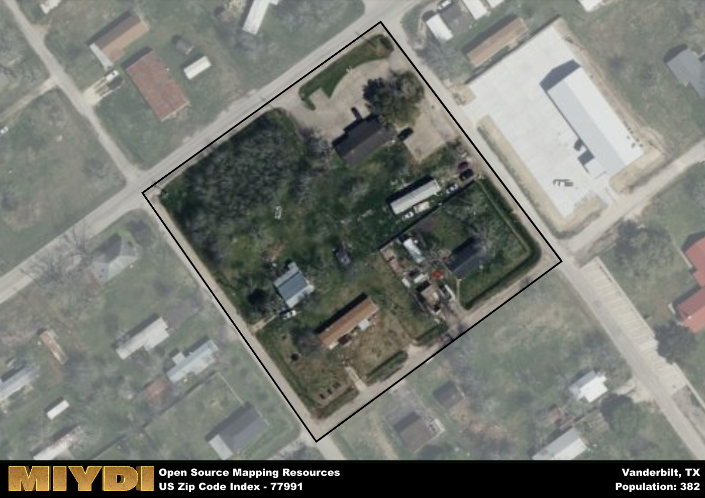

**Area Name:** Vanderbilt

**Zip Code:** 77991

**State:** TX

# Vanderbilt: A Charming Community in South Texas  

Located in the southern part of Texas, zip code 77991 encompasses the quaint neighborhood of Vanderbilt. Bordered by lush farmlands and small rural communities, Vanderbilt is situated just a short drive away from the bustling city of Victoria. This close proximity allows residents to enjoy the peaceful ambiance of a small town while having easy access to urban amenities and employment opportunities.

Originally founded as a railroad stop in the late 19th century, Vanderbilt quickly grew into a thriving agricultural community with a strong emphasis on cotton production. Over the years, the area has maintained its agricultural roots while also diversifying its economy to include small businesses and services catering to the local population. The neighborhood takes pride in its rich history, evident in the well-preserved historic buildings and landmarks that dot the area.

Today, Vanderbilt offers a mix of residential neighborhoods, local businesses, and recreational facilities that cater to its close-knit community. The area boasts a range of amenities such as parks, community centers, and local shops that provide essential services to residents. Vanderbilt also serves as a gateway to nearby natural attractions, making it an ideal location for outdoor enthusiasts. With its blend of history, charm, and modern conveniences, Vanderbilt remains a hidden gem in the vibrant landscape of South Texas.

# Vanderbilt Demographics

The population of Vanderbilt is 382.  
The area of Vanderbilt is 0 square miles.  

## Vanderbilt AI and Census Variables

The values presented in this dataset for Vanderbilt are AI-optimized, streamlined, and categorized into relevant buckets for enhanced utility in AI and mapping programs. These simplified values have been optimized to facilitate efficient analysis and integration into various technological applications, offering users accessible and actionable insights into demographics within the Vanderbilt area.

| AI Variables for Vanderbilt | Value |
|-------------|-------|
| Shape Area | 15874.65234375 |
| Shape Length | 504.041929163792 |

## How to use this free AI optimized Geo-Spatial Data for Vanderbilt, TX

This data is made freely available under the Creative Commons license, allowing for unrestricted use for any purpose. Users can access static resources directly from GitHub or leverage more advanced functionalities by utilizing the GeoJSON files. All datasets originate from official government or private sector sources and are meticulously compiled into relevant datasets within QGIS. However, the versatility of the data ensures compatibility with any mapping application.

## Data Accuracy Disclaimer
It's important to note that the data provided here may contain errors or discrepancies and should be considered as 'close enough' for business applications and AI rather than a definitive source of truth. This data is aggregated from multiple sources, some of which publish information on wildly different intervals, leading to potential inconsistencies. Additionally, certain data points may not be corrected for Covid-related changes, further impacting accuracy. Moreover, the assumption that demographic trends are consistent throughout a region may lead to discrepancies, as trends often concentrate in areas of highest population density. As a result, dense areas may be slightly underrepresented, while rural areas may be slightly overrepresented, resulting in a more conservative dataset. Furthermore, the focus primarily on areas within US Major and Minor Statistical areas means that approximately 40 million Americans living outside of these areas may not be fully represented. Lastly, the historical background and area descriptions generated using AI are susceptible to potential mistakes, so users should exercise caution when interpreting the information provided.
