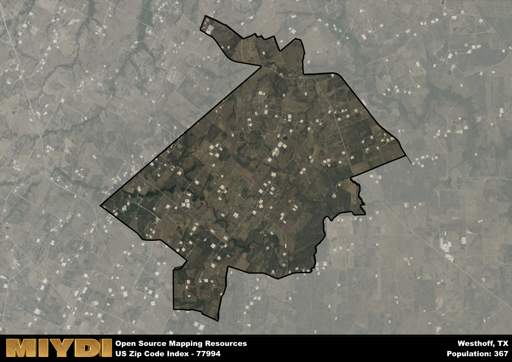

**Area Name:** Westhoff

**Zip Code:** 77994

**State:** TX

# Westhoff: A Quaint Neighborhood in South Texas

Located in South Texas, the zip code area 77994 corresponds to the charming neighborhood of Westhoff. Situated within the larger metropolitan context of Victoria, Westhoff is surrounded by rural landscapes and small towns. It is approximately 40 miles southeast of San Antonio and 100 miles southwest of Houston, making it an ideal residential area for those seeking a peaceful retreat while still being within driving distance of major cities.

Established in the late 19th century, Westhoff has a rich historical narrative that reflects its agricultural roots. Originally settled by German immigrants, the area quickly grew into a thriving farming community known for its cotton and corn production. The town was named after a local landowner, John Westhoff, who played a significant role in the development of the area. Over the years, Westhoff has maintained its small-town charm while adapting to modern times.

Today, Westhoff is a tight-knit community with a strong sense of pride in its agricultural heritage. The area is known for its family-owned farms, producing crops such as cotton, corn, and sorghum. Residents enjoy access to local markets, parks, and community events that celebrate the town's history. Visitors can explore historic sites like the Westhoff Heritage Museum, which showcases artifacts and photographs from the area's past. With its peaceful atmosphere and close-knit community, Westhoff offers a unique blend of rural charm and modern convenience in the heart of South Texas.

# Westhoff Demographics

The population of Westhoff is 367.  
Westhoff has a population density of 9.02 per square mile.  
The area of Westhoff is 40.67 square miles.  

## Westhoff Income and Economic Data

These demographic numbers are sourced from IRS return data, providing comprehensive insights into the population dynamics and economic trends within Westhoff.

**Breakdown of return types for Westhoff**

The table offers insight into the composition of tax returns filed with the IRS, categorizing them into three main types. Single returns represent filings by individuals, joint returns by married couples, and head of household returns by individuals who qualify as heads of households, typically having dependents. This breakdown provides an understanding of the different filing statuses adopted by taxpayers when submitting their tax documentation.

| Return Types filed for Westhoff                              | Percentage          |
|----------------------------------------------------------|---------------------|
| Single Returns                                            | 0.38 |
| Joint Returns                                             | 0.5 |
| Head Household Returns                                    | 0 |

The income and economic data presented here is sourced from the IRS income brackets, utilized for categorizing tax returns by income levels. This table displays income ranges for both single filers and married couples, along with the corresponding number of returns and the percentage within each bracket, providing valuable insight into the distribution of taxes across various income groups.

| Bracket Name       | Single Filer Income Range | Married Couple Range | Number of Returns | Percentage of Returns |
|--------------------|----------------------------|----------------------|-------------------|-----------------------|
| 10% Bracket        | Up to $10,275              | Up to $20,550        | 50 | 0.31% |
| 12% Bracket        | $10,276 - $41,775          | $20,551 - $83,550    | 30 | 0.19% |
| 22% Bracket        | $41,776 - $89,075          | $83,551 - $178,150   | 40 | 0.25% |
| 24% Bracket        | $89,076 - $170,050         | $178,151 - $340,100  | 0 | 0% |
| 32% Bracket        | $170,051 - $215,950        | $340,101 - $431,900  | 20 | 0.13% |
| 35% Bracket        | $215,951 - $539,900        | $431,901 - $647,850  | 20 | 0.13% |

### Exploring Taxpayer Diversity: A Breakdown of Different Types of Tax Returns in Westhoff

The table offers insights into various types of tax returns filed, reflecting different aspects of taxpayer activities and demographics. Categories include charitable returns for donations, dependent returns for claimed dependents, educator population, elderly population, real estate returns, self-employment returns, student loan returns, and unemployment returns, providing valuable insights into taxpayer behavior and demographics.

| Westhoff Filing Types                    | Count | Percentage |
|--------------------------------------|-------|------------|
| Charitable Donations                 | 0 | 0% |
| Dependents Claimed                   | 0 | 0% |
| Educator Residents                   | 0 | 0% |
| Elderly Population                   | 70 | 0.44% |
| Farming Population                   | 40 | 0.25% |
| Real Estate Transactions             | 0 | 0% |
| Self-Employed Individuals            | 0 | 0% |
| Student Loan Cases                   | 0 | 0% |
| Unemployment Benefit Filings         | 0 | 0% |

## Westhoff AI and Census Variables

The values presented in this dataset for Westhoff are AI-optimized, streamlined, and categorized into relevant buckets for enhanced utility in AI and mapping programs. These simplified values have been optimized to facilitate efficient analysis and integration into various technological applications, offering users accessible and actionable insights into demographics within the Westhoff area.

| AI Variables for Westhoff | Value |
|-------------|-------|
| Shape Area | 138590969.25 |
| Shape Length | 68543.0807942225 |

## How to use this free AI optimized Geo-Spatial Data for Westhoff, TX

This data is made freely available under the Creative Commons license, allowing for unrestricted use for any purpose. Users can access static resources directly from GitHub or leverage more advanced functionalities by utilizing the GeoJSON files. All datasets originate from official government or private sector sources and are meticulously compiled into relevant datasets within QGIS. However, the versatility of the data ensures compatibility with any mapping application.

## Data Accuracy Disclaimer
It's important to note that the data provided here may contain errors or discrepancies and should be considered as 'close enough' for business applications and AI rather than a definitive source of truth. This data is aggregated from multiple sources, some of which publish information on wildly different intervals, leading to potential inconsistencies. Additionally, certain data points may not be corrected for Covid-related changes, further impacting accuracy. Moreover, the assumption that demographic trends are consistent throughout a region may lead to discrepancies, as trends often concentrate in areas of highest population density. As a result, dense areas may be slightly underrepresented, while rural areas may be slightly overrepresented, resulting in a more conservative dataset. Furthermore, the focus primarily on areas within US Major and Minor Statistical areas means that approximately 40 million Americans living outside of these areas may not be fully represented. Lastly, the historical background and area descriptions generated using AI are susceptible to potential mistakes, so users should exercise caution when interpreting the information provided.
