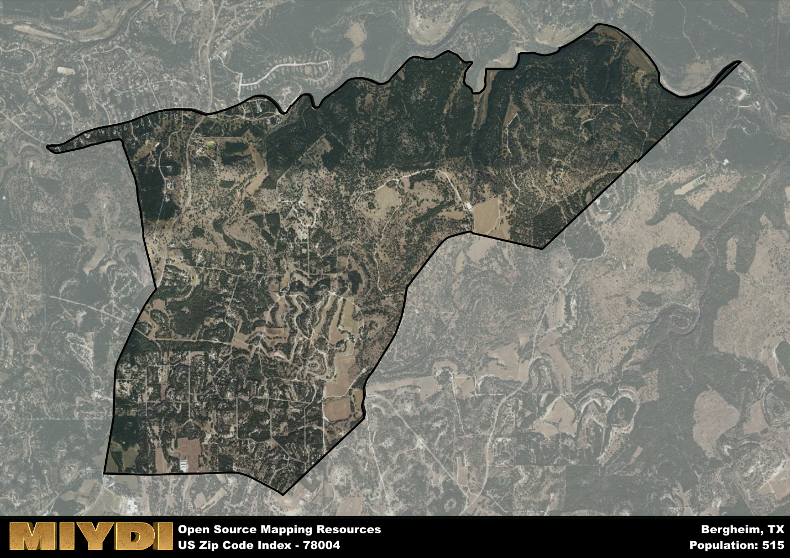

**Area Name:** Bergheim

**Zip Code:** 78004

**State:** TX

Bergheim is a part of the San Antonio-New Braunfels - TX Metro Area, and makes up  of the Metro's population.  

# Bergheim: A Charming Neighborhood in the Heart of Texas Hill Country  

Located in the heart of Texas Hill Country, zip code 78004 encompasses the quaint neighborhood of Bergheim. Surrounded by rolling hills and sprawling ranches, this area is situated just north of Boerne and is a short drive from San Antonio. Bergheim seamlessly integrates into the larger metropolitan context by providing a peaceful retreat for residents while still offering easy access to urban amenities and employment opportunities.

Bergheim has a rich historical narrative, dating back to its establishment by German immigrants in the mid-19th century. The area flourished as a farming community, with settlers cultivating the fertile land and establishing a tight-knit community. Over the years, Bergheim has maintained its small-town charm while experiencing steady growth due to its scenic beauty and proximity to major cities. The name "Bergheim" itself means "mountain home" in German, reflecting the area's picturesque surroundings.

Today, Bergheim is a thriving community known for its equestrian facilities, vineyards, and charming bed and breakfasts. The area boasts a variety of local businesses, from boutique shops to family-owned restaurants, providing residents with all the necessities close to home. Outdoor enthusiasts can enjoy hiking and biking trails, as well as nearby parks and wineries. Bergheim also preserves its history through historic landmarks and annual events that celebrate its German heritage, making it a unique and vibrant neighborhood within the Texas Hill Country.

# Bergheim Demographics

The population of Bergheim is 515.  
Bergheim has a population density of 53.76 per square mile.  
The area of Bergheim is 9.58 square miles.  

## Bergheim Income and Economic Data

These demographic numbers are sourced from IRS return data, providing comprehensive insights into the population dynamics and economic trends within Bergheim.

**Breakdown of return types for Bergheim**

The table offers insight into the composition of tax returns filed with the IRS, categorizing them into three main types. Single returns represent filings by individuals, joint returns by married couples, and head of household returns by individuals who qualify as heads of households, typically having dependents. This breakdown provides an understanding of the different filing statuses adopted by taxpayers when submitting their tax documentation.

| Return Types filed for Bergheim                              | Percentage          |
|----------------------------------------------------------|---------------------|
| Single Returns                                            | 0.4 |
| Joint Returns                                             | 0.52 |
| Head Household Returns                                    | 0 |

The income and economic data presented here is sourced from the IRS income brackets, utilized for categorizing tax returns by income levels. This table displays income ranges for both single filers and married couples, along with the corresponding number of returns and the percentage within each bracket, providing valuable insight into the distribution of taxes across various income groups.

| Bracket Name       | Single Filer Income Range | Married Couple Range | Number of Returns | Percentage of Returns |
|--------------------|----------------------------|----------------------|-------------------|-----------------------|
| 10% Bracket        | Up to $10,275              | Up to $20,550        | 60 | 0.24% |
| 12% Bracket        | $10,276 - $41,775          | $20,551 - $83,550    | 40 | 0.16% |
| 22% Bracket        | $41,776 - $89,075          | $83,551 - $178,150   | 30 | 0.12% |
| 24% Bracket        | $89,076 - $170,050         | $178,151 - $340,100  | 30 | 0.12% |
| 32% Bracket        | $170,051 - $215,950        | $340,101 - $431,900  | 60 | 0.24% |
| 35% Bracket        | $215,951 - $539,900        | $431,901 - $647,850  | 30 | 0.12% |

### Exploring Taxpayer Diversity: A Breakdown of Different Types of Tax Returns in Bergheim

The table offers insights into various types of tax returns filed, reflecting different aspects of taxpayer activities and demographics. Categories include charitable returns for donations, dependent returns for claimed dependents, educator population, elderly population, real estate returns, self-employment returns, student loan returns, and unemployment returns, providing valuable insights into taxpayer behavior and demographics.

| Bergheim Filing Types                    | Count | Percentage |
|--------------------------------------|-------|------------|
| Charitable Donations                 | 0 | 0% |
| Dependents Claimed                   | 0 | 0% |
| Educator Residents                   | 0 | 0% |
| Elderly Population                   | 100 | 0.4% |
| Farming Population                   | 0 | 0% |
| Real Estate Transactions             | 20 | 0.08% |
| Self-Employed Individuals            | 40 | 0.16% |
| Student Loan Cases                   | 0 | 0% |
| Unemployment Benefit Filings         | 0 | 0% |

## Bergheim AI and Census Variables

The values presented in this dataset for Bergheim are AI-optimized, streamlined, and categorized into relevant buckets for enhanced utility in AI and mapping programs. These simplified values have been optimized to facilitate efficient analysis and integration into various technological applications, offering users accessible and actionable insights into demographics within the Bergheim area.

| AI Variables for Bergheim | Value |
|-------------|-------|
| Shape Area | 33100877.8984375 |
| Shape Length | 33356.2108341096 |
| CBSA Federal Processing Standard Code | 41700 |

## How to use this free AI optimized Geo-Spatial Data for Bergheim, TX

This data is made freely available under the Creative Commons license, allowing for unrestricted use for any purpose. Users can access static resources directly from GitHub or leverage more advanced functionalities by utilizing the GeoJSON files. All datasets originate from official government or private sector sources and are meticulously compiled into relevant datasets within QGIS. However, the versatility of the data ensures compatibility with any mapping application.

## Data Accuracy Disclaimer
It's important to note that the data provided here may contain errors or discrepancies and should be considered as 'close enough' for business applications and AI rather than a definitive source of truth. This data is aggregated from multiple sources, some of which publish information on wildly different intervals, leading to potential inconsistencies. Additionally, certain data points may not be corrected for Covid-related changes, further impacting accuracy. Moreover, the assumption that demographic trends are consistent throughout a region may lead to discrepancies, as trends often concentrate in areas of highest population density. As a result, dense areas may be slightly underrepresented, while rural areas may be slightly overrepresented, resulting in a more conservative dataset. Furthermore, the focus primarily on areas within US Major and Minor Statistical areas means that approximately 40 million Americans living outside of these areas may not be fully represented. Lastly, the historical background and area descriptions generated using AI are susceptible to potential mistakes, so users should exercise caution when interpreting the information provided.
