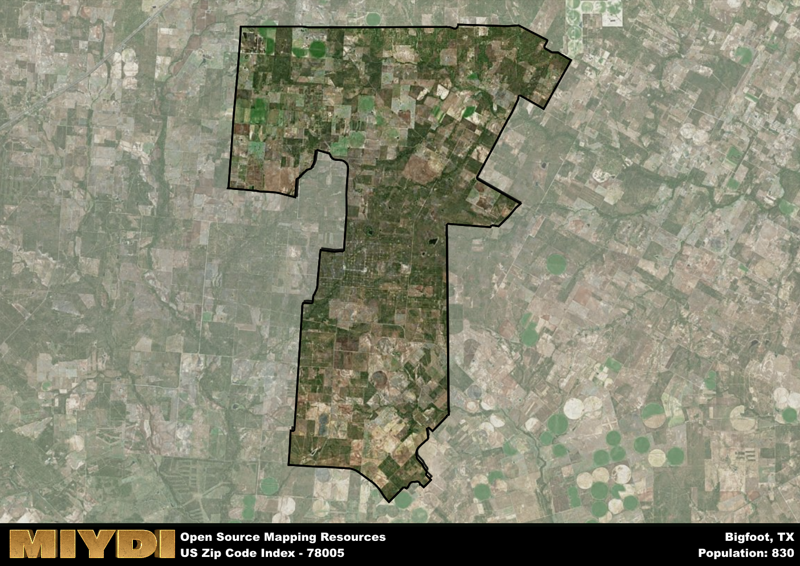

**Area Name:** Bigfoot

**Zip Code:** 78005

**State:** TX

Bigfoot is a part of the Pearsall - TX Micro Area, and makes up  of the Metro's population.  

# Bigfoot, Texas: Embracing Small-Town Charm in Zip Code 78005  

Located in south-central Texas, Bigfoot is a charming rural community nestled within Medina County. The zip code 78005 encompasses the area surrounding Bigfoot, bordered by Devine to the east and Moore to the west. Despite its small size, Bigfoot is seamlessly integrated into the larger metropolitan area of San Antonio, situated approximately 40 miles northeast of the city center. This proximity allows residents to enjoy the tranquility of rural life while still easily accessing the amenities of a major urban center.  

Bigfoot has a rich historical narrative that dates back to the mid-19th century when settlers began to establish farms and ranches in the area. The community received its unique name from the legendary creature that has become synonymous with the region. Over the years, Bigfoot has developed a close-knit community of residents who take pride in their heritage and rural way of life. Today, the area maintains its agricultural roots, with many families continuing the tradition of farming and ranching that has sustained the community for generations.  

Presently, Bigfoot offers a peaceful retreat from the hustle and bustle of city life, with a focus on agriculture and rural living. The area is home to local businesses that cater to the needs of residents, including family-owned farms, ranches, and country stores. Residents and visitors alike can enjoy outdoor recreational activities such as hiking, fishing, and hunting in the picturesque countryside surrounding Bigfoot. Additionally, the community boasts several historic sites that showcase its storied past, providing a glimpse into the area's rich heritage.

# Bigfoot Demographics

The population of Bigfoot is 830.  
Bigfoot has a population density of 11 per square mile.  
The area of Bigfoot is 75.43 square miles.  

## Bigfoot Income and Economic Data

These demographic numbers are sourced from IRS return data, providing comprehensive insights into the population dynamics and economic trends within Bigfoot.

**Breakdown of return types for Bigfoot**

The table offers insight into the composition of tax returns filed with the IRS, categorizing them into three main types. Single returns represent filings by individuals, joint returns by married couples, and head of household returns by individuals who qualify as heads of households, typically having dependents. This breakdown provides an understanding of the different filing statuses adopted by taxpayers when submitting their tax documentation.

| Return Types filed for Bigfoot                              | Percentage          |
|----------------------------------------------------------|---------------------|
| Single Returns                                            | 0.42 |
| Joint Returns                                             | 0.5 |
| Head Household Returns                                    | 0.06 |

The income and economic data presented here is sourced from the IRS income brackets, utilized for categorizing tax returns by income levels. This table displays income ranges for both single filers and married couples, along with the corresponding number of returns and the percentage within each bracket, providing valuable insight into the distribution of taxes across various income groups.

| Bracket Name       | Single Filer Income Range | Married Couple Range | Number of Returns | Percentage of Returns |
|--------------------|----------------------------|----------------------|-------------------|-----------------------|
| 10% Bracket        | Up to $10,275              | Up to $20,550        | 100 | 0.28% |
| 12% Bracket        | $10,276 - $41,775          | $20,551 - $83,550    | 100 | 0.28% |
| 22% Bracket        | $41,776 - $89,075          | $83,551 - $178,150   | 60 | 0.17% |
| 24% Bracket        | $89,076 - $170,050         | $178,151 - $340,100  | 40 | 0.11% |
| 32% Bracket        | $170,051 - $215,950        | $340,101 - $431,900  | 60 | 0.17% |
| 35% Bracket        | $215,951 - $539,900        | $431,901 - $647,850  | 0 | 0% |

### Exploring Taxpayer Diversity: A Breakdown of Different Types of Tax Returns in Bigfoot

The table offers insights into various types of tax returns filed, reflecting different aspects of taxpayer activities and demographics. Categories include charitable returns for donations, dependent returns for claimed dependents, educator population, elderly population, real estate returns, self-employment returns, student loan returns, and unemployment returns, providing valuable insights into taxpayer behavior and demographics.

| Bigfoot Filing Types                    | Count | Percentage |
|--------------------------------------|-------|------------|
| Charitable Donations                 | 0 | 0% |
| Dependents Claimed                   | 0 | 0% |
| Educator Residents                   | 0 | 0% |
| Elderly Population                   | 130 | 0.36% |
| Farming Population                   | 70 | 0.194% |
| Real Estate Transactions             | 0 | 0% |
| Self-Employed Individuals            | 50 | 0.139% |
| Student Loan Cases                   | 0 | 0% |
| Unemployment Benefit Filings         | 40 | 0.11% |

## Bigfoot AI and Census Variables

The values presented in this dataset for Bigfoot are AI-optimized, streamlined, and categorized into relevant buckets for enhanced utility in AI and mapping programs. These simplified values have been optimized to facilitate efficient analysis and integration into various technological applications, offering users accessible and actionable insights into demographics within the Bigfoot area.

| AI Variables for Bigfoot | Value |
|-------------|-------|
| Shape Area | 256374510.289063 |
| Shape Length | 97372.715415108 |
| CBSA Federal Processing Standard Code | 37770 |

## How to use this free AI optimized Geo-Spatial Data for Bigfoot, TX

This data is made freely available under the Creative Commons license, allowing for unrestricted use for any purpose. Users can access static resources directly from GitHub or leverage more advanced functionalities by utilizing the GeoJSON files. All datasets originate from official government or private sector sources and are meticulously compiled into relevant datasets within QGIS. However, the versatility of the data ensures compatibility with any mapping application.

## Data Accuracy Disclaimer
It's important to note that the data provided here may contain errors or discrepancies and should be considered as 'close enough' for business applications and AI rather than a definitive source of truth. This data is aggregated from multiple sources, some of which publish information on wildly different intervals, leading to potential inconsistencies. Additionally, certain data points may not be corrected for Covid-related changes, further impacting accuracy. Moreover, the assumption that demographic trends are consistent throughout a region may lead to discrepancies, as trends often concentrate in areas of highest population density. As a result, dense areas may be slightly underrepresented, while rural areas may be slightly overrepresented, resulting in a more conservative dataset. Furthermore, the focus primarily on areas within US Major and Minor Statistical areas means that approximately 40 million Americans living outside of these areas may not be fully represented. Lastly, the historical background and area descriptions generated using AI are susceptible to potential mistakes, so users should exercise caution when interpreting the information provided.
