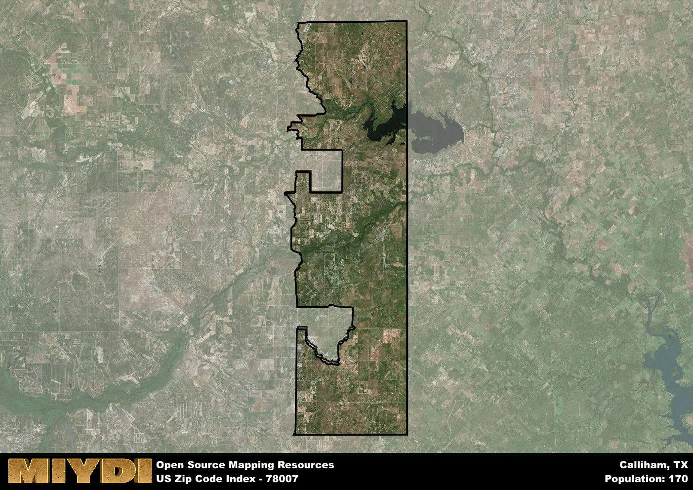

**Area Name:** Calliham

**Zip Code:** 78007

**State:** TX

Calliham is a part of the Alice - TX Micro Area, and makes up  of the Metro's population.  

# Calliham: A Hidden Gem in South Texas

Located in the southern region of Texas, the zip code area 78007 encompasses the charming neighborhood of Calliham. Situated within the larger McMullen County, Calliham is surrounded by vast expanses of ranch land and is in close proximity to major cities such as San Antonio and Corpus Christi. Despite its rural setting, Calliham is well-connected to the urban fabric of South Texas, serving as a tranquil retreat for residents seeking a quieter pace of life.

Calliham has a rich historical narrative, stemming from its origins as a small settlement established in the late 19th century. Named after early settler John Calliham, the area experienced growth with the arrival of the railroad, which facilitated trade and transportation of goods. Over the years, Calliham has maintained its small-town charm while adapting to modern developments, preserving its unique identity and sense of community.

Today, Calliham offers a range of economic activities, including agriculture, ranching, and oil production. The neighborhood boasts essential services such as schools, grocery stores, and healthcare facilities to meet the needs of its residents. Additionally, Calliham is home to recreational amenities such as parks, fishing spots, and hiking trails, allowing locals and visitors to enjoy the natural beauty of the South Texas landscape. With its rich history and vibrant present, Calliham remains a hidden gem worth exploring in the heart of Texas.

# Calliham Demographics

The population of Calliham is 170.  
Calliham has a population density of 0.42 per square mile.  
The area of Calliham is 400.06 square miles.  

## Calliham AI and Census Variables

The values presented in this dataset for Calliham are AI-optimized, streamlined, and categorized into relevant buckets for enhanced utility in AI and mapping programs. These simplified values have been optimized to facilitate efficient analysis and integration into various technological applications, offering users accessible and actionable insights into demographics within the Calliham area.

| AI Variables for Calliham | Value |
|-------------|-------|
| Shape Area | 1342775567.33594 |
| Shape Length | 269888.653474126 |
| CBSA Federal Processing Standard Code | 10860 |

## How to use this free AI optimized Geo-Spatial Data for Calliham, TX

This data is made freely available under the Creative Commons license, allowing for unrestricted use for any purpose. Users can access static resources directly from GitHub or leverage more advanced functionalities by utilizing the GeoJSON files. All datasets originate from official government or private sector sources and are meticulously compiled into relevant datasets within QGIS. However, the versatility of the data ensures compatibility with any mapping application.

## Data Accuracy Disclaimer
It's important to note that the data provided here may contain errors or discrepancies and should be considered as 'close enough' for business applications and AI rather than a definitive source of truth. This data is aggregated from multiple sources, some of which publish information on wildly different intervals, leading to potential inconsistencies. Additionally, certain data points may not be corrected for Covid-related changes, further impacting accuracy. Moreover, the assumption that demographic trends are consistent throughout a region may lead to discrepancies, as trends often concentrate in areas of highest population density. As a result, dense areas may be slightly underrepresented, while rural areas may be slightly overrepresented, resulting in a more conservative dataset. Furthermore, the focus primarily on areas within US Major and Minor Statistical areas means that approximately 40 million Americans living outside of these areas may not be fully represented. Lastly, the historical background and area descriptions generated using AI are susceptible to potential mistakes, so users should exercise caution when interpreting the information provided.
