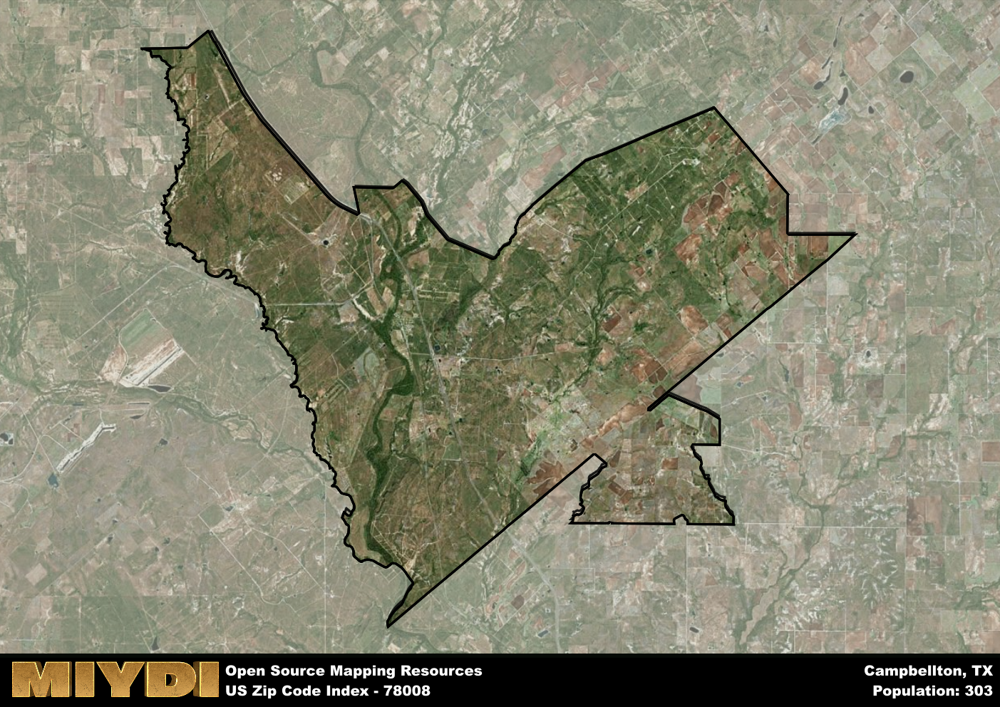

**Area Name:** Campbellton

**Zip Code:** 78008

**State:** TX

Campbellton is a part of the San Antonio-New Braunfels - TX Metro Area, and makes up  of the Metro's population.  

# Campbellton: A Historic Neighborhood in South Texas  

Located in the southern part of Texas, zip code 78008 encompasses the charming neighborhood of Campbellton. Situated within Atascosa County, Campbellton is surrounded by the cities of Charlotte, Christine, and Leming. It is a part of the larger metropolitan area of San Antonio, providing residents with easy access to urban amenities while maintaining a distinct rural character. Campbellton is known for its picturesque landscapes and close-knit community feel, making it a desirable place to live for those seeking a peaceful retreat from city life.  

Campbellton has a rich history dating back to the mid-19th century when it was founded as a farming and ranching community. The area experienced significant growth with the arrival of the railroad in the late 1800s, which facilitated trade and commerce in the region. The neighborhood was named after John Campbell, a local landowner who played a key role in the development of the area. Over the years, Campbellton has retained its agricultural roots while also embracing modern developments, creating a unique blend of tradition and progress.  

Today, Campbellton is a thriving community with a diverse economy that includes agriculture, oil and gas production, and small businesses. Residents enjoy a range of neighborhood-specific services such as local shops, restaurants, and schools. The area is home to several parks and recreational facilities, providing ample opportunities for outdoor activities. Campbellton also boasts a number of historic sites, including the Campbellton Community Center, which serves as a hub for cultural events and community gatherings. With its blend of history, natural beauty, and modern conveniences, Campbellton continues to be a hidden gem in South Texas.  

# Campbellton Demographics

The population of Campbellton is 303.  
Campbellton has a population density of 2.57 per square mile.  
The area of Campbellton is 117.8 square miles.  

## Campbellton Income and Economic Data

These demographic numbers are sourced from IRS return data, providing comprehensive insights into the population dynamics and economic trends within Campbellton.

**Breakdown of return types for Campbellton**

The table offers insight into the composition of tax returns filed with the IRS, categorizing them into three main types. Single returns represent filings by individuals, joint returns by married couples, and head of household returns by individuals who qualify as heads of households, typically having dependents. This breakdown provides an understanding of the different filing statuses adopted by taxpayers when submitting their tax documentation.

| Return Types filed for Campbellton                              | Percentage          |
|----------------------------------------------------------|---------------------|
| Single Returns                                            | 0.5 |
| Joint Returns                                             | 0.33 |
| Head Household Returns                                    | 0 |

The income and economic data presented here is sourced from the IRS income brackets, utilized for categorizing tax returns by income levels. This table displays income ranges for both single filers and married couples, along with the corresponding number of returns and the percentage within each bracket, providing valuable insight into the distribution of taxes across various income groups.

| Bracket Name       | Single Filer Income Range | Married Couple Range | Number of Returns | Percentage of Returns |
|--------------------|----------------------------|----------------------|-------------------|-----------------------|
| 10% Bracket        | Up to $10,275              | Up to $20,550        | 50 | 0.42% |
| 12% Bracket        | $10,276 - $41,775          | $20,551 - $83,550    | 50 | 0.42% |
| 22% Bracket        | $41,776 - $89,075          | $83,551 - $178,150   | 0 | 0% |
| 24% Bracket        | $89,076 - $170,050         | $178,151 - $340,100  | 0 | 0% |
| 32% Bracket        | $170,051 - $215,950        | $340,101 - $431,900  | 20 | 0.17% |
| 35% Bracket        | $215,951 - $539,900        | $431,901 - $647,850  | 0 | 0% |

### Exploring Taxpayer Diversity: A Breakdown of Different Types of Tax Returns in Campbellton

The table offers insights into various types of tax returns filed, reflecting different aspects of taxpayer activities and demographics. Categories include charitable returns for donations, dependent returns for claimed dependents, educator population, elderly population, real estate returns, self-employment returns, student loan returns, and unemployment returns, providing valuable insights into taxpayer behavior and demographics.

| Campbellton Filing Types                    | Count | Percentage |
|--------------------------------------|-------|------------|
| Charitable Donations                 | 0 | 0% |
| Dependents Claimed                   | 0 | 0% |
| Educator Residents                   | 0 | 0% |
| Elderly Population                   | 40 | 0.33% |
| Farming Population                   | 20 | 0.167% |
| Real Estate Transactions             | 0 | 0% |
| Self-Employed Individuals            | 0 | 0% |
| Student Loan Cases                   | 0 | 0% |
| Unemployment Benefit Filings         | 0 | 0% |

## Campbellton AI and Census Variables

The values presented in this dataset for Campbellton are AI-optimized, streamlined, and categorized into relevant buckets for enhanced utility in AI and mapping programs. These simplified values have been optimized to facilitate efficient analysis and integration into various technological applications, offering users accessible and actionable insights into demographics within the Campbellton area.

| AI Variables for Campbellton | Value |
|-------------|-------|
| Shape Area | 398328355.980469 |
| Shape Length | 143944.289532537 |
| CBSA Federal Processing Standard Code | 41700 |

## How to use this free AI optimized Geo-Spatial Data for Campbellton, TX

This data is made freely available under the Creative Commons license, allowing for unrestricted use for any purpose. Users can access static resources directly from GitHub or leverage more advanced functionalities by utilizing the GeoJSON files. All datasets originate from official government or private sector sources and are meticulously compiled into relevant datasets within QGIS. However, the versatility of the data ensures compatibility with any mapping application.

## Data Accuracy Disclaimer
It's important to note that the data provided here may contain errors or discrepancies and should be considered as 'close enough' for business applications and AI rather than a definitive source of truth. This data is aggregated from multiple sources, some of which publish information on wildly different intervals, leading to potential inconsistencies. Additionally, certain data points may not be corrected for Covid-related changes, further impacting accuracy. Moreover, the assumption that demographic trends are consistent throughout a region may lead to discrepancies, as trends often concentrate in areas of highest population density. As a result, dense areas may be slightly underrepresented, while rural areas may be slightly overrepresented, resulting in a more conservative dataset. Furthermore, the focus primarily on areas within US Major and Minor Statistical areas means that approximately 40 million Americans living outside of these areas may not be fully represented. Lastly, the historical background and area descriptions generated using AI are susceptible to potential mistakes, so users should exercise caution when interpreting the information provided.
