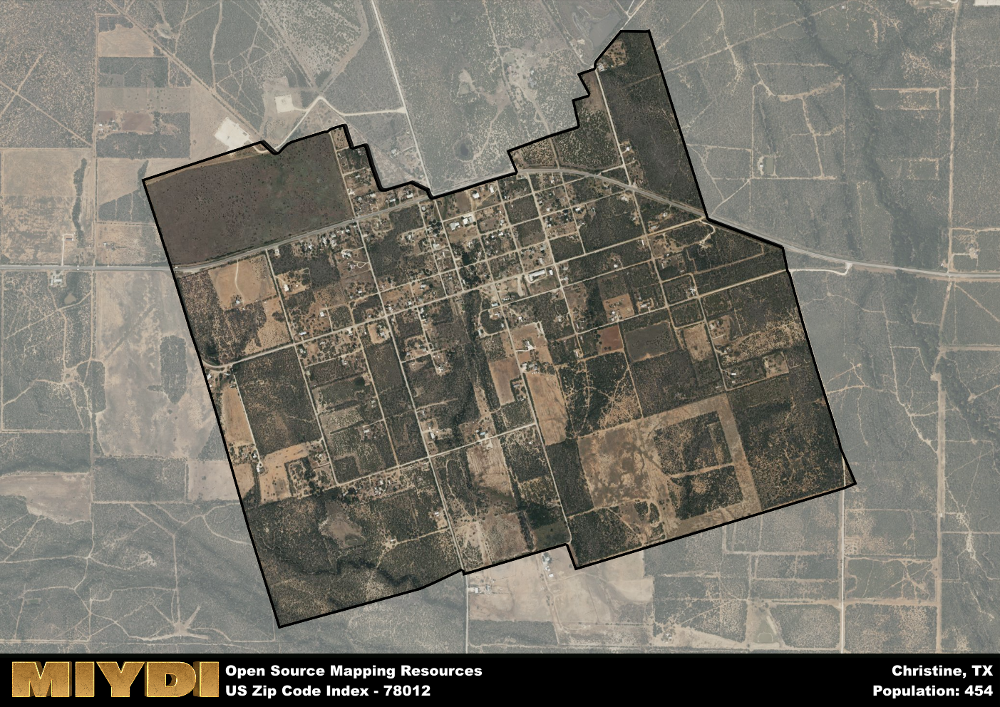

**Area Name:** Christine

**Zip Code:** 78012

**State:** TX

Christine is a part of the San Antonio-New Braunfels - TX Metro Area, and makes up  of the Metro's population.  

# Christine: A Charming Rural Community in South Texas

Located in South Texas, the zip code 78012 corresponds to the small community of Christine. Situated within Atascosa County, Christine is surrounded by vast farmlands and open spaces, making it a peaceful retreat from the hustle and bustle of nearby cities like San Antonio and Corpus Christi. Despite its rural setting, Christine is well-connected to major highways, allowing for easy access to urban centers for work or leisure.

Christine has a rich historical heritage dating back to its founding in the early 20th century. Originally established as a railroad town, Christine quickly grew into a thriving community centered around agriculture and ranching. The town was named after the daughter of a prominent landowner, solidifying its place in local lore. Over the years, Christine has maintained its small-town charm while adapting to modern times with the introduction of new businesses and services.

Today, Christine remains a close-knit community with a strong agricultural presence. Residents enjoy a laid-back lifestyle surrounded by nature, with opportunities for hunting, fishing, and other outdoor activities. The town boasts a few local businesses, including family-owned shops and restaurants, providing essential services to the neighborhood. Additionally, Christine is home to historic sites that offer a glimpse into its past, making it a unique destination within the South Texas region.

# Christine Demographics

The population of Christine is 454.  
Christine has a population density of 252.22 per square mile.  
The area of Christine is 1.8 square miles.  

## Christine Income and Economic Data

These demographic numbers are sourced from IRS return data, providing comprehensive insights into the population dynamics and economic trends within Christine.

**Breakdown of return types for Christine**

The table offers insight into the composition of tax returns filed with the IRS, categorizing them into three main types. Single returns represent filings by individuals, joint returns by married couples, and head of household returns by individuals who qualify as heads of households, typically having dependents. This breakdown provides an understanding of the different filing statuses adopted by taxpayers when submitting their tax documentation.

| Return Types filed for Christine                              | Percentage          |
|----------------------------------------------------------|---------------------|
| Single Returns                                            | 0.42 |
| Joint Returns                                             | 0.37 |
| Head Household Returns                                    | 0.21 |

The income and economic data presented here is sourced from the IRS income brackets, utilized for categorizing tax returns by income levels. This table displays income ranges for both single filers and married couples, along with the corresponding number of returns and the percentage within each bracket, providing valuable insight into the distribution of taxes across various income groups.

| Bracket Name       | Single Filer Income Range | Married Couple Range | Number of Returns | Percentage of Returns |
|--------------------|----------------------------|----------------------|-------------------|-----------------------|
| 10% Bracket        | Up to $10,275              | Up to $20,550        | 70 | 0.37% |
| 12% Bracket        | $10,276 - $41,775          | $20,551 - $83,550    | 50 | 0.26% |
| 22% Bracket        | $41,776 - $89,075          | $83,551 - $178,150   | 30 | 0.16% |
| 24% Bracket        | $89,076 - $170,050         | $178,151 - $340,100  | 40 | 0.21% |
| 32% Bracket        | $170,051 - $215,950        | $340,101 - $431,900  | 0 | 0% |
| 35% Bracket        | $215,951 - $539,900        | $431,901 - $647,850  | 0 | 0% |

### Exploring Taxpayer Diversity: A Breakdown of Different Types of Tax Returns in Christine

The table offers insights into various types of tax returns filed, reflecting different aspects of taxpayer activities and demographics. Categories include charitable returns for donations, dependent returns for claimed dependents, educator population, elderly population, real estate returns, self-employment returns, student loan returns, and unemployment returns, providing valuable insights into taxpayer behavior and demographics.

| Christine Filing Types                    | Count | Percentage |
|--------------------------------------|-------|------------|
| Charitable Donations                 | 0 | 0% |
| Dependents Claimed                   | 0 | 0% |
| Educator Residents                   | 0 | 0% |
| Elderly Population                   | 40 | 0.21% |
| Farming Population                   | 0 | 0% |
| Real Estate Transactions             | 0 | 0% |
| Self-Employed Individuals            | 0 | 0% |
| Student Loan Cases                   | 0 | 0% |
| Unemployment Benefit Filings         | 20 | 0.11% |

## Christine AI and Census Variables

The values presented in this dataset for Christine are AI-optimized, streamlined, and categorized into relevant buckets for enhanced utility in AI and mapping programs. These simplified values have been optimized to facilitate efficient analysis and integration into various technological applications, offering users accessible and actionable insights into demographics within the Christine area.

| AI Variables for Christine | Value |
|-------------|-------|
| Shape Area | 6076017.828125 |
| Shape Length | 11466.3879458248 |
| CBSA Federal Processing Standard Code | 41700 |

## How to use this free AI optimized Geo-Spatial Data for Christine, TX

This data is made freely available under the Creative Commons license, allowing for unrestricted use for any purpose. Users can access static resources directly from GitHub or leverage more advanced functionalities by utilizing the GeoJSON files. All datasets originate from official government or private sector sources and are meticulously compiled into relevant datasets within QGIS. However, the versatility of the data ensures compatibility with any mapping application.

## Data Accuracy Disclaimer
It's important to note that the data provided here may contain errors or discrepancies and should be considered as 'close enough' for business applications and AI rather than a definitive source of truth. This data is aggregated from multiple sources, some of which publish information on wildly different intervals, leading to potential inconsistencies. Additionally, certain data points may not be corrected for Covid-related changes, further impacting accuracy. Moreover, the assumption that demographic trends are consistent throughout a region may lead to discrepancies, as trends often concentrate in areas of highest population density. As a result, dense areas may be slightly underrepresented, while rural areas may be slightly overrepresented, resulting in a more conservative dataset. Furthermore, the focus primarily on areas within US Major and Minor Statistical areas means that approximately 40 million Americans living outside of these areas may not be fully represented. Lastly, the historical background and area descriptions generated using AI are susceptible to potential mistakes, so users should exercise caution when interpreting the information provided.
