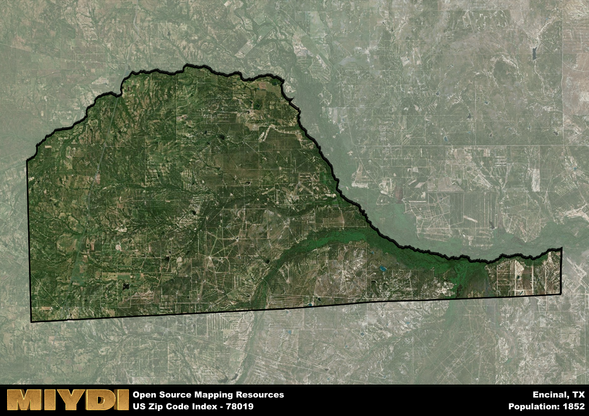

**Area Name:** Encinal

**Zip Code:** 78019

**State:** TX

Encinal is a part of the Laredo - TX Metro Area, and makes up 0.75% of the Metro's population.  

# Encinal: A Vibrant Community in South Texas

Located in South Texas, Encinal zip code 78019 encompasses a small but vibrant community in Webb County. Bordered by the city of Laredo to the east and the Rio Grande to the south, Encinal serves as a gateway to the Mexican border. The area is primarily rural, with a mix of agricultural land and residential neighborhoods. Despite its small size, Encinal plays a crucial role in the regional economy and transportation network, connecting the surrounding areas through its central location.

Founded in the late 19th century as a stop along the International-Great Northern Railroad, Encinal has a rich history tied to the development of the railroad industry in Texas. The town experienced rapid growth during the early 20th century, attracting settlers looking for opportunities in agriculture and commerce. The name "Encinal" is derived from the Spanish word for oak grove, a nod to the abundant oak trees that once covered the area. Over the years, Encinal has maintained its small-town charm while adapting to the changing economic landscape of South Texas.

Today, Encinal is a close-knit community with a strong focus on agriculture, oil production, and trade. Residents enjoy a range of local services, including schools, parks, and small businesses that cater to their daily needs. The area is also home to several historic sites, such as the old railroad depot and the Encinal Cemetery, which offer a glimpse into the town's past. With its unique blend of history, culture, and economic activity, Encinal continues to thrive as a hidden gem in South Texas.

# Encinal Demographics

The population of Encinal is 1852.  
Encinal has a population density of 5.18 per square mile.  
The area of Encinal is 357.37 square miles.  

### Exploring Real Estate Trends: A Comprehensive Analysis of the Encinal Area and its Neighbors

This table contains an in-depth examination of the real estate market in the Encinal area. Sourced from trusted real estate market firms, this dataset provides a wealth of raw data detailing the local real estate landscape, along with comparative analyses juxtaposing the market dynamics with those of neighboring areas. Explore the intricacies of the Encinal real estate market and gain valuable insights into its relationship with adjacent regions.

| Real Estate Data for Encinal                       | Value    |
|------------------------------------------------|----------|
| Real Estate Prices to Income Ratio           | 1.024 |

This table offers essential real estate data for the Encinal area, including average and median listing prices, median days on market, and property size. It also presents ratio metrics as percentages, providing insights into how the local market compares to the surrounding region. A ratio of 100% signifies performance in line with the regional average, while values above or below indicate overperformance or underperformance, respectively, relative to expectations.

## Encinal Sports and Recreation Data

#### Annual Youth Sports Spending for Encinal

This table provides fundamental insights into the Sports and Recreation data for the Encinal area, detailing the estimated annual expenditure on Youth Athletics. This includes estimated spending by the major consumer brackets. 
| Sports Spending for Encinal| Value |
|-------------------------|-------|
| Athlete Spending Compared to the region | 4.83% |
| Total Youth Athlete Spending | 89,234 |
| Athletic Spending - Essential Focused Consumer | 3,647 |
| Athletic Spending - Typical Consumer | 30,660 |
| Athletic Spending - Affluent Consumers | 14,866 |

#### Youth Coaching Estimates for Encinal

This table presents the estimated number of coaches for the Encinal area, derived from comprehensive national coaching surveys and athletic participation rates by state. It offers valuable insights into the vital role of coaching personnel in fostering athletic development and facilitating sports participation within the local community.

| Coaching Data for Encinal | Value |
|-------------|-------|
| Total Coaches | 30 |
| Paid Coaches | 8 |
| Volunteer Coaches | 22 |

#### Youth Athlete Participation for Encinal

This table shows the estimated total number of youth athletes in the Encinal area, sourced from comprehensive national coaching surveys and athletic participation rates by state.

| Total YA Athletes in Encinal | Value |
|-------------|-------|
| Total High School Athletes | 46 |
| Total Youth Athletes | 139 |
| Total Young Adult Athletes | 93 |
| Total Athletes to Age 25 | 278 |

#### High School Age Athletes - Breakdown by Sport for Encinal

This table shows insights regarding high school age estimated players by sport in the Encinal area, derived from national and state-level athletic participation trends. 

| HS Players by Sport in Encinal | Value |
|-------------|-------|
| Football Players | 11 |
| Basketball Players | 6 |
| Soccer Players | 5 |
| Volleyball Players | 3 |
| Baseball Players | 6 |
| Tennis Players | 3 |
| Track Athletes | 8 |
| Golf Players | 1 |
| Swimming Athletes | 1 |
| Wrestling Competitors | 1 |
| Lacrosse Players | 0 |

Estimating the number of younger athletes presents unique challenges due to their varied starting ages, typically beginning around six years old, and a gradual decline in participation rates as they age. Unlike high school-aged athletes, younger athletes are less likely to switch sports as they grow older, contributing to the stability of participation numbers within specific sports at younger ages.  

As a general trend, the total number of younger athletes is approximately three times the number of high school-aged athletes, underscoring the significant presence of youth athletes in sports programs and highlighting the importance of early engagement in athletic activities.

## Encinal AI and Census Variables

The values presented in this dataset for Encinal are AI-optimized, streamlined, and categorized into relevant buckets for enhanced utility in AI and mapping programs. These simplified values have been optimized to facilitate efficient analysis and integration into various technological applications, offering users accessible and actionable insights into demographics within the Encinal area.

| AI Variables for Encinal | Value |
|-------------|-------|
| Shape Area | 1194716011.125 |
| Shape Length | 190719.651667689 |
| CBSA Federal Processing Standard Code | 29700 |
| RE Income Ratio | 1.024 |
| RE Activity Flag | 1 |

## How to use this free AI optimized Geo-Spatial Data for Encinal, TX

This data is made freely available under the Creative Commons license, allowing for unrestricted use for any purpose. Users can access static resources directly from GitHub or leverage more advanced functionalities by utilizing the GeoJSON files. All datasets originate from official government or private sector sources and are meticulously compiled into relevant datasets within QGIS. However, the versatility of the data ensures compatibility with any mapping application.

## Data Accuracy Disclaimer
It's important to note that the data provided here may contain errors or discrepancies and should be considered as 'close enough' for business applications and AI rather than a definitive source of truth. This data is aggregated from multiple sources, some of which publish information on wildly different intervals, leading to potential inconsistencies. Additionally, certain data points may not be corrected for Covid-related changes, further impacting accuracy. Moreover, the assumption that demographic trends are consistent throughout a region may lead to discrepancies, as trends often concentrate in areas of highest population density. As a result, dense areas may be slightly underrepresented, while rural areas may be slightly overrepresented, resulting in a more conservative dataset. Furthermore, the focus primarily on areas within US Major and Minor Statistical areas means that approximately 40 million Americans living outside of these areas may not be fully represented. Lastly, the historical background and area descriptions generated using AI are susceptible to potential mistakes, so users should exercise caution when interpreting the information provided.
