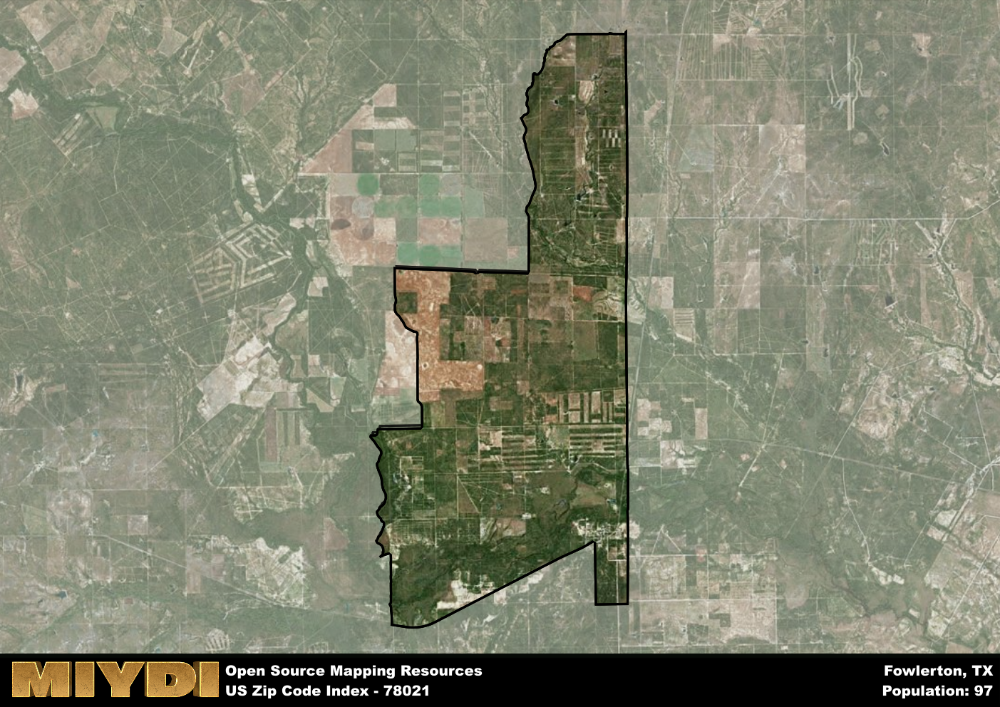

**Area Name:** Fowlerton

**Zip Code:** 78021

**State:** TX

# Fowlerton (Zip Code 78021): A Quaint Rural Community in South Texas

Located in southern Texas, zip code 78021 encompasses the charming rural community of Fowlerton. Situated within Frio County, Fowlerton is surrounded by vast open spaces and agricultural lands. The area is a part of the larger metropolitan context of the San Antonio metropolitan area, providing a peaceful retreat from the hustle and bustle of city life while still maintaining close proximity to urban amenities. Fowlerton is easily accessible via major highways, making it a convenient location for those seeking a quiet lifestyle within reach of a major city.

Fowlerton has a rich historical narrative that dates back to its establishment as a farming and ranching community in the late 19th century. The area was named after the Fowlkes brothers, who were prominent landowners in the region. Over the years, Fowlerton has grown into a close-knit community known for its agricultural heritage and friendly residents. The area's history is preserved through local museums and historic sites, providing insight into its pioneering past.

Today, Fowlerton remains a thriving rural community with a focus on agriculture and ranching. The area boasts a range of neighborhood-specific services, including local stores, schools, and healthcare facilities. Residents and visitors can enjoy recreational amenities such as parks, hiking trails, and community events. Fowlerton also features cultural and historic sites that showcase its unique identity within the larger urban fabric of the San Antonio metropolitan area. With its picturesque landscapes and small-town charm, Fowlerton offers a peaceful retreat for those looking to escape the city life.

# Fowlerton Demographics

The population of Fowlerton is 97.  
Fowlerton has a population density of 1.98 per square mile.  
The area of Fowlerton is 49.02 square miles.  

## Fowlerton AI and Census Variables

The values presented in this dataset for Fowlerton are AI-optimized, streamlined, and categorized into relevant buckets for enhanced utility in AI and mapping programs. These simplified values have been optimized to facilitate efficient analysis and integration into various technological applications, offering users accessible and actionable insights into demographics within the Fowlerton area.

| AI Variables for Fowlerton | Value |
|-------------|-------|
| Shape Area | 165066823.5625 |
| Shape Length | 74654.2164045205 |

## How to use this free AI optimized Geo-Spatial Data for Fowlerton, TX

This data is made freely available under the Creative Commons license, allowing for unrestricted use for any purpose. Users can access static resources directly from GitHub or leverage more advanced functionalities by utilizing the GeoJSON files. All datasets originate from official government or private sector sources and are meticulously compiled into relevant datasets within QGIS. However, the versatility of the data ensures compatibility with any mapping application.

## Data Accuracy Disclaimer
It's important to note that the data provided here may contain errors or discrepancies and should be considered as 'close enough' for business applications and AI rather than a definitive source of truth. This data is aggregated from multiple sources, some of which publish information on wildly different intervals, leading to potential inconsistencies. Additionally, certain data points may not be corrected for Covid-related changes, further impacting accuracy. Moreover, the assumption that demographic trends are consistent throughout a region may lead to discrepancies, as trends often concentrate in areas of highest population density. As a result, dense areas may be slightly underrepresented, while rural areas may be slightly overrepresented, resulting in a more conservative dataset. Furthermore, the focus primarily on areas within US Major and Minor Statistical areas means that approximately 40 million Americans living outside of these areas may not be fully represented. Lastly, the historical background and area descriptions generated using AI are susceptible to potential mistakes, so users should exercise caution when interpreting the information provided.
