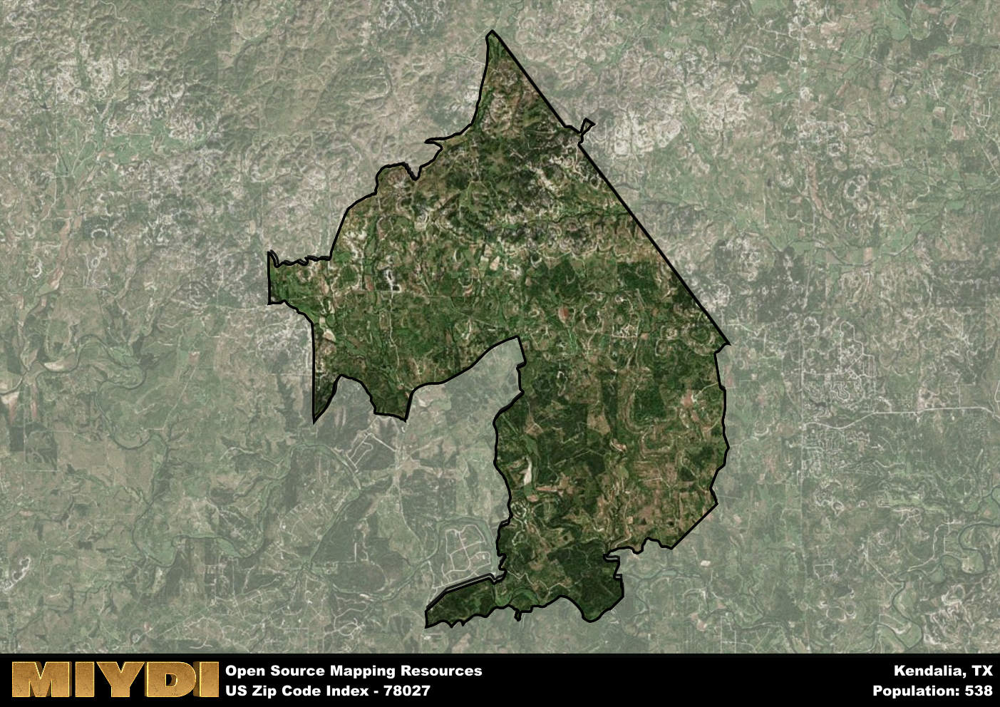

**Area Name:** Kendalia

**Zip Code:** 78027

**State:** TX

Kendalia is a part of the San Antonio-New Braunfels - TX Metro Area, and makes up  of the Metro's population.  

# Kendalia: A Charming Hill Country Community

Located in the heart of the Texas Hill Country, the zip code 78027 area of Kendalia is surrounded by rolling hills, scenic landscapes, and sprawling ranches. Situated between the cities of Boerne and Blanco, Kendalia serves as a peaceful retreat from the hustle and bustle of urban life while still being within driving distance of major population centers like San Antonio and Austin. The area is characterized by its small-town charm and close-knit community, making it a desirable destination for those seeking a quieter way of life.

Kendalia has a rich history dating back to the mid-19th century when German settlers established the first homesteads in the area. The town was officially founded in 1883 and named after George Wilkins Kendall, a prominent journalist and landowner. Over the years, Kendalia has evolved into a thriving rural community known for its agricultural heritage and strong sense of community pride. The area's historic buildings and landmarks serve as a reminder of its past, while modern amenities and businesses cater to the needs of residents and visitors alike.

Today, Kendalia remains a picturesque destination that offers a variety of recreational activities, including hiking, horseback riding, and bird watching. The area's economy is primarily driven by agriculture, tourism, and small businesses, with local shops and restaurants providing essential services to residents. Kendalia also boasts several historic sites, such as the Kendalia Halle, a popular event venue that hosts community gatherings and cultural events. With its natural beauty, rich history, and welcoming atmosphere, Kendalia embodies the charm and spirit of the Texas Hill Country.

# Kendalia Demographics

The population of Kendalia is 538.  
Kendalia has a population density of 7.35 per square mile.  
The area of Kendalia is 73.17 square miles.  

## Kendalia Income and Economic Data

These demographic numbers are sourced from IRS return data, providing comprehensive insights into the population dynamics and economic trends within Kendalia.

**Breakdown of return types for Kendalia**

The table offers insight into the composition of tax returns filed with the IRS, categorizing them into three main types. Single returns represent filings by individuals, joint returns by married couples, and head of household returns by individuals who qualify as heads of households, typically having dependents. This breakdown provides an understanding of the different filing statuses adopted by taxpayers when submitting their tax documentation.

| Return Types filed for Kendalia                              | Percentage          |
|----------------------------------------------------------|---------------------|
| Single Returns                                            | 0.44 |
| Joint Returns                                             | 0.48 |
| Head Household Returns                                    | 0 |

The income and economic data presented here is sourced from the IRS income brackets, utilized for categorizing tax returns by income levels. This table displays income ranges for both single filers and married couples, along with the corresponding number of returns and the percentage within each bracket, providing valuable insight into the distribution of taxes across various income groups.

| Bracket Name       | Single Filer Income Range | Married Couple Range | Number of Returns | Percentage of Returns |
|--------------------|----------------------------|----------------------|-------------------|-----------------------|
| 10% Bracket        | Up to $10,275              | Up to $20,550        | 60 | 0.24% |
| 12% Bracket        | $10,276 - $41,775          | $20,551 - $83,550    | 60 | 0.24% |
| 22% Bracket        | $41,776 - $89,075          | $83,551 - $178,150   | 30 | 0.12% |
| 24% Bracket        | $89,076 - $170,050         | $178,151 - $340,100  | 30 | 0.12% |
| 32% Bracket        | $170,051 - $215,950        | $340,101 - $431,900  | 40 | 0.16% |
| 35% Bracket        | $215,951 - $539,900        | $431,901 - $647,850  | 30 | 0.12% |

### Exploring Taxpayer Diversity: A Breakdown of Different Types of Tax Returns in Kendalia

The table offers insights into various types of tax returns filed, reflecting different aspects of taxpayer activities and demographics. Categories include charitable returns for donations, dependent returns for claimed dependents, educator population, elderly population, real estate returns, self-employment returns, student loan returns, and unemployment returns, providing valuable insights into taxpayer behavior and demographics.

| Kendalia Filing Types                    | Count | Percentage |
|--------------------------------------|-------|------------|
| Charitable Donations                 | 0 | 0% |
| Dependents Claimed                   | 0 | 0% |
| Educator Residents                   | 0 | 0% |
| Elderly Population                   | 100 | 0.4% |
| Farming Population                   | 40 | 0.16% |
| Real Estate Transactions             | 0 | 0% |
| Self-Employed Individuals            | 40 | 0.16% |
| Student Loan Cases                   | 0 | 0% |
| Unemployment Benefit Filings         | 0 | 0% |

## Kendalia AI and Census Variables

The values presented in this dataset for Kendalia are AI-optimized, streamlined, and categorized into relevant buckets for enhanced utility in AI and mapping programs. These simplified values have been optimized to facilitate efficient analysis and integration into various technological applications, offering users accessible and actionable insights into demographics within the Kendalia area.

| AI Variables for Kendalia | Value |
|-------------|-------|
| Shape Area | 253383342.671875 |
| Shape Length | 108745.182066718 |
| CBSA Federal Processing Standard Code | 41700 |

## How to use this free AI optimized Geo-Spatial Data for Kendalia, TX

This data is made freely available under the Creative Commons license, allowing for unrestricted use for any purpose. Users can access static resources directly from GitHub or leverage more advanced functionalities by utilizing the GeoJSON files. All datasets originate from official government or private sector sources and are meticulously compiled into relevant datasets within QGIS. However, the versatility of the data ensures compatibility with any mapping application.

## Data Accuracy Disclaimer
It's important to note that the data provided here may contain errors or discrepancies and should be considered as 'close enough' for business applications and AI rather than a definitive source of truth. This data is aggregated from multiple sources, some of which publish information on wildly different intervals, leading to potential inconsistencies. Additionally, certain data points may not be corrected for Covid-related changes, further impacting accuracy. Moreover, the assumption that demographic trends are consistent throughout a region may lead to discrepancies, as trends often concentrate in areas of highest population density. As a result, dense areas may be slightly underrepresented, while rural areas may be slightly overrepresented, resulting in a more conservative dataset. Furthermore, the focus primarily on areas within US Major and Minor Statistical areas means that approximately 40 million Americans living outside of these areas may not be fully represented. Lastly, the historical background and area descriptions generated using AI are susceptible to potential mistakes, so users should exercise caution when interpreting the information provided.
