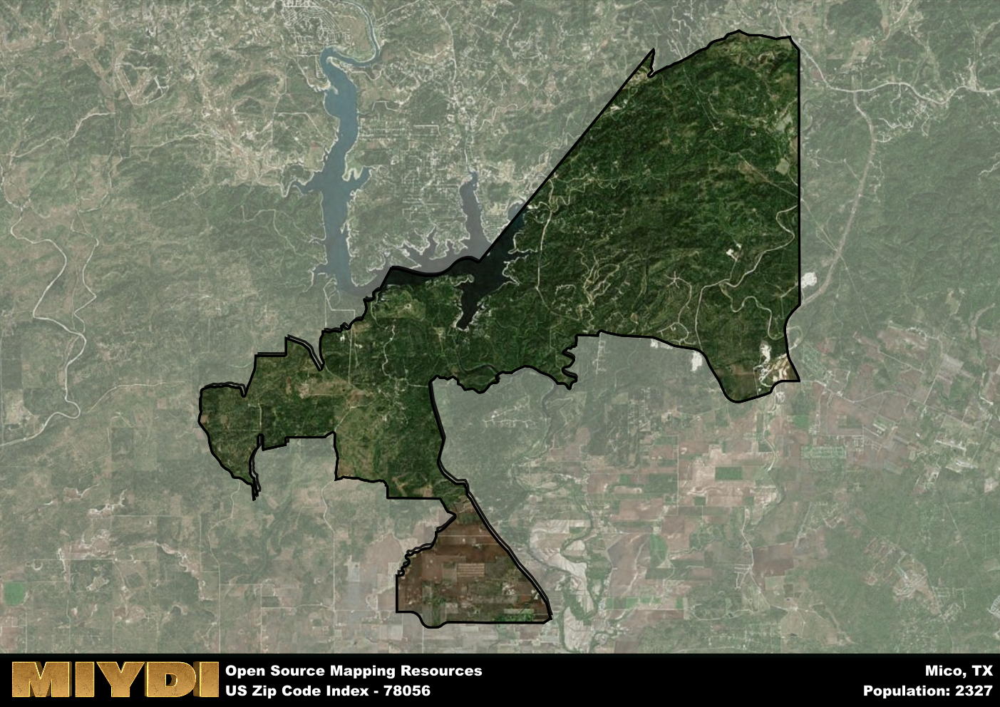

**Area Name:** Mico

**Zip Code:** 78056

**State:** TX

Mico is a part of the San Antonio-New Braunfels - TX Metro Area, and makes up  of the Metro's population.  

# Hidden Gem of the Texas Hill Country: Mico, 78056

Mico, zip code 78056, is a charming neighborhood nestled in the heart of the Texas Hill Country. Located just west of San Antonio, Mico is bordered by the scenic Medina Lake to the south and vast open countryside to the north. This idyllic setting provides residents with a peaceful retreat from the hustle and bustle of the nearby urban center, while still being within a convenient driving distance to major highways and amenities in San Antonio.

Originally settled in the mid-19th century, Mico has a rich history tied to its agricultural roots and proximity to the Medina River. The area experienced a population boom in the early 20th century with the discovery of oil nearby, leading to the establishment of small businesses and a tight-knit community. The name "Mico" is believed to be derived from a Spanish term meaning "monkey," though the exact origin remains uncertain. Today, Mico retains its small-town charm and historic character, with many residents proud of their heritage and commitment to preserving the area's unique identity.

Presently, Mico is a thriving community with a mix of residential neighborhoods, local businesses, and recreational opportunities. The economy is primarily driven by agriculture, tourism, and small-scale industries catering to the needs of residents and visitors alike. Mico boasts a range of outdoor activities, including fishing, boating, and hiking, making it a popular destination for nature enthusiasts. In addition, the area is home to several historic sites, such as the Mico Schoolhouse Museum, which offers a glimpse into the area's past. With its picturesque setting and close-knit community, Mico continues to be a hidden gem in the Texas Hill Country.

# Mico Demographics

The population of Mico is 2327.  
Mico has a population density of 33.94 per square mile.  
The area of Mico is 68.56 square miles.  

## Mico Income and Economic Data

These demographic numbers are sourced from IRS return data, providing comprehensive insights into the population dynamics and economic trends within Mico.

**Breakdown of return types for Mico**

The table offers insight into the composition of tax returns filed with the IRS, categorizing them into three main types. Single returns represent filings by individuals, joint returns by married couples, and head of household returns by individuals who qualify as heads of households, typically having dependents. This breakdown provides an understanding of the different filing statuses adopted by taxpayers when submitting their tax documentation.

| Return Types filed for Mico                              | Percentage          |
|----------------------------------------------------------|---------------------|
| Single Returns                                            | 0.32 |
| Joint Returns                                             | 0.61 |
| Head Household Returns                                    | 0.05 |

The income and economic data presented here is sourced from the IRS income brackets, utilized for categorizing tax returns by income levels. This table displays income ranges for both single filers and married couples, along with the corresponding number of returns and the percentage within each bracket, providing valuable insight into the distribution of taxes across various income groups.

| Bracket Name       | Single Filer Income Range | Married Couple Range | Number of Returns | Percentage of Returns |
|--------------------|----------------------------|----------------------|-------------------|-----------------------|
| 10% Bracket        | Up to $10,275              | Up to $20,550        | 250 | 0.22% |
| 12% Bracket        | $10,276 - $41,775          | $20,551 - $83,550    | 140 | 0.12% |
| 22% Bracket        | $41,776 - $89,075          | $83,551 - $178,150   | 130 | 0.12% |
| 24% Bracket        | $89,076 - $170,050         | $178,151 - $340,100  | 130 | 0.12% |
| 32% Bracket        | $170,051 - $215,950        | $340,101 - $431,900  | 340 | 0.3% |
| 35% Bracket        | $215,951 - $539,900        | $431,901 - $647,850  | 140 | 0.12% |

### Exploring Taxpayer Diversity: A Breakdown of Different Types of Tax Returns in Mico

The table offers insights into various types of tax returns filed, reflecting different aspects of taxpayer activities and demographics. Categories include charitable returns for donations, dependent returns for claimed dependents, educator population, elderly population, real estate returns, self-employment returns, student loan returns, and unemployment returns, providing valuable insights into taxpayer behavior and demographics.

| Mico Filing Types                    | Count | Percentage |
|--------------------------------------|-------|------------|
| Charitable Donations                 | 160 | 0.142% |
| Dependents Claimed                   | 40 | 0.035% |
| Educator Residents                   | 40 | 0.035% |
| Elderly Population                   | 360 | 0.32% |
| Farming Population                   | 40 | 0.035% |
| Real Estate Transactions             | 180 | 0.159% |
| Self-Employed Individuals            | 130 | 0.115% |
| Student Loan Cases                   | 60 | 0.053% |
| Unemployment Benefit Filings         | 100 | 0.09% |

## Mico AI and Census Variables

The values presented in this dataset for Mico are AI-optimized, streamlined, and categorized into relevant buckets for enhanced utility in AI and mapping programs. These simplified values have been optimized to facilitate efficient analysis and integration into various technological applications, offering users accessible and actionable insights into demographics within the Mico area.

| AI Variables for Mico | Value |
|-------------|-------|
| Shape Area | 235437890.417969 |
| Shape Length | 121450.498693913 |
| CBSA Federal Processing Standard Code | 41700 |

## How to use this free AI optimized Geo-Spatial Data for Mico, TX

This data is made freely available under the Creative Commons license, allowing for unrestricted use for any purpose. Users can access static resources directly from GitHub or leverage more advanced functionalities by utilizing the GeoJSON files. All datasets originate from official government or private sector sources and are meticulously compiled into relevant datasets within QGIS. However, the versatility of the data ensures compatibility with any mapping application.

## Data Accuracy Disclaimer
It's important to note that the data provided here may contain errors or discrepancies and should be considered as 'close enough' for business applications and AI rather than a definitive source of truth. This data is aggregated from multiple sources, some of which publish information on wildly different intervals, leading to potential inconsistencies. Additionally, certain data points may not be corrected for Covid-related changes, further impacting accuracy. Moreover, the assumption that demographic trends are consistent throughout a region may lead to discrepancies, as trends often concentrate in areas of highest population density. As a result, dense areas may be slightly underrepresented, while rural areas may be slightly overrepresented, resulting in a more conservative dataset. Furthermore, the focus primarily on areas within US Major and Minor Statistical areas means that approximately 40 million Americans living outside of these areas may not be fully represented. Lastly, the historical background and area descriptions generated using AI are susceptible to potential mistakes, so users should exercise caution when interpreting the information provided.
