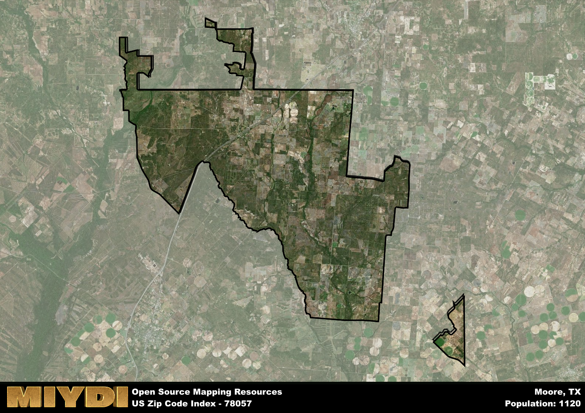

**Area Name:** Moore

**Zip Code:** 78057

**State:** TX

Moore is a part of the Pearsall - TX Micro Area, and makes up  of the Metro's population.  

# Moore: A Historical and Vibrant Community in Zip Code 78057

Located in the southern part of Texas, zip code 78057 encompasses the charming neighborhood of Moore. Bordered by rolling hills and picturesque landscapes, Moore seamlessly integrates with the surrounding cities of Devine and Bigfoot, forming a cohesive community within the larger metropolitan area. Situated within close proximity to San Antonio, Moore serves as a peaceful retreat from the bustling urban center while still providing easy access to the amenities of the city.

Originally settled by pioneers in the 19th century, Moore has a rich historical heritage that is evident in its architecture and landmarks. The area experienced significant growth during the early 1900s with the development of agriculture and ranching industries. The community's name pays homage to an influential local family, highlighting the deep roots and close-knit nature of the residents. Over the years, Moore has evolved into a welcoming and inclusive neighborhood, attracting visitors with its small-town charm and friendly atmosphere.

Today, Moore is a thriving community with a diverse economy that includes agriculture, small businesses, and tourism. Residents and visitors alike can enjoy a range of neighborhood-specific services such as local shops, restaurants, and schools. The area also boasts recreational amenities like parks and hiking trails, providing opportunities for outdoor activities and leisure. Additionally, Moore is home to several cultural and historic sites, offering insight into the area's past and preserving its unique identity within the larger urban fabric.

# Moore Demographics

The population of Moore is 1120.  
Moore has a population density of 8.86 per square mile.  
The area of Moore is 126.38 square miles.  

## Moore Income and Economic Data

These demographic numbers are sourced from IRS return data, providing comprehensive insights into the population dynamics and economic trends within Moore.

**Breakdown of return types for Moore**

The table offers insight into the composition of tax returns filed with the IRS, categorizing them into three main types. Single returns represent filings by individuals, joint returns by married couples, and head of household returns by individuals who qualify as heads of households, typically having dependents. This breakdown provides an understanding of the different filing statuses adopted by taxpayers when submitting their tax documentation.

| Return Types filed for Moore                              | Percentage          |
|----------------------------------------------------------|---------------------|
| Single Returns                                            | 0.47 |
| Joint Returns                                             | 0.38 |
| Head Household Returns                                    | 0.12 |

The income and economic data presented here is sourced from the IRS income brackets, utilized for categorizing tax returns by income levels. This table displays income ranges for both single filers and married couples, along with the corresponding number of returns and the percentage within each bracket, providing valuable insight into the distribution of taxes across various income groups.

| Bracket Name       | Single Filer Income Range | Married Couple Range | Number of Returns | Percentage of Returns |
|--------------------|----------------------------|----------------------|-------------------|-----------------------|
| 10% Bracket        | Up to $10,275              | Up to $20,550        | 180 | 0.31% |
| 12% Bracket        | $10,276 - $41,775          | $20,551 - $83,550    | 170 | 0.29% |
| 22% Bracket        | $41,776 - $89,075          | $83,551 - $178,150   | 100 | 0.17% |
| 24% Bracket        | $89,076 - $170,050         | $178,151 - $340,100  | 50 | 0.09% |
| 32% Bracket        | $170,051 - $215,950        | $340,101 - $431,900  | 80 | 0.14% |
| 35% Bracket        | $215,951 - $539,900        | $431,901 - $647,850  | 0 | 0% |

### Exploring Taxpayer Diversity: A Breakdown of Different Types of Tax Returns in Moore

The table offers insights into various types of tax returns filed, reflecting different aspects of taxpayer activities and demographics. Categories include charitable returns for donations, dependent returns for claimed dependents, educator population, elderly population, real estate returns, self-employment returns, student loan returns, and unemployment returns, providing valuable insights into taxpayer behavior and demographics.

| Moore Filing Types                    | Count | Percentage |
|--------------------------------------|-------|------------|
| Charitable Donations                 | 0 | 0% |
| Dependents Claimed                   | 0 | 0% |
| Educator Residents                   | 0 | 0% |
| Elderly Population                   | 140 | 0.24% |
| Farming Population                   | 90 | 0.155% |
| Real Estate Transactions             | 0 | 0% |
| Self-Employed Individuals            | 100 | 0.172% |
| Student Loan Cases                   | 30 | 0.052% |
| Unemployment Benefit Filings         | 90 | 0.16% |

## Moore AI and Census Variables

The values presented in this dataset for Moore are AI-optimized, streamlined, and categorized into relevant buckets for enhanced utility in AI and mapping programs. These simplified values have been optimized to facilitate efficient analysis and integration into various technological applications, offering users accessible and actionable insights into demographics within the Moore area.

| AI Variables for Moore | Value |
|-------------|-------|
| Shape Area | 429576430.847656 |
| Shape Length | 176505.427248323 |
| CBSA Federal Processing Standard Code | 37770 |

## How to use this free AI optimized Geo-Spatial Data for Moore, TX

This data is made freely available under the Creative Commons license, allowing for unrestricted use for any purpose. Users can access static resources directly from GitHub or leverage more advanced functionalities by utilizing the GeoJSON files. All datasets originate from official government or private sector sources and are meticulously compiled into relevant datasets within QGIS. However, the versatility of the data ensures compatibility with any mapping application.

## Data Accuracy Disclaimer
It's important to note that the data provided here may contain errors or discrepancies and should be considered as 'close enough' for business applications and AI rather than a definitive source of truth. This data is aggregated from multiple sources, some of which publish information on wildly different intervals, leading to potential inconsistencies. Additionally, certain data points may not be corrected for Covid-related changes, further impacting accuracy. Moreover, the assumption that demographic trends are consistent throughout a region may lead to discrepancies, as trends often concentrate in areas of highest population density. As a result, dense areas may be slightly underrepresented, while rural areas may be slightly overrepresented, resulting in a more conservative dataset. Furthermore, the focus primarily on areas within US Major and Minor Statistical areas means that approximately 40 million Americans living outside of these areas may not be fully represented. Lastly, the historical background and area descriptions generated using AI are susceptible to potential mistakes, so users should exercise caution when interpreting the information provided.
