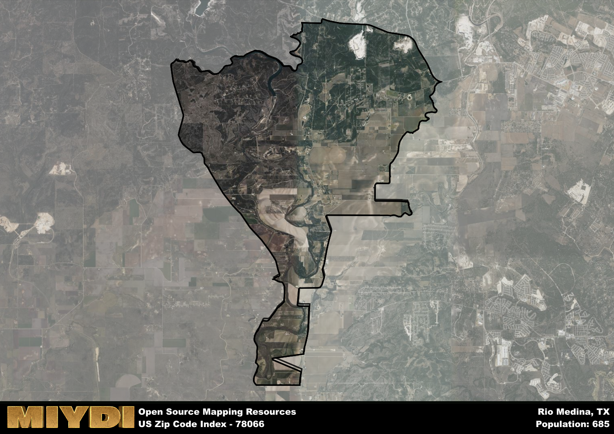

**Area Name:** Rio Medina

**Zip Code:** 78066

**State:** TX

Rio Medina is a part of the San Antonio-New Braunfels - TX Metro Area, and makes up  of the Metro's population.  

# Rio Medina: A Historic Neighborhood in San Antonio's Metropolitan Area

Located within the metropolitan area of San Antonio, Texas, zip code 78066 encompasses the charming neighborhood of Rio Medina. Situated to the west of the city center, Rio Medina is bordered by the Medina River to the south and offers a tranquil rural setting amidst the bustling urban landscape of San Antonio. The neighborhood is well-connected to the rest of the city through major highways, providing easy access to downtown attractions and amenities.

Rio Medina has a rich historical narrative that dates back to the mid-19th century when the area was settled by European immigrants, primarily from the Canary Islands. The neighborhood flourished as an agricultural community, with farming and ranching playing a significant role in its economy. The name "Rio Medina" reflects the area's proximity to the Medina River, which has been a vital water source for the community throughout its history. Over the years, Rio Medina has maintained its tight-knit community feel and preserved its heritage through local events and traditions.

Today, Rio Medina is a blend of its agricultural past and modern development, offering a mix of residential properties, small businesses, and recreational opportunities. The neighborhood is known for its equestrian facilities and scenic trails along the river, making it a popular destination for outdoor enthusiasts. Local services such as family-owned restaurants and shops cater to the needs of residents, fostering a sense of community pride. Visitors can explore historic sites like the Rio Medina Store, which has been serving the neighborhood for generations, adding to the area's unique charm and character.

# Rio Medina Demographics

The population of Rio Medina is 685.  
Rio Medina has a population density of 23.24 per square mile.  
The area of Rio Medina is 29.47 square miles.  

## Rio Medina Income and Economic Data

These demographic numbers are sourced from IRS return data, providing comprehensive insights into the population dynamics and economic trends within Rio Medina.

**Breakdown of return types for Rio Medina**

The table offers insight into the composition of tax returns filed with the IRS, categorizing them into three main types. Single returns represent filings by individuals, joint returns by married couples, and head of household returns by individuals who qualify as heads of households, typically having dependents. This breakdown provides an understanding of the different filing statuses adopted by taxpayers when submitting their tax documentation.

| Return Types filed for Rio Medina                              | Percentage          |
|----------------------------------------------------------|---------------------|
| Single Returns                                            | 0.37 |
| Joint Returns                                             | 0.57 |
| Head Household Returns                                    | 0 |

The income and economic data presented here is sourced from the IRS income brackets, utilized for categorizing tax returns by income levels. This table displays income ranges for both single filers and married couples, along with the corresponding number of returns and the percentage within each bracket, providing valuable insight into the distribution of taxes across various income groups.

| Bracket Name       | Single Filer Income Range | Married Couple Range | Number of Returns | Percentage of Returns |
|--------------------|----------------------------|----------------------|-------------------|-----------------------|
| 10% Bracket        | Up to $10,275              | Up to $20,550        | 90 | 0.26% |
| 12% Bracket        | $10,276 - $41,775          | $20,551 - $83,550    | 50 | 0.14% |
| 22% Bracket        | $41,776 - $89,075          | $83,551 - $178,150   | 60 | 0.17% |
| 24% Bracket        | $89,076 - $170,050         | $178,151 - $340,100  | 40 | 0.11% |
| 32% Bracket        | $170,051 - $215,950        | $340,101 - $431,900  | 110 | 0.31% |
| 35% Bracket        | $215,951 - $539,900        | $431,901 - $647,850  | 0 | 0% |

### Exploring Taxpayer Diversity: A Breakdown of Different Types of Tax Returns in Rio Medina

The table offers insights into various types of tax returns filed, reflecting different aspects of taxpayer activities and demographics. Categories include charitable returns for donations, dependent returns for claimed dependents, educator population, elderly population, real estate returns, self-employment returns, student loan returns, and unemployment returns, providing valuable insights into taxpayer behavior and demographics.

| Rio Medina Filing Types                    | Count | Percentage |
|--------------------------------------|-------|------------|
| Charitable Donations                 | 0 | 0% |
| Dependents Claimed                   | 0 | 0% |
| Educator Residents                   | 0 | 0% |
| Elderly Population                   | 150 | 0.43% |
| Farming Population                   | 50 | 0.143% |
| Real Estate Transactions             | 0 | 0% |
| Self-Employed Individuals            | 50 | 0.143% |
| Student Loan Cases                   | 0 | 0% |
| Unemployment Benefit Filings         | 20 | 0.06% |

## Rio Medina AI and Census Variables

The values presented in this dataset for Rio Medina are AI-optimized, streamlined, and categorized into relevant buckets for enhanced utility in AI and mapping programs. These simplified values have been optimized to facilitate efficient analysis and integration into various technological applications, offering users accessible and actionable insights into demographics within the Rio Medina area.

| AI Variables for Rio Medina | Value |
|-------------|-------|
| Shape Area | 101094273.179688 |
| Shape Length | 66129.0789473934 |
| CBSA Federal Processing Standard Code | 41700 |

## How to use this free AI optimized Geo-Spatial Data for Rio Medina, TX

This data is made freely available under the Creative Commons license, allowing for unrestricted use for any purpose. Users can access static resources directly from GitHub or leverage more advanced functionalities by utilizing the GeoJSON files. All datasets originate from official government or private sector sources and are meticulously compiled into relevant datasets within QGIS. However, the versatility of the data ensures compatibility with any mapping application.

## Data Accuracy Disclaimer
It's important to note that the data provided here may contain errors or discrepancies and should be considered as 'close enough' for business applications and AI rather than a definitive source of truth. This data is aggregated from multiple sources, some of which publish information on wildly different intervals, leading to potential inconsistencies. Additionally, certain data points may not be corrected for Covid-related changes, further impacting accuracy. Moreover, the assumption that demographic trends are consistent throughout a region may lead to discrepancies, as trends often concentrate in areas of highest population density. As a result, dense areas may be slightly underrepresented, while rural areas may be slightly overrepresented, resulting in a more conservative dataset. Furthermore, the focus primarily on areas within US Major and Minor Statistical areas means that approximately 40 million Americans living outside of these areas may not be fully represented. Lastly, the historical background and area descriptions generated using AI are susceptible to potential mistakes, so users should exercise caution when interpreting the information provided.
